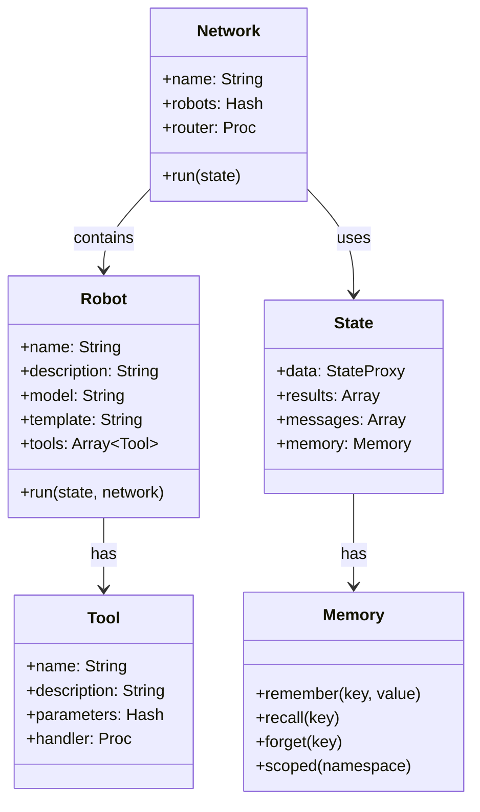

# Core Classes

The fundamental classes that power RobotLab.

## Overview



## Classes

| Class | Purpose |
|-------|---------|
| [Robot](robot.md) | LLM agent with personality, tools, and model configuration |
| [Network](network.md) | Container for robots with routing and orchestration |
| [State](state.md) | Conversation state with data, results, and memory |
| [Tool](tool.md) | Callable function with parameters and handler |
| [Memory](memory.md) | Namespaced key-value store for sharing data |

## Quick Examples

### Robot

```ruby
robot = RobotLab.build do
  name "assistant"
  model "claude-sonnet-4"
  template "You are helpful."

  tool :greet do
    parameter :name, type: :string
    handler { |name:, **_| "Hello, #{name}!" }
  end
end
```

### Network

```ruby
network = RobotLab.create_network do
  name "my_network"
  add_robot robot
  router ->(args) { args.call_count.zero? ? :assistant : nil }
end
```

### State

```ruby
state = RobotLab.create_state(
  message: "Hello",
  data: { user_id: "123" }
)
```

### Tool

```ruby
tool = RobotLab::Tool.new(
  name: "get_time",
  description: "Get current time",
  handler: ->(**, _) { Time.now.to_s }
)
```

### Memory

```ruby
state.memory.remember("key", "value")
value = state.memory.recall("key")
```
