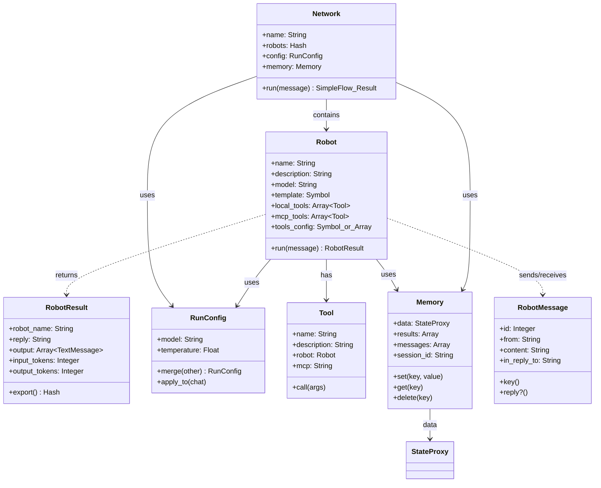

# Core Classes

The fundamental classes that power RobotLab.

## Overview


```mermaid
classDiagram
    class Robot {
        +name: String
        +description: String
        +model: String
        +template: Symbol
        +local_tools: Array~Tool~
        +mcp_tools: Array~Tool~
        +tools_config: Symbol_or_Array
        +run(message) RobotResult
    }

    class RobotResult {
        +robot_name: String
        +reply: String
        +output: Array~TextMessage~
        +input_tokens: Integer
        +output_tokens: Integer
        +export() Hash
    }

    class Network {
        +name: String
        +robots: Hash
        +config: RunConfig
        +memory: Memory
        +run(message) SimpleFlow_Result
    }

    class RunConfig {
        +model: String
        +temperature: Float
        +merge(other) RunConfig
        +apply_to(chat)
    }

    class Tool {
        +name: String
        +description: String
        +robot: Robot
        +mcp: String
        +call(args)
    }

    class Memory {
        +set(key, value)
        +get(key)
        +delete(key)
        +data: StateProxy
        +results: Array
        +messages: Array
        +session_id: String
    }

    class RobotMessage {
        +id: Integer
        +from: String
        +content: String
        +in_reply_to: String
        +key()
        +reply?()
    }

    Network --> Robot : contains
    Network --> RunConfig : uses
    Robot --> RunConfig : uses
    Robot --> Tool : has
    Robot --> Memory : uses
    Robot ..> RobotResult : returns
    Network --> Memory : uses
    Robot ..> RobotMessage : sends/receives
    Memory --> StateProxy : data
```

## Classes

| Class | Purpose |
|-------|---------|
| [Robot](robot.md) | LLM agent with templates, tools, memory, and model configuration |
| [RobotResult](result.md) | Value object returned by `Robot#run` |
| [Network](network.md) | Container for robots with DAG orchestration |
| [RunConfig](robot.md#runconfig) | Shared configuration for LLM, tools, callbacks, and infrastructure |
| [Tool](tool.md) | Callable function with parameters and an `execute` method |
| [AskUser](tool.md#built-in-askuser) | Built-in tool for terminal-based user interaction |
| [Memory](memory.md) | Reactive key-value store for sharing data |
| [StateProxy](state.md) | Hash/method-access wrapper returned by `memory.data` |
| RobotMessage | Typed envelope for bus-based inter-robot communication |
| `RobotLab::Runnable` | Shared interface (`crew`, `chief`, `robot_count`, `network?`, `single?`) implemented by both `Robot` and `Network` — see [Runnable Protocol](../../architecture/core-concepts.md#runnable-protocol) |

There is no `RobotLab::State` class and no `RobotLab::NetworkRun` class.

## Quick Examples

### Robot

```ruby
robot = RobotLab.build(
  name: "assistant",
  model: "claude-sonnet-4",
  system_prompt: "You are helpful.",
  local_tools: [greet_tool]
)

result = robot.run("Hello!")              # no tools sent — run() defaults to tools: :none
result = robot.run("Hello!", tools: :inherit)  # sends greet_tool
result.reply                              # => String
```

`Robot#run` returns a [`RobotLab::RobotResult`](result.md), not a `Message`.

### Network

The builder DSL method is `task` (there is no `step`):

```ruby
network = RobotLab.create_network(name: "my_network") do
  task :analyzer, analyzer_robot, depends_on: :none
  task :writer, writer_robot, depends_on: [:analyzer]
end

result = network.run(message: "Process this")  # => SimpleFlow::Result
result.value                                   # => RobotResult of the last task
```

### Memory

```ruby
memory = RobotLab.create_memory(data: { user_id: "123" })
memory.set(:category, "billing")
memory.get(:category)  # => "billing"
```

### Tool

```ruby
tool = RobotLab::Tool.create(
  name: "get_time",
  description: "Get current time"
) { |**_| Time.now.to_s }
```
