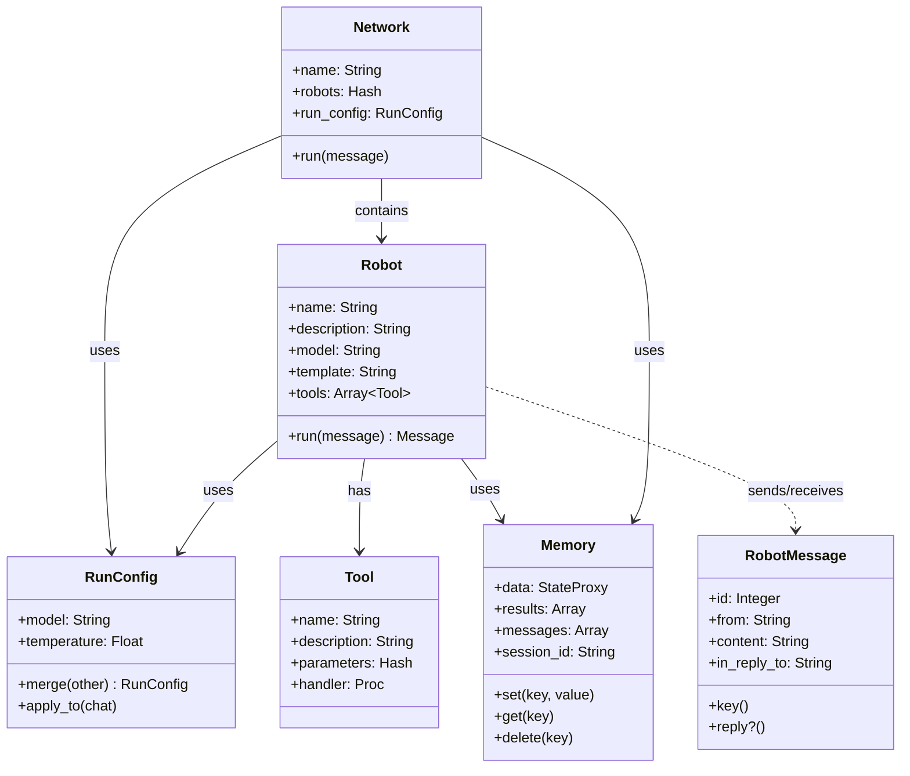

# Core Classes

The fundamental classes that power RobotLab.

## Overview


```mermaid
classDiagram
    class Robot {
        +name: String
        +description: String
        +model: String
        +template: String
        +tools: Array~Tool~
        +run(message) Message
    }

    class Network {
        +name: String
        +robots: Hash
        +run_config: RunConfig
        +run(message)
    }

    class RunConfig {
        +model: String
        +temperature: Float
        +merge(other) RunConfig
        +apply_to(chat)
    }

    class Tool {
        +name: String
        +description: String
        +parameters: Hash
        +handler: Proc
    }

    class Memory {
        +set(key, value)
        +get(key)
        +delete(key)
        +data: StateProxy
        +results: Array
        +messages: Array
        +session_id: String
    }

    class RobotMessage {
        +id: Integer
        +from: String
        +content: String
        +in_reply_to: String
        +key()
        +reply?()
    }

    Network --> Robot : contains
    Network --> RunConfig : uses
    Robot --> RunConfig : uses
    Robot --> Tool : has
    Robot --> Memory : uses
    Network --> Memory : uses
    Robot ..> RobotMessage : sends/receives
```

## Classes

| Class | Purpose |
|-------|---------|
| [Robot](robot.md) | LLM agent with personality, tools, and model configuration |
| [Network](network.md) | Container for robots with routing and orchestration |
| RunConfig | Shared configuration for LLM, tools, callbacks, and infrastructure |
| [Tool](tool.md) | Callable function with parameters and handler |
| [AskUser](tool.md#built-in-askuser) | Built-in tool for terminal-based user interaction |
| [Memory](memory.md) | Reactive key-value store for sharing data |
| RobotMessage | Typed envelope for bus-based inter-robot communication |

## Quick Examples

### Robot

```ruby
robot = RobotLab.build(
  name: "assistant",
  model: "claude-sonnet-4",
  system_prompt: "You are helpful.",
  local_tools: [greet_tool]
)

result = robot.run("Hello!")
```

### Network

```ruby
network = RobotLab.create_network(name: "my_network") do
  step :analyzer, analyzer_robot, depends_on: :none
  step :writer, writer_robot, depends_on: [:analyzer]
end

result = network.run(message: "Process this")
```

### Memory

```ruby
memory = RobotLab.create_memory(data: { user_id: "123" })
memory.set(:category, "billing")
memory.get(:category)  # => "billing"
```

### Tool

```ruby
tool = RobotLab::Tool.create(
  name: "get_time",
  description: "Get current time"
) { |**_| Time.now.to_s }
```
