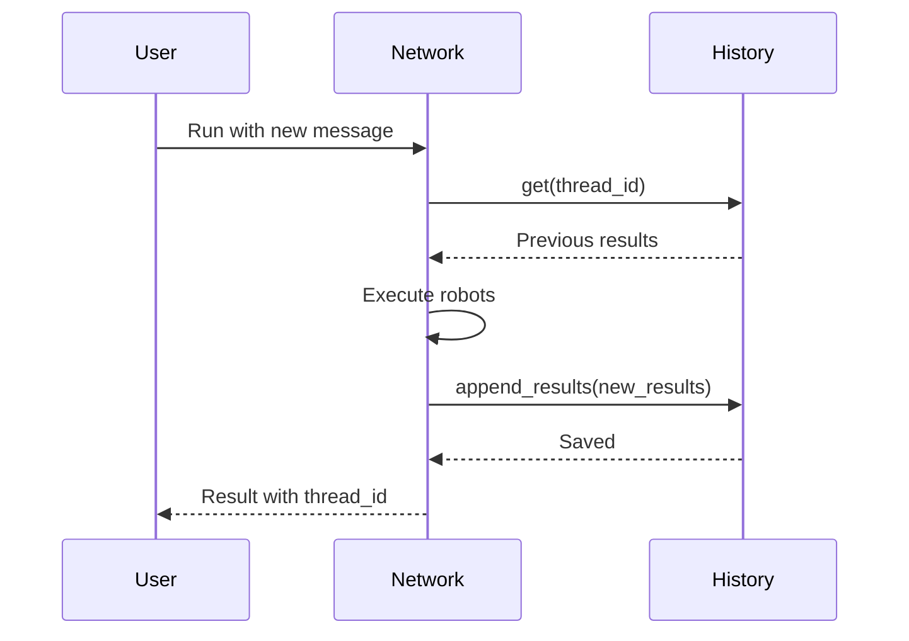

# History

Conversation persistence and thread management.

## Overview

The history system enables persistent conversations by storing and retrieving conversation threads and results.

```ruby
network = RobotLab.create_network do
  name "persistent_chat"

  history History::Config.new(
    create_thread: ->(state:, **) { Thread.create(id: SecureRandom.uuid) },
    get: ->(thread_id:, **) { Thread.find(thread_id).results },
    append_results: ->(thread_id:, new_results:, **) {
      Thread.find(thread_id).results.concat(new_results)
    }
  )

  add_robot assistant
end
```

## Components

| Component | Description |
|-----------|-------------|
| [Config](config.md) | History configuration |
| [ThreadManager](thread-manager.md) | Thread lifecycle management |
| [ActiveRecordAdapter](active-record-adapter.md) | Rails integration |

## Quick Start

### Basic Configuration

```ruby
history = History::Config.new(
  create_thread: ->(state:, input:, **) {
    { id: SecureRandom.uuid }
  },
  get: ->(thread_id:, **) {
    STORE[thread_id] || []
  },
  append_results: ->(thread_id:, new_results:, **) {
    STORE[thread_id] ||= []
    STORE[thread_id].concat(new_results)
  }
)
```

### With ActiveRecord

```ruby
history = History::ActiveRecordAdapter.new(
  thread_model: ConversationThread,
  result_model: ConversationResult
).to_config
```

## Callbacks

| Callback | Purpose |
|----------|---------|
| `create_thread` | Create new conversation thread |
| `get` | Retrieve existing thread history |
| `append_results` | Add results to thread |

## Thread Lifecycle



## Examples

### In-Memory Store

```ruby
THREADS = {}

history = History::Config.new(
  create_thread: ->(state:, **) {
    id = SecureRandom.uuid
    THREADS[id] = []
    { id: id }
  },
  get: ->(thread_id:, **) {
    THREADS[thread_id] || []
  },
  append_results: ->(thread_id:, new_results:, **) {
    THREADS[thread_id].concat(new_results)
  }
)
```

### Redis Store

```ruby
history = History::Config.new(
  create_thread: ->(state:, **) {
    id = SecureRandom.uuid
    Redis.current.set("thread:#{id}", [].to_json)
    { id: id }
  },
  get: ->(thread_id:, **) {
    data = Redis.current.get("thread:#{thread_id}")
    data ? JSON.parse(data) : []
  },
  append_results: ->(thread_id:, new_results:, **) {
    existing = JSON.parse(Redis.current.get("thread:#{thread_id}") || "[]")
    existing.concat(new_results.map(&:to_h))
    Redis.current.set("thread:#{thread_id}", existing.to_json)
  }
)
```

## See Also

- [History Guide](../../guides/history.md)
- [State](../core/state.md)
