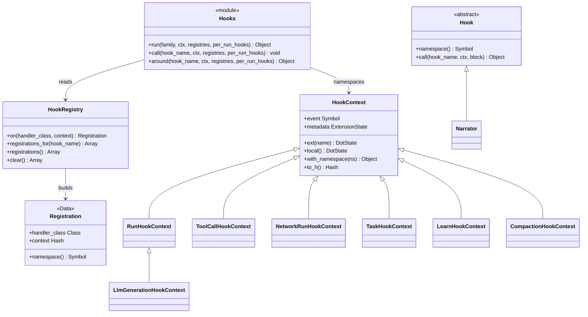

# Hooks API

Class-level reference for the hook system. For the conceptual walkthrough —
families, firing order, registration levels, and worked examples — see the
[Hook System guide](../guides/hooks.md). This page documents the public methods
of the classes that implement it.



---

## RobotLab::Hook

Base class for hook handlers. Subclasses implement hook methods as **class**
methods; any method a subclass does not define is silently skipped when that hook
fires.

### namespace / namespace=

```ruby
class TimerHook < RobotLab::Hook; end
TimerHook.namespace          # => :timer_hook

class Tracer < RobotLab::Hook
  self.namespace = :trace
end
Tracer.namespace             # => :trace

RobotLab::Hook.namespace     # => nil (the base class has none)
```

The namespace isolates a handler's `ctx.local` scratchpad from every other
handler. It defaults to the snake_case form of the **last** segment of the class
name, so `MyExt::Tracer` becomes `:tracer`. `HookRegistry#on` raises
`ArgumentError` when `namespace` is `nil`, which is why the base `Hook` class
itself can never be registered.

`inherited` resets `@namespace` to `nil` on each subclass, so a namespace set on
a parent handler is **not** inherited by its subclasses — each re-derives its own.

### call

```ruby
HandlerClass.call(hook_name, context)            # point / before / after hook
HandlerClass.call(hook_name, context) { ... }    # around hook
```

Dispatch one hook to this handler. This is the method `Hooks.call_registration`
invokes; you rarely call it directly.

| Case | Behavior |
|------|----------|
| Handler defines `hook_name` | Called with `context` (and the block, for around hooks) |
| Handler does not define it, block given | The block is called directly — **around passthrough**, so the chain never breaks |
| Handler does not define it, no block | Silent no-op |

The check is `singleton_class.public_method_defined?(hook_name)`, so a hook
defined as a *private* class method never fires.

---

## RobotLab::HookRegistry

The store behind `RobotLab.hooks`, `network.hooks`, and `robot.hooks`. Each of
those three is a separate instance; a run consults all three.

### on

```ruby
registration = registry.on(HandlerClass, context: nil)
# => RobotLab::HookRegistry::Registration
```

Register a handler class.

| Name | Type | Default | Description |
|------|------|---------|-------------|
| `handler_class` | `Class` | **required** | Must be a subclass of `RobotLab::Hook` |
| `context` | `Hash`, `nil` | `nil` | Defaults merged into the handler's `ctx.local` before each callback (via `DotState#merge_defaults`, so an already-set key is not overwritten) |

**Raises `ArgumentError`** when `handler_class` is not a `RobotLab::Hook`
subclass, or when its `namespace` is `nil`.

`RobotLab.on`, `network.on`, and `robot.on` are thin delegators to this method.

### registrations_for

```ruby
registry.registrations_for(:before_run)  # => Array<Registration>
```

Only the registrations whose handler class actually implements `hook_name`. This
is the filter that makes an unimplemented hook a no-op rather than an error, and
it is what `Hooks.registrations` calls on each registry.

### registrations

```ruby
registry.registrations  # => Array<Registration>
```

Every registration, as a defensive copy (`@registrations.dup`) — mutating the
returned array does not affect the registry.

Used by `Network#ractor_hook_classes_for` to collect the handler classes that
must cross a Ractor boundary under `parallel_mode: :ractor`.

### clear

```ruby
registry.clear  # => the emptied internal array
```

Remove every registration **in place**. Note the difference from
`RobotLab.clear_hooks!`, which replaces the global registry object entirely
rather than emptying it.

### HookRegistry::Registration

A `Data` value object pairing a handler with its optional context.

| Member / method | Type | Description |
|-----------------|------|-------------|
| `handler_class` | `Class` | The `RobotLab::Hook` subclass |
| `context` | `Hash`, `nil` | Per-registration defaults (defaults to `nil`) |
| `namespace` | `Symbol` | Delegates to `handler_class.namespace` |

---

## RobotLab::Hooks

The dispatcher (`module_function`, so every method is called as
`RobotLab::Hooks.foo`). Core calls into it; extension authors normally write
handler classes instead. It is documented here because a host that drives
RobotLab objects directly — or an extension that adds its own hook family — needs
the contract.

### run

```ruby
RobotLab::Hooks.run(family, context, registries:, per_run_hooks: nil) { core_work }
# => the block's return value
```

Execute a full hook family around a block. In order: every `before_<family>`,
then the `around_<family>` chain wrapping the block, then
[`set_result`](#set_result), then every `after_<family>`.

| Name | Type | Description |
|------|------|-------------|
| `family` | `Symbol` | `:run`, `:llm_generation`, `:tool_call`, `:network_run`, `:task`, `:compaction`, `:learn` |
| `context` | `HookContext` | The family's context object |
| `registries` | `Array<HookRegistry, nil>` | Consulted in order; `nil` entries are compacted away |
| `per_run_hooks` | `Class`, `Array<Class>`, `nil` | Handler classes active only for this call (`robot.run(..., hooks:)`) |

**Error path:** `run` rescues `Exception` (not just `StandardError`, so
`Timeout::Error` and `SignalException` are covered), assigns it to
`context.error` when the context has an `error=` writer, fires `on_error`, and
**re-raises**. Hooks never swallow an exception.

### call

```ruby
RobotLab::Hooks.call(hook_name, context, registries:, per_run_hooks: nil)
```

Fire one non-around hook across all matching registrations. This is how the point
hooks `:on_compaction` and `:on_learn` are dispatched from inside the core block
of their family — which is why they do not compose with `around_*` handlers and
have no chainable result.

### around

```ruby
RobotLab::Hooks.around(hook_name, context, registries:, per_run_hooks: nil) { ... }
```

Build and invoke just the around chain for one hook name, without the
before/after phases.

### registrations

```ruby
RobotLab::Hooks.registrations(hook_name, registries, per_run_hooks)
# => Array<Registration>
```

The complete ordered list for one hook name: each registry's
`registrations_for(hook_name)` concatenated in registry order, followed by the
per-run entries. This ordering is what produces **global → network → robot →
per-run** execution.

### error_registrations

```ruby
RobotLab::Hooks.error_registrations(family, registries, per_run_hooks)
# => Array<Registration>
```

`on_error` registrations, but **only** for the `:run`, `:network_run`, and
`:task` families — every other family returns `[]`. This is the mechanism behind
the guide's statement that `:llm_generation`, `:tool_call`, `:compaction`, and
`:learn` have no `on_error` variant.

### call_all

```ruby
RobotLab::Hooks.call_all(registrations, hook_name, context)
```

Invoke each registration in order for a non-around hook.

### call_around

```ruby
RobotLab::Hooks.call_around(registrations, hook_name, context) { core_work }
```

Fold the registrations into a nested chain and call it. The list is `reverse`d
before folding, so the **first** registration ends up outermost — a global
`around_run` wraps a robot-level one, not the other way round. A handler that
does not implement the hook passes the block straight through.

### call_registration

```ruby
RobotLab::Hooks.call_registration(registration, hook_name, context, &block)
```

Invoke one registration with its namespace active. It wraps the call in
`context.with_namespace(registration.namespace)` and, when the registration
carries a `context:` hash, merges those values into
`context.ext(namespace)` as defaults first. This is what makes `ctx.local`
resolve to the *calling handler's* private `DotState`.

### per_run_entries

```ruby
RobotLab::Hooks.per_run_entries(hook_name, hooks)
# => Array<Registration>
```

Turn `robot.run(msg, hooks: HandlerClass)` or `hooks: [A, B]` into
`Registration`s, skipping any class that does not implement `hook_name`. Per-run
registrations carry no `context:`.

### set_result

```ruby
RobotLab::Hooks.set_result(context, family, result)
```

Publish a family's return value onto its context so `after_*` handlers can read
it. The mapping is fixed:

| Family | Assigned to |
|--------|-------------|
| `:run` | `context.response` |
| `:network_run`, `:task` | `context.result` |
| `:llm_generation` | `context.generation_response` |
| `:tool_call`, `:compaction`, `:learn` | *(nothing — those contexts carry their result in a family-specific accessor set by the core block)* |

Each assignment is guarded by `respond_to?`, so a custom context lacking the
writer is simply skipped.

---

## RobotLab::HookContext

Base class for every hook context. The family-specific subclasses below add the
accessors a handler actually reads.

| Method | Returns | Description |
|--------|---------|-------------|
| `event` | `Symbol` | The family (`:run`, `:tool_call`, …), symbolized at construction |
| `metadata` | `ExtensionState` | The per-run namespace store; defaults to a fresh `ExtensionState` |
| `ext(name)` | `DotState` | Another handler's namespaced state — `ctx.ext(:timer).start_time` |
| `local` | `DotState` | **This** handler's state. Raises `ArgumentError: No hook namespace active` outside a `with_namespace` block |
| `with_namespace(ns) { \|ctx\| }` | block's value | Sets the active namespace for the duration of the block and restores the previous one in an `ensure`. Called by `Hooks.call_registration` |
| `to_h` | `Hash` | Snapshot of every public reader (excluding `to_h` and `local`) plus `metadata: metadata.to_h` |

!!! warning "`ctx.local` lives for exactly one run"
    `metadata` is a fresh `ExtensionState` per `HookContext`, and a new context is
    built per run. Use a class-level accessor on the handler for cross-run state.

### Context subclasses

Readers are read-only unless marked **rw**.

#### RunHookContext (`event: :run`)

| Accessor | | Description |
|----------|--|-------------|
| `robot` | | The robot being run |
| `network` | | Owning `Network`, or `nil` when standalone |
| `task` | | The `Task` wrapper, when run from a pipeline |
| `memory` | | The resolved run memory |
| `config` | | The robot's effective `RunConfig` |
| `request` | rw | The user message. **Writable** — assign in `before_run` to rewrite the prompt |
| `response` | rw | The `RobotResult`; set by `Hooks.set_result` before `after_run` |
| `error` | rw | Set by `Hooks.run` before `on_error` |

#### LlmGenerationHookContext (`event: :run`) — subclass of `RunHookContext`

Adds `iteration` (Integer, defaults to `0`) and `generation_response` (**rw**,
set by `set_result`). Note it inherits `event: :run` from its parent; the family
name comes from the hook method names, not from `event`.

#### ToolCallHookContext (`event: :tool_call`)

| Accessor | | Description |
|----------|--|-------------|
| `tool` | | The tool instance |
| `tool_name` | | `tool.name`, falling back to `tool.class.name` |
| `tool_args` | | Arguments the LLM supplied |
| `robot` | | Owning robot, or `nil` |
| `tool_result` | rw | The result. Assign it in `around_tool_call` **without** calling the block to block a tool |
| `tool_error` | rw | Set by `Tool#call` when `execute` raised |

#### NetworkRunHookContext (`event: :network_run`)

`network`, `memory`, `config`; **rw**: `context` (the run params hash), `result`, `error`.

#### TaskHookContext (`event: :task`)

`network`, `task`, `task_name` (`task.name`), `robot` (falls back to
`task.robot`), `memory`, `config`; **rw**: `result`, `error`.

#### LearnHookContext (`event: :learn`)

| Accessor | | Description |
|----------|--|-------------|
| `robot` | | The robot learning |
| `text` | | The stripped learning text |
| `learnings_before` | | Frozen copy of `robot.learnings` prior to the write |
| `stored` | rw | Set `true` by core when the learning was actually appended (i.e. not deduplicated away) |
| `error` | rw | |

#### CompactionHookContext (`event: :compaction`)

| Accessor | | Description |
|----------|--|-------------|
| `robot` | | |
| `messages_before` | | Frozen copy of `chat.messages` before compaction |
| `config` | | The effective `RunConfig` |
| `strategy` | | `:context_window`, or `:custom` when `auto_compact` is a `Proc` |
| `compacted_messages` | rw | Assign in `on_compaction` to **replace** the core algorithm |
| `error` | rw | |
| `handled?` | | `!compacted_messages.nil?` — core skips its own compaction when true |

---

## ExtensionState and DotState

The two-level store behind `ctx.local` / `ctx.ext`.

### ExtensionState

| Method | Returns | Description |
|--------|---------|-------------|
| `ext(name)` | `DotState` | The `DotState` for a namespace, auto-created on first access |
| `to_h` | `Hash` | `{ namespace => state_hash }` for every namespace touched |

### DotState

A schemaless dot-access bag.

| Method | Returns | Description |
|--------|---------|-------------|
| `method_missing` | value / assigned value | `state.foo` reads, `state.foo = 1` writes. Any key is allowed |
| `merge_defaults(hash)` | `self` | Writes each pair **only when the key is absent** — this is how a registration's `context:` becomes defaults rather than an override |
| `to_h` | `Hash` | A `dup` of the backing hash |

!!! warning "`DotState#respond_to_missing?` always returns true"
    `state.respond_to?(:anything)` is `true`, and reading a key that was never
    set returns `nil` instead of raising `NoMethodError`. A typo in a `ctx.local`
    reader fails silently.

---

## Module-level hook methods

```ruby
RobotLab.hooks                     # => the global HookRegistry (memoized)
RobotLab.on(HandlerClass, context: nil)
RobotLab.clear_hooks!              # => replaces the global registry with a new one
```

`clear_hooks!` swaps in a brand-new `HookRegistry`; any `Registration` object you
held from before is orphaned. Use it in test teardown to avoid leaking handlers
between examples.

### with_hook_scope / current_hook_scope

```ruby
RobotLab.with_hook_scope(registries, per_run_hooks) { ... }
RobotLab.current_hook_scope   # => { registries: [...], per_run_hooks: ... } or nil
```

Publishes the active run's registries and per-run handlers in a
`Thread.current` slot for the duration of the block, restoring the previous value
in an `ensure`. `Robot::Hooking#run` opens the scope; `Tool#call` reads it so a
tool invoked deep inside RubyLLM's tool loop still resolves the same registries
(including the network's and any `hooks:` passed to that one `run`) instead of
falling back to `[RobotLab.hooks, robot.hooks]`.

!!! note "Thread-local, so it does not cross a thread boundary"
    A tool that executes on another thread — or a `delegate(async: true)` target —
    sees `current_hook_scope == nil` and falls back to the global + robot
    registries. Network-scoped and per-run hooks will not fire for it.

---

## See Also

- [Hook System guide](../guides/hooks.md) — families, ordering, and applied patterns
- [Observability & Safety](../guides/observability.md) — `Narrator`, budgets, doom-loop detection
- [Support API](support.md) — `Narrator`, the one `Hook` subclass shipped in core
- [Robot: on](core/robot.md#on) · [Network: on](core/network.md#on)
