# MCP Transports

Communication methods for MCP connections.

## Overview

Transports handle the low-level communication between MCP clients and servers. RobotLab supports multiple transport types for different deployment scenarios.

## Transport Types

### Stdio

Standard input/output for local process communication.

```ruby
{
  type: "stdio",
  command: "npx",
  args: ["@modelcontextprotocol/server-filesystem", "/path"],
  env: { "DEBUG" => "true" }
}
```

**Options:**

| Option | Type | Description |
|--------|------|-------------|
| `command` | `String` | Executable command |
| `args` | `Array` | Command arguments |
| `env` | `Hash` | Environment variables |
| `cwd` | `String` | Working directory |

**Use Cases:**

- Local development
- CLI tools
- Subprocess servers

### WebSocket

Bidirectional real-time communication.

```ruby
{
  type: "websocket",
  url: "wss://mcp.example.com/ws",
  headers: { "Authorization" => "Bearer token" }
}
```

**Options:**

| Option | Type | Description |
|--------|------|-------------|
| `url` | `String` | WebSocket endpoint |
| `headers` | `Hash` | HTTP headers |
| `ping_interval` | `Integer` | Keep-alive interval (seconds) |

**Use Cases:**

- Remote servers
- Real-time applications
- Long-running connections

### SSE (Server-Sent Events)

Unidirectional server-to-client streaming.

```ruby
{
  type: "sse",
  url: "https://mcp.example.com/sse",
  headers: { "Authorization" => "Bearer token" }
}
```

**Options:**

| Option | Type | Description |
|--------|------|-------------|
| `url` | `String` | SSE endpoint |
| `headers` | `Hash` | HTTP headers |
| `post_url` | `String` | Endpoint for client messages |

**Use Cases:**

- Firewall-friendly connections
- Browser-based clients
- Streaming responses

### HTTP

Request/response communication.

```ruby
{
  type: "http",
  url: "https://mcp.example.com/mcp",
  headers: { "Authorization" => "Bearer token" },
  timeout: 30
}
```

**Options:**

| Option | Type | Description |
|--------|------|-------------|
| `url` | `String` | HTTP endpoint |
| `headers` | `Hash` | HTTP headers |
| `timeout` | `Integer` | Request timeout (seconds) |
| `retry` | `Integer` | Retry attempts |

**Use Cases:**

- Simple integrations
- Stateless operations
- Load-balanced servers

## Examples

### Local Server with Stdio

```ruby
network = RobotLab.create_network do
  mcp [
    {
      name: "filesystem",
      transport: {
        type: "stdio",
        command: "npx",
        args: ["@modelcontextprotocol/server-filesystem", "/home/user/docs"]
      }
    }
  ]
end
```

### Remote Server with WebSocket

```ruby
network = RobotLab.create_network do
  mcp [
    {
      name: "remote_tools",
      transport: {
        type: "websocket",
        url: "wss://tools.example.com/mcp",
        headers: {
          "Authorization" => "Bearer #{ENV['MCP_TOKEN']}"
        }
      }
    }
  ]
end
```

### Multiple Transports

```ruby
network = RobotLab.create_network do
  mcp [
    # Local filesystem
    {
      name: "fs",
      transport: { type: "stdio", command: "mcp-fs" }
    },
    # Remote API
    {
      name: "api",
      transport: {
        type: "http",
        url: "https://api.example.com/mcp"
      }
    },
    # Real-time service
    {
      name: "realtime",
      transport: {
        type: "websocket",
        url: "wss://realtime.example.com/mcp"
      }
    }
  ]
end
```

### Custom Transport

```ruby
class CustomTransport
  def initialize(options)
    @options = options
  end

  def connect
    # Establish connection
  end

  def disconnect
    # Close connection
  end

  def send(message)
    # Send message to server
  end

  def receive
    # Receive message from server
  end
end

RobotLab::MCP.register_transport(:custom, CustomTransport)

# Use custom transport
{
  type: "custom",
  option1: "value1"
}
```

## Connection Lifecycle

```mermaid
sequenceDiagram
    participant C as Client
    participant T as Transport
    participant S as Server

    C->>T: connect()
    T->>S: Establish connection
    S-->>T: Connection established
    T-->>C: Connected

    C->>T: send(request)
    T->>S: Forward request
    S-->>T: Response
    T-->>C: receive() → response

    C->>T: disconnect()
    T->>S: Close connection
```



## Error Handling

```ruby
begin
  client.connect
rescue RobotLab::MCP::ConnectionError => e
  case e.transport
  when "stdio"
    puts "Command failed: #{e.message}"
  when "websocket"
    puts "WebSocket error: #{e.message}"
  when "http"
    puts "HTTP error: #{e.status} - #{e.message}"
  end
end
```

## See Also

- [MCP Overview](index.md)
- [MCP Client](client.md)
- [MCP Server](server.md)
