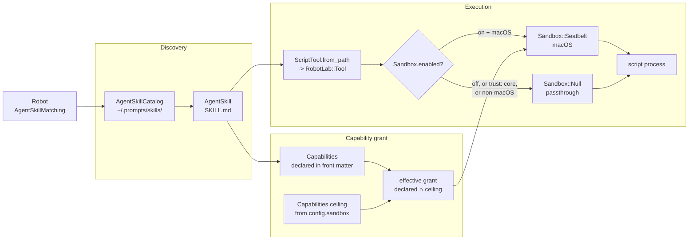

# Skills API

Class-level reference for the AgentSkills subsystem: skill bundles, the scripts
they expose as tools, the capabilities those scripts declare, and the sandbox
that confines them. For the how-to, see
[Using Tools: Skill Scripts and Sandboxing](../guides/using-tools.md#skill-scripts-and-sandboxing)
and [Building Robots: Composable Skills](../guides/building-robots.md#composable-skills).

!!! note "Two different things are called 'skills'"
    **Template skills** (`RobotLab.build(skills: [:clarifier])`) are ordinary
    prompt templates whose bodies are prepended to a robot's system prompt — see
    [Robot: Skills](core/robot.md#skills). **AgentSkills** (this page) are
    `SKILL.md` *bundles* on disk, discovered from `~/.prompts/skills/`, matched
    to a message by embedding similarity at run time, and capable of contributing
    executable tools. They share the word but not the mechanism.



---

## RobotLab::AgentSkill

Immutable value object for one skill folder: a directory containing a `SKILL.md`
with `name` and `description` front matter, plus optional `scripts/`,
`references/`, and `assets/` subdirectories.

### Constructor

```ruby
skill = RobotLab::AgentSkill.new("~/.prompts/skills/deploy-checker/SKILL.md")
```

| Name | Type | Description |
|------|------|-------------|
| `skill_md_path` | `String`, `Pathname` | Path to the `SKILL.md` file itself, **not** the directory |

**Raises `RobotLab::ConfigurationError`** when front matter is missing `name` or
`description` (or either is blank) — and because a file with no `---` block
parses to an empty hash, a `SKILL.md` without front matter always raises.
Malformed YAML raises `Psych::SyntaxError` instead, straight from
`YAML.safe_load`. [`AgentSkillCatalog`](#robotlabagentskillcatalog) rescues both
and skips the bundle; construct an `AgentSkill` directly and you get the
exception.

### Attributes

| Attribute | Type | Description |
|-----------|------|-------------|
| `name` | `String` | Front-matter `name`; also the catalog lookup key (symbolized) |
| `description` | `String` | Front-matter `description`; the text matched against the user's message |
| `path` | `Pathname` | The skill **directory** (`dirname` of the `SKILL.md` path) |
| `capabilities` | `Capabilities` | Built from front matter via `Capabilities.from_front_matter` |

### instructions

```ruby
skill.instructions  # => String
```

The `SKILL.md` body below the front matter, stripped. This is the text
`Robot::AgentSkillMatching` prepends to the system prompt when the skill matches.
Memoized.

### scripts

```ruby
skill.scripts  # => Array<Pathname>
```

Every **file** directly inside the skill's `scripts/` directory, sorted. Returns
`[]` when there is no `scripts/` directory. Not recursive — subdirectories are
skipped. Memoized.

### script_tools

```ruby
skill.script_tools  # => Array<RobotLab::Tool>
```

One `RobotLab::Tool` per script, built with
[`ScriptTool.from_path`](#scripttoolfrom_path) and carrying this skill's
`capabilities` and directory. **Non-executable scripts are skipped** (logged at
`warn` and filtered out by `filter_map`), so this array can be shorter than
`scripts`. Memoized.

These tools are appended to `robot.local_tools` for the duration of a matched
`run` and removed again in the `ensure` block — see
[Robot Execution](../architecture/robot-execution.md#execution-overview).

---

## RobotLab::AgentSkillCatalog

Lazily-loaded registry of the skill folders under a root directory.

### SKILLS_ROOT

```ruby
RobotLab::AgentSkillCatalog::SKILLS_ROOT
# => #<Pathname:/Users/you/.prompts/skills>
```

`~/.prompts/skills`, expanded at load time. The path the process-level singleton
scans.

### instance / reset!

```ruby
RobotLab::AgentSkillCatalog.instance  # => the singleton, scanning SKILLS_ROOT
RobotLab::AgentSkillCatalog.reset!    # => nil; next `instance` builds a fresh one
```

`instance` memoizes. `reset!` drops the memo — it exists so tests can point the
catalog at a fixture directory by resetting and constructing an instance
explicitly with a different root.

### Constructor

```ruby
catalog = RobotLab::AgentSkillCatalog.new("/path/to/skills")
```

| Name | Type | Default | Description |
|------|------|---------|-------------|
| `skills_root` | `String`, `Pathname` | `SKILLS_ROOT` | Directory to scan |

Construction does **no** I/O; the scan happens on the first `find`/`all`.

### find

```ruby
catalog.find(:deploy_checker)   # => AgentSkill or nil
catalog.find("deploy-checker")  # => AgentSkill or nil
```

Look up by skill **name** (the front-matter `name`, symbolized) — not by
directory name, and not by file path. Returns `nil` when not found.

### all

```ruby
catalog.all  # => Array<AgentSkill>
```

Every successfully-loaded skill.

!!! note "Loading is lazy, thread-safe, and forgiving"
    The scan runs once, under a `Mutex`, on the first `find` or `all`. A missing
    root directory is not an error — the catalog is simply empty. A directory
    without a `SKILL.md` is skipped silently; a `SKILL.md` that raises
    `ConfigurationError` or `Psych::SyntaxError` is skipped with a `warn`
    (`"AgentSkillCatalog: <message>, skipping <dir>"`). One bad bundle never
    prevents the others from loading, and the scan is never retried.

---

## RobotLab::Capabilities

What a skill's scripts may read, write, reach, and how long they may run.

A skill declares what it **wants** in `SKILL.md` front matter; the global
`sandbox:` config declares the **ceiling**. The effective grant is the
[intersection](#intersect) of the two.

### Constants

| Constant | Value | Description |
|----------|-------|-------------|
| `DEFAULT_TIMEOUT` | `60` | Seconds, used when `timeout` is absent or non-positive |
| `TRUST_LEVELS` | `["core", "external"]` | Any other value falls back to `"external"` |

### Constructor

```ruby
RobotLab::Capabilities.new(
  fs_read: [], fs_write: [], network: false,
  timeout: DEFAULT_TIMEOUT, trust: "external"
)
```

| Name | Type | Default | Coercion |
|------|------|---------|----------|
| `fs_read` | `Array<String>` | `[]` | `Array(...)` then `to_s` on each entry |
| `fs_write` | `Array<String>` | `[]` | Same |
| `network` | `Boolean` | `false` | Any truthy value becomes `true` |
| `timeout` | `Integer` | `60` | `to_i`; anything not positive becomes `DEFAULT_TIMEOUT` |
| `trust` | `String` | `"external"` | Must be in `TRUST_LEVELS`, else `"external"` |

Every value is normalized in the constructor, so the readers `fs_read`,
`fs_write`, `network`, `timeout`, and `trust` always return well-formed values —
a malformed `SKILL.md` degrades to the safe default rather than raising.

### from_front_matter

```ruby
RobotLab::Capabilities.from_front_matter(front_matter_hash)  # => Capabilities
```

Build from a parsed `SKILL.md` front-matter hash, reading `fs_read`, `fs_write`,
`network`, `timeout`, and `trust`. A `nil` front matter yields an all-defaults
instance.

### fm_value

```ruby
RobotLab::Capabilities.fm_value(front_matter, :network, false)
```

Look up a front-matter key tolerating **either** string or symbol keys (string
first, then symbol), returning `default` when both are `nil`. Exposed because
`from_front_matter` uses it and skill-tooling may need the same leniency.

### ceiling

```ruby
RobotLab::Capabilities.ceiling                 # => from RobotLab.config.sandbox
RobotLab::Capabilities.ceiling(custom_config)
```

The maximum grant any skill may receive, read from the config's `sandbox:`
section. When there is no `sandbox` section at all, the ceiling is
`Capabilities.new(fs_read: ["."])` — read-only access to the working directory,
no writes, no network.

Note the ceiling never carries a `trust` — trust is a property of the skill, not
of the ceiling, and `intersect` keeps the declared value.

### core?

```ruby
capabilities.core?  # => trust == "core"
```

A `core` skill is exempt from confinement: `Sandbox.for` returns a
[`Null`](#robotlabsandboxnull) strategy for it regardless of platform or config.
Reserve `trust: core` for bundles you wrote and audited.

### intersect

```ruby
grant = declared.intersect(RobotLab::Capabilities.ceiling)
```

The effective grant. Per field:

| Field | Rule |
|-------|------|
| `fs_read` / `fs_write` | A requested path survives only when it **is** a ceiling root or lives beneath one. Both sides are `File.expand_path`ed before comparison, so `~` and relative paths resolve first |
| `network` | `declared && ceiling` — both must allow it |
| `timeout` | The **smaller** of the two |
| `trust` | The **declared** value, unchanged |

Because the check is prefix-based on expanded paths, a ceiling of `["."]` grants
nothing outside the working directory even if a skill asks for `/etc`.

---

## RobotLab::ScriptTool

Factory module that turns an executable script into a `RobotLab::Tool`. All
methods are module functions.

### ScriptTool.from_path

```ruby
tool = RobotLab::ScriptTool.from_path(script_path, capabilities: nil, skill_dir: nil)
# => RobotLab::Tool, or nil
```

| Name | Type | Default | Description |
|------|------|---------|-------------|
| `script_path` | `String`, `Pathname` | **required** | The script file |
| `capabilities` | `Capabilities`, `nil` | `nil` → `Capabilities.new` | The skill's declared capabilities |
| `skill_dir` | `String`, `nil` | `nil` → the script's own directory | Bundle root; always granted read access under Seatbelt |

**Returns `nil`** when the file is not executable, logging
`"ScriptTool: <basename> is not executable, skipping"` at `warn`. It never raises.

The generated tool takes a single optional `args` string parameter, which is
`Shellwords.split` and appended to `bash <script>`. Its name comes from
[`derive_name`](#scripttoolderive_name) and its description from
[`extract_description`](#scripttoolextract_description).

### ScriptTool.execute

```ruby
RobotLab::ScriptTool.execute(cmd, capabilities:, skill_dir:)  # => String
```

Run a command array and return its combined stdout+stderr, or an error string.
Two paths:

- **Sandboxing off** (the default) — `Open3.capture2e`, unconfined, **no timeout**.
- **Sandboxing on** — intersects `capabilities` with `Capabilities.ceiling`, wraps
  the command with the strategy from `Sandbox.for`, runs it under the grant's
  timeout, and cleans the strategy up in an `ensure`.

The declared `timeout:` therefore only takes effect when sandboxing is enabled.

### ScriptTool.run_with_timeout

```ruby
RobotLab::ScriptTool.run_with_timeout(cmd, timeout)
# => [String, Process::Status | nil]
```

Run `cmd` in its own process group (`pgroup: true`), reading combined output
until `timeout` seconds elapse. On expiry it terminates the group and returns
`["<partial output>\n[killed: exceeded <N>s]", nil]` — a `nil` status is the
timeout signal.

### ScriptTool.terminate

```ruby
RobotLab::ScriptTool.terminate(pid)
```

`Process.kill('-TERM', ...)` against the process **group** of `pid`, so a script
that spawned children takes them down with it. Swallows every error and returns
`nil` — a process that already exited is not an error.

### ScriptTool.format_result

```ruby
RobotLab::ScriptTool.format_result(output, status)  # => String
```

| `status` | Result |
|----------|--------|
| `nil` | `"Error (timed out):\n<output>"` |
| success | `output` verbatim |
| non-zero exit | `"Error (exit <N>):\n<output>"` |

Failures come back as **text for the LLM**, not exceptions — the model sees the
error and can adapt.

### ScriptTool.derive_name

```ruby
RobotLab::ScriptTool.derive_name(Pathname.new("check-deploy.sh"))  # => "check_deploy"
```

Strips the final extension, replaces every run of non-alphanumerics with `_`, and
trims leading/trailing underscores.

### ScriptTool.extract_description

```ruby
RobotLab::ScriptTool.extract_description(path)  # => String
```

The first non-shebang comment line in the file, with leading `#` and whitespace
removed. Falls back to `derive_name(path)` when there is no comment or the file
cannot be read.

```bash
#!/usr/bin/env bash
# Verifies a deployment's health before promoting it.   <- becomes the description
```

---

## RobotLab::Sandbox

Strategy selector for confining skill-script execution. Module functions.

### Sandbox.enabled?

```ruby
RobotLab::Sandbox.enabled?              # => Boolean
RobotLab::Sandbox.enabled?(some_config)
```

`true` only when the config responds to `sandbox`, that section exists, and
`sandbox.enabled == true`. **Sandboxing is off by default** — see the
[`sandbox:` config section](../getting-started/configuration.md#skill-script-sandboxing-sandbox-section).

### Sandbox.macos?

```ruby
RobotLab::Sandbox.macos?  # => RUBY_PLATFORM.include?("darwin")
```

### Sandbox.for

```ruby
strategy = RobotLab::Sandbox.for(grant, skill_dir:, macos: macos?)
# => Sandbox::Seatbelt or Sandbox::Null
```

| Name | Type | Default | Description |
|------|------|---------|-------------|
| `grant` | `Capabilities` | **required** | The **already-intersected** effective grant |
| `skill_dir` | `String` | **required** | Bundle root, always granted read access |
| `macos` | `Boolean` | `macos?` | Injectable so both branches are testable on any host |

Selection order: a `trust: core` grant gets `Null`; otherwise macOS gets
`Seatbelt`; anything else warns once and gets `Null`.

### Sandbox.warn_once_non_macos

```ruby
RobotLab::Sandbox.warn_once_non_macos
```

Emits `"Sandbox: OS-level confinement is only available on macOS; scripts run
unconfined here"` at `warn`, at most once per process. Idempotent, so a run with
many scripts does not flood the log.

---

## RobotLab::Sandbox::Null

Passthrough strategy — used off macOS and for `trust: core` skills.

| Method | Returns | Description |
|--------|---------|-------------|
| `wrap(cmd)` | `cmd` | Unchanged |
| `cleanup` | `nil` | No-op |

---

## RobotLab::Sandbox::Seatbelt

macOS strategy: generates a deny-by-default `sandbox-exec` profile from the grant
and wraps the command as `sandbox-exec -f <profile> <cmd...>`.

### Constants

| Constant | Description |
|----------|-------------|
| `SYSTEM_READ` | `/usr /bin /sbin /System /Library /opt /private/etc /dev /var/select` — the locations an interpreter needs to boot |
| `DEV_WRITE` | `/dev/null /dev/stdout /dev/stderr /dev/dtracehelper /dev/tty` — always writable |

### Constructor

```ruby
RobotLab::Sandbox::Seatbelt.new(grant, skill_dir:)
```

### wrap / cleanup

```ruby
cmd = strategy.wrap(["bash", "script.sh"])
# => ["sandbox-exec", "-f", "/tmp/robot_lab-sandbox-xxxx.sb", "bash", "script.sh"]
strategy.cleanup  # unlinks the generated profile
```

`wrap` writes the profile to a `Tempfile`; `cleanup` unlinks it and swallows any
error (an already-removed file is fine). `ScriptTool.execute` always calls
`cleanup` in an `ensure`.

### profile_text

```ruby
strategy.profile_text  # => String
```

The generated Seatbelt profile. Public so the policy can be asserted in tests
rather than inferred from behavior. It imports `bsd.sb` (without which a
deny-default profile aborts the binary before it starts), denies by default, then
allows: `process-fork`, `process-exec`, `sysctl-read`, `mach-lookup`,
`file-read-metadata` on any path, `file-read*` on `SYSTEM_READ` + the skill
directory + granted `fs_read` paths, `file-write*` on `DEV_WRITE` + granted
`fs_write` paths, and `network*` only when the grant allows it.

Every path is canonicalized to its symlink-free real path first, because macOS
symlinks `/tmp` → `/private/tmp` and the kernel matches against the real path. For
write targets that do not exist yet, the nearest existing ancestor is resolved and
the remainder re-appended.

!!! warning "`$HOME` is never implicitly readable"
    Which is the point — SSH keys and cloud credentials stay out of reach. But it
    also means an interpreter installed under `$HOME` (rbenv, asdf, mise, a
    Homebrew prefix in `~`) is **invisible** to the sandboxed process and the
    script fails to start. Grant that path explicitly in `fs_read`, or mark the
    skill `trust: core`.

---

## See Also

- [Using Tools: Skill Scripts and Sandboxing](../guides/using-tools.md#skill-scripts-and-sandboxing)
- [Configuration: `sandbox:` section](../getting-started/configuration.md#skill-script-sandboxing-sandbox-section)
- [Robot: Skills](core/robot.md#skills) — template skills, the other meaning
- [Tool](core/tool.md) — `Tool.create`, which `ScriptTool` builds on
