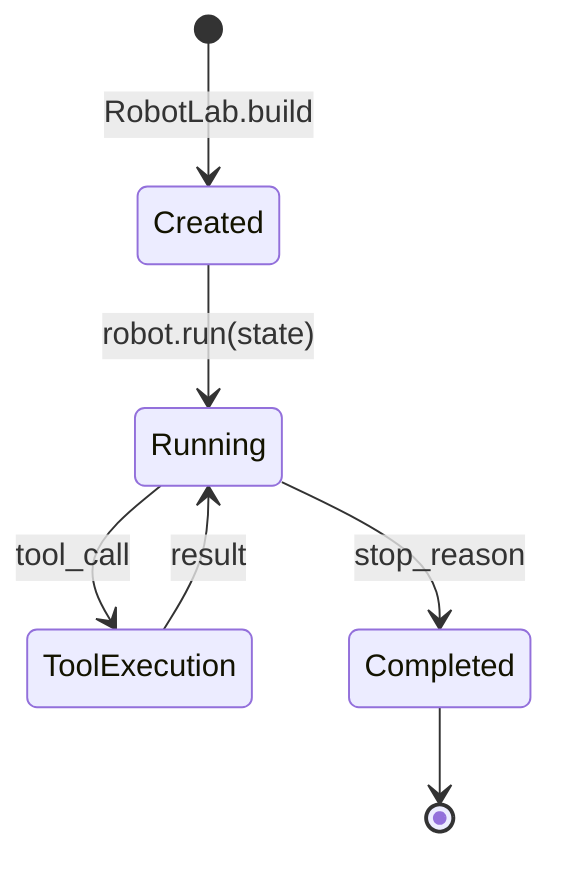
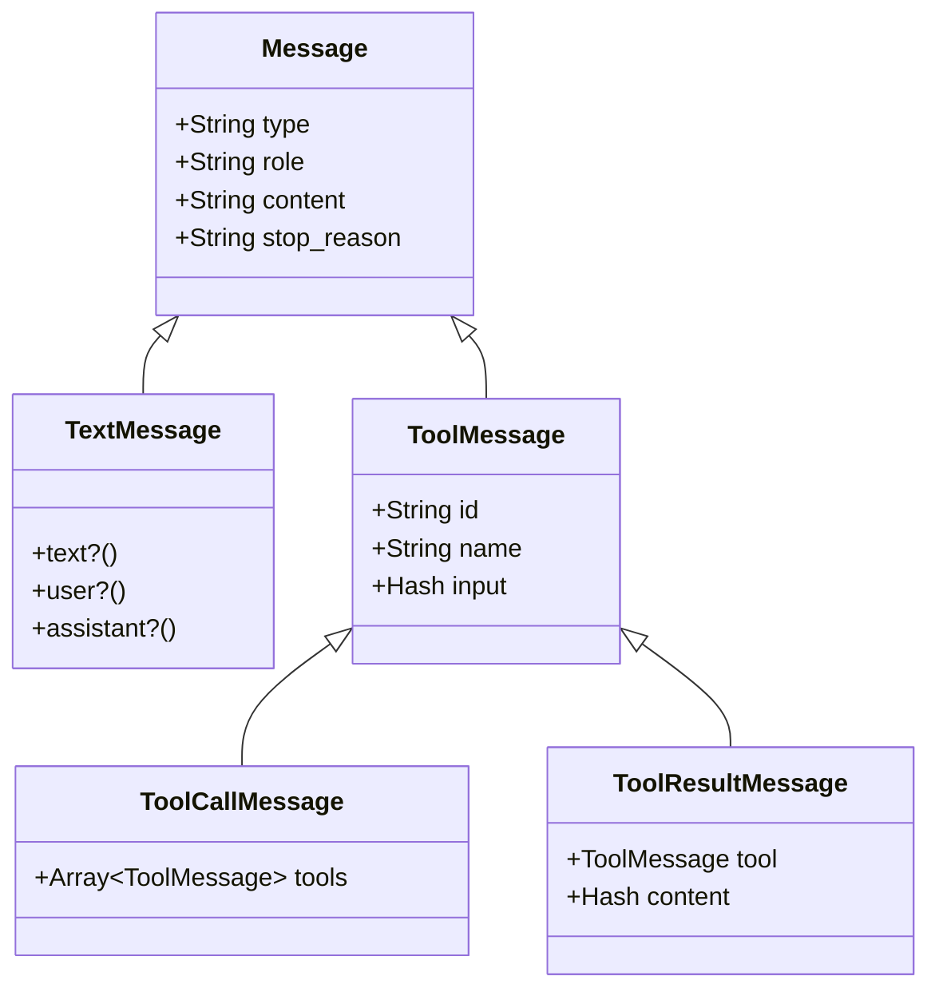

# Core Concepts

This page provides an in-depth look at RobotLab's fundamental building blocks.

## Robot

A Robot is the primary unit of computation in RobotLab. It wraps an LLM with:

- A unique identity (name, description)
- A personality (system prompt/template)
- Capabilities (tools, MCP connections)
- A specific model configuration

### Robot Anatomy

```ruby
robot = RobotLab.build do
  name "support_agent"                    # Unique identifier
  description "Handles support requests"  # Used for routing hints
  model "claude-sonnet-4"                 # LLM model

  # System prompt - defines personality
  template <<~PROMPT
    You are a friendly customer support agent for Acme Corp.
    Always be polite and helpful. If you don't know something,
    say so honestly.
  PROMPT

  # Tools - extend capabilities
  tool :lookup_account do
    description "Look up customer account"
    parameter :email, type: :string, required: true
    handler { |email:, **_| Account.find_by_email(email)&.to_h }
  end

  # MCP - external tool servers
  mcp :inherit  # Use network's MCP servers
end
```

### Robot Lifecycle



### Robot Properties

| Property | Type | Description |
|----------|------|-------------|
| `name` | String | Unique identifier within network |
| `description` | String | What the robot does |
| `model` | String | LLM model to use |
| `template` | String | System prompt |
| `local_tools` | Array | Defined tools |
| `mcp_clients` | Array | Connected MCP clients |

## Tool

Tools give robots the ability to interact with external systems.

### Tool Structure

```ruby
tool = RobotLab::Tool.new(
  name: "get_weather",
  description: "Get current weather for a location",
  parameters: {
    location: {
      type: "string",
      description: "City name",
      required: true
    },
    unit: {
      type: "string",
      enum: ["celsius", "fahrenheit"],
      default: "celsius"
    }
  },
  handler: ->(location:, unit: "celsius", **_context) {
    WeatherAPI.current(location, unit: unit)
  }
)
```

### Tool Execution

When an LLM decides to use a tool:

1. LLM generates a `ToolCallMessage` with tool name and arguments
2. RobotLab validates arguments against the tool's schema
3. Tool handler is called with validated arguments
4. Result is wrapped in a `ToolResultMessage`
5. Result is sent back to the LLM for continued processing

### Handler Context

Tool handlers receive context about the current execution:

```ruby
handler: ->(param:, robot:, network:, state:) {
  # robot - The Robot instance executing the tool
  # network - The Network (or NetworkRun) context
  # state - Current State with data, results, memory
}
```

!!! tip "Ignoring Context"
    Use `**_context` to accept but ignore context parameters:
    ```ruby
    handler: ->(location:, **_context) { ... }
    ```

## ToolManifest

When you need to modify tool metadata without changing functionality:

```ruby
manifest = RobotLab::ToolManifest.new(
  tool: existing_tool,
  name: "custom_name",           # Override name
  description: "New description" # Override description
)
```

## Message Types

RobotLab uses a type hierarchy for messages:



### Message Roles

| Role | Description |
|------|-------------|
| `user` | Input from the user |
| `assistant` | Response from the LLM |
| `system` | System instructions |
| `tool` | Tool call or result |

### Stop Reasons

| Reason | Description |
|--------|-------------|
| `stop` | Natural completion |
| `tool` | Tool call requested |
| `max_tokens` | Token limit reached |

## RobotResult

The output from a robot execution:

```ruby
result = robot.run(state: state, network: network)

result.robot_name   # => "support_agent"
result.output       # => [TextMessage, ...]
result.tool_calls   # => [ToolMessage, ...]
result.stop_reason  # => "stop"
result.created_at   # => Time
```

### Accessing Response Content

```ruby
# Get text response
text = result.output.select(&:text?).map(&:content).join

# Check if tools were called
has_tools = result.tool_calls.any?

# Get all tool names called
tool_names = result.tool_calls.map(&:name)
```

## Configuration Hierarchy

RobotLab uses a cascading configuration system:

```
Global (RobotLab.configure)
│
├── mcp: [server1, server2]
├── tools: [tool1, tool2]
│
└── Network
    │
    ├── mcp: :inherit | :none | [servers]
    ├── tools: :inherit | :none | [tools]
    │
    └── Robot
        │
        ├── mcp: :inherit | :none | [servers]
        └── tools: :inherit | :none | [tools]
```

The `:inherit` value pulls from the parent level.

## Next Steps

- [Robot Execution](robot-execution.md) - Detailed execution flow
- [Network Orchestration](network-orchestration.md) - Multi-robot coordination
- [State Management](state-management.md) - Managing conversation state
