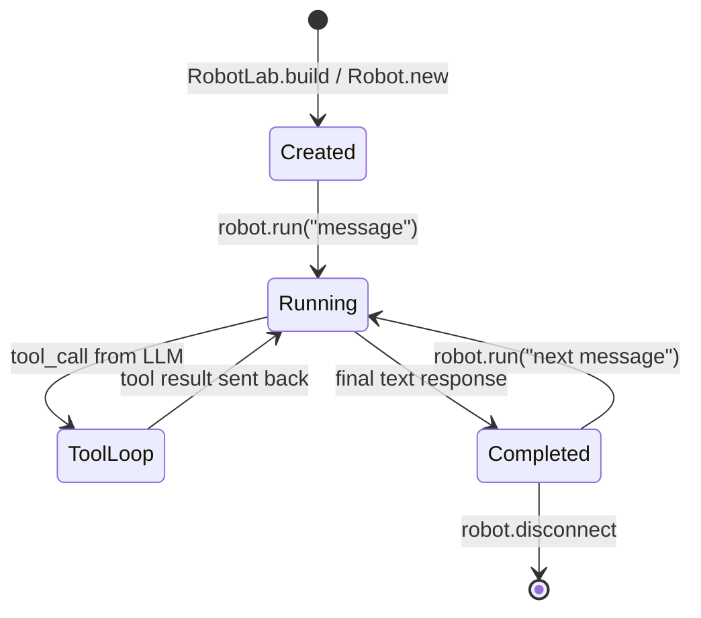
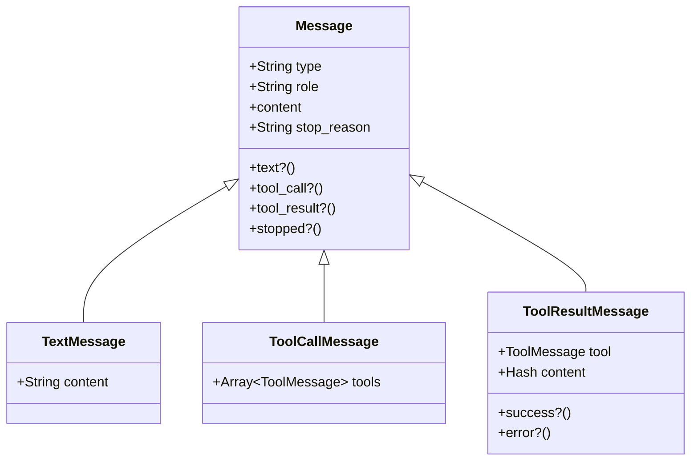

# Core Concepts

This page provides an in-depth look at RobotLab's fundamental building blocks.

## Robot

A Robot is the primary unit of computation in RobotLab. It is a subclass of `RubyLLM::Agent` that wraps a persistent `@chat` with:

- A unique identity (name, description)
- A personality (system prompt and/or template)
- Capabilities (tools, MCP connections)
- Model, provider, and inference configuration
- Inherent memory (key-value store)

### Robot Anatomy

```ruby
robot = RobotLab.build(
  name: "support_agent",                    # Unique identifier
  description: "Handles support requests",  # Used for routing hints
  model: "claude-sonnet-4",                 # LLM model
  system_prompt: <<~PROMPT,                 # Inline system prompt
    You are a friendly customer support agent for Acme Corp.
    Always be polite and helpful. If you don't know something,
    say so honestly.
  PROMPT
  local_tools: [OrderLookup, RefundProcessor],  # RubyLLM::Tool subclasses
  mcp: :inherit,                                 # Use network's MCP servers
  temperature: 0.7                               # Inference parameter
)
```

Or with a template:

```ruby
robot = RobotLab.build(
  name: "support_agent",
  template: :support,                  # Loads prompts/support.md
  context: { company: "Acme Corp" },   # Template variables
  local_tools: [OrderLookup]
)
```

### Robot Lifecycle


```mermaid
stateDiagram-v2
    [*] --> Created: RobotLab.build / Robot.new
    Created --> Running: robot.run("message")
    Running --> ToolLoop: tool_call from LLM
    ToolLoop --> Running: tool result sent back
    Running --> Completed: final text response
    Completed --> Running: robot.run("next message")
    Completed --> [*]: robot.disconnect
```

The persistent `@chat` maintains conversation history across multiple `run` calls, making the robot stateful.

### Robot Properties

| Property | Type | Description |
|----------|------|-------------|
| `name` | `String` | Unique identifier within network |
| `description` | `String`, `nil` | What the robot does |
| `model` | `String` | LLM model ID (resolved from chat) |
| `template` | `Symbol`, `nil` | Prompt template identifier |
| `system_prompt` | `String`, `nil` | Inline system prompt |
| `local_tools` | `Array` | Locally defined tools |
| `mcp_clients` | `Hash` | Connected MCP clients by server name |
| `mcp_tools` | `Array` | Tools discovered from MCP servers |
| `memory` | `Memory` | Inherent key-value memory |
| `bus` | `TypedBus::MessageBus`, `nil` | Message bus instance |
| `outbox` | `Hash` | Sent messages tracked with status and replies |
| `mcp_config` | `Symbol`, `Array` | Build-time MCP configuration |
| `tools_config` | `Symbol`, `Array` | Build-time tools configuration |

### Running a Robot

The primary method is `robot.run("message")`:

```ruby
result = robot.run("What is the weather in Berlin?")
puts result.last_text_content
```

With runtime overrides:

```ruby
result = robot.run("Analyze this",
  memory: { data: report },
  mcp: :none,
  tools: :none
)
```

With streaming:

```ruby
robot.run("Tell me a story") do |event|
  print event.text if event.respond_to?(:text)
end
```

## Tool

Tools give robots the ability to interact with external systems. There are two patterns for defining tools.

### RubyLLM::Tool Subclass (Primary)

```ruby
class GetWeather < RubyLLM::Tool
  description "Get current weather for a location"

  param :location, type: "string", desc: "City name"
  param :unit, type: "string", desc: "celsius or fahrenheit"

  def execute(location:, unit: "celsius")
    WeatherAPI.current(location, unit: unit)
  end
end
```

Tools defined as `RubyLLM::Tool` subclasses are passed to robots via `local_tools:`:

```ruby
robot = RobotLab.build(
  name: "weather_bot",
  system_prompt: "You provide weather information.",
  local_tools: [GetWeather]
)
```

### RobotLab::Tool.create Factory

For simpler tools that do not need a class:

```ruby
tool = RobotLab::Tool.create(
  name: "get_time",
  description: "Get the current time"
) { |_args| Time.now.to_s }
```

With parameter schema:

```ruby
tool = RobotLab::Tool.create(
  name: "get_weather",
  description: "Get weather for a location",
  parameters: {
    type: "object",
    properties: {
      location: { type: "string", description: "City name" }
    },
    required: ["location"]
  }
) { |args| WeatherAPI.current(args[:location]) }
```

### Tool Execution

When an LLM decides to use a tool:

1. LLM generates a tool call with tool name and arguments
2. `@chat` (RubyLLM) identifies the tool from its registered tools
3. Calls the `execute` method with keyword arguments
4. Result is sent back to the LLM for continued processing
5. Loop repeats until the LLM produces a final text response

### Error Handling

Tool errors are captured and returned to the LLM:

```ruby
def execute(order_id:)
  order = ORDERS[order_id]
  if order
    order
  else
    { error: "Order not found" }
  end
end
```

## Memory

Memory is a reactive key-value store used by robots and networks.

### Standalone vs Network Memory

- **Standalone**: Each robot has its own inherent `Memory` instance (`robot.memory`)
- **In a Network**: All robots share the network's `Memory` instance

```ruby
# Standalone memory
robot.memory[:user_id] = 123
robot.memory[:user_id]  # => 123

# Network memory is passed automatically
network = RobotLab.create_network(name: "pipeline") do
  task :robot_a, robot_a, depends_on: :none
  task :robot_b, robot_b, depends_on: [:robot_a]
end
# Both robot_a and robot_b share network.memory during execution
```

### Reserved Keys

| Key | Type | Description |
|-----|------|-------------|
| `:data` | `Hash` | Runtime data (accessible via `memory.data.key_name`) |
| `:results` | `Array` | Accumulated robot results |
| `:messages` | `Array` | Conversation history |
| `:session_id` | `String` | Session identifier |
| `:cache` | `Module` | Semantic cache (RubyLLM::SemanticCache) |

### Reactive Features

Memory supports pub/sub semantics for inter-robot communication:

```ruby
# Write a value (notifies subscribers, wakes waiters)
memory.set(:sentiment, { score: 0.8 })

# Read a value (non-blocking)
memory.get(:sentiment)  # => { score: 0.8 } or nil

# Blocking read (waits until value exists)
memory.get(:sentiment, wait: true)    # Blocks indefinitely
memory.get(:sentiment, wait: 30)      # Blocks up to 30 seconds

# Subscribe to changes
memory.subscribe(:sentiment) do |change|
  puts "#{change.key} = #{change.value} (written by #{change.writer})"
end
```

## Message Types

RobotLab uses a type hierarchy for messages:


```mermaid
classDiagram
    Message <|-- TextMessage
    Message <|-- ToolCallMessage
    Message <|-- ToolResultMessage

    class Message {
        +String type
        +String role
        +content
        +String stop_reason
        +text?()
        +tool_call?()
        +tool_result?()
        +stopped?()
    }

    class TextMessage {
        +String content
    }

    class ToolCallMessage {
        +Array~ToolMessage~ tools
    }

    class ToolResultMessage {
        +ToolMessage tool
        +Hash content
        +success?()
        +error?()
    }
```

### Message Roles

| Role | Description |
|------|-------------|
| `user` | Input from the user |
| `assistant` | Response from the LLM |
| `system` | System instructions |
| `tool_result` | Tool execution result |

### Stop Reasons

| Reason | Description |
|--------|-------------|
| `stop` | Natural completion |
| `tool` | Tool call requested |

## RobotResult

The output from a robot execution:

```ruby
result = robot.run("Hello!")

result.robot_name       # => "support_agent"
result.output           # => [TextMessage, ...]
result.tool_calls       # => [ToolResultMessage, ...]
result.stop_reason      # => "stop"
result.created_at       # => Time
result.id               # => UUID string
```

### Accessing Response Content

```ruby
# Get last text response (most common)
text = result.last_text_content

# Check if tools were called
has_tools = result.has_tool_calls?

# Check if execution completed naturally
result.stopped?

# Serialization
result.export     # => Hash (excludes debug fields)
result.to_h       # => Hash (includes debug fields)
result.to_json    # => JSON string
```

## Configuration

RobotLab uses `MywayConfig` for configuration. There is no `RobotLab.configure` block. Configuration is loaded from:

1. Bundled defaults (`lib/robot_lab/config/defaults.yml`)
2. Environment-specific overrides
3. XDG config files (`~/.config/robot_lab/config.yml`)
4. Project config (`./config/robot_lab.yml`)
5. Environment variables (`ROBOT_LAB_*` prefix)

Access via `RobotLab.config`:

```ruby
RobotLab.config.ruby_llm.model            # => "claude-sonnet-4"
RobotLab.config.ruby_llm.request_timeout  # => 120
```

## Configuration Hierarchy

Tools and MCP servers use a cascading configuration system:

```
RobotLab.config (global)
|
+-- mcp: [server1, server2]
+-- tools: [tool1, tool2]
|
+-- Network
|     |
|     +-- mcp: :inherit | :none | [servers]
|     +-- tools: :inherit | :none | [tools]
|     |
|     +-- Task (per-step config)
|     |     +-- context: { department: "billing" }
|     |     +-- mcp: :none | :inherit | [servers]
|     |     +-- tools: :none | :inherit | [tools]
|     |
|     +-- Robot (build-time config)
|           |
|           +-- mcp: :inherit | :none | [servers]
|           +-- tools: :inherit | :none | [tools]
|           |
|           +-- run() call (runtime config)
|                 +-- mcp: :none | [servers]
|                 +-- tools: :none | [tools]
```

Resolution order: **runtime > robot build-time > task > network > global config**.

The `:inherit` value pulls from the parent level. `:none` explicitly disables.

## Message Bus

The **Message Bus** provides bidirectional, cyclic communication between robots, independent of the Network pipeline. While Networks enforce DAG-based (acyclic) execution, the bus enables negotiation loops, convergence patterns, and multi-turn dialogues.

### How It Works

Robots connect to a shared `TypedBus::MessageBus` via the `bus:` parameter. Each robot gets a typed channel (accepting only `RobotMessage` objects) named after its `name`. Messages are delivered asynchronously via the `async` gem's fiber scheduler.

```ruby
bus = TypedBus::MessageBus.new

bob   = RobotLab.build(name: "bob", system_prompt: "You tell jokes.", bus: bus)
alice = RobotLab.build(name: "alice", system_prompt: "You evaluate jokes.", bus: bus)
```

### RobotMessage

`RobotMessage` is an immutable `Data.define` value object used as the typed envelope:

| Field | Type | Description |
|-------|------|-------------|
| `id` | `Integer` | Per-robot sequential counter |
| `from` | `String` | Sender's robot name (= channel name) |
| `content` | `String`, `Hash` | Message payload |
| `in_reply_to` | `String`, `nil` | Composite key of the original message (e.g., `"alice:1"`) |

Methods: `key` returns `"from:id"` composite identity; `reply?` returns true when `in_reply_to` is set.

### Sending and Receiving

```ruby
# Send a message to another robot
alice.send_message(to: :bob, content: "Tell me a joke.")

# Handle incoming messages with auto-ack (1 arg)
bob.on_message do |message|
  joke = bob.run(message.content.to_s).last_text_content
  bob.send_reply(to: message.from.to_sym, content: joke, in_reply_to: message.key)
end
```

Block arity controls delivery handling: 1 argument auto-acks; 2 arguments give manual control over `delivery.ack!`/`delivery.nack!`.

### Dynamic Spawning

Robots can create new robots at runtime using `spawn`. The bus is created lazily — no upfront wiring required:

```ruby
dispatcher = RobotLab.build(name: "dispatcher", system_prompt: "You delegate work.")

# spawn creates a child on the same bus (bus created automatically)
helper = dispatcher.spawn(name: "helper", system_prompt: "You answer questions.")

# The child can immediately communicate with the parent
answer = helper.run("What is 2+2?").last_text_content
helper.send_message(to: :dispatcher, content: answer)
```

Robots can also join a bus after creation using `with_bus`:

```ruby
bot = RobotLab.build(name: "late_joiner", system_prompt: "Hello.")
bot.with_bus(existing_bus)  # now connected to the bus
```

**Fan-out messaging**: Multiple robots with the same name all subscribe to the same channel. Messages sent to that name are delivered to all subscribers:

```ruby
worker1 = dispatcher.spawn(name: "worker", system_prompt: "Worker 1")
worker2 = dispatcher.spawn(name: "worker", system_prompt: "Worker 2")
dispatcher.send_message(to: :worker, content: "Do this task")
# Both worker1 and worker2 receive the message
```

### Bus vs Network

| Feature | Network | Message Bus |
|---------|---------|-------------|
| Execution model | DAG (acyclic) | Cyclic, bidirectional |
| Communication | Sequential pipeline | Pub/sub channels |
| Memory | Shared network memory | Independent per-robot |
| Use case | Linear workflows | Negotiation, convergence |

The bus is purely additive — robots without `bus:` work exactly as before.

## Network

A Network orchestrates multiple robots in a pipeline workflow using SimpleFlow:

```ruby
network = RobotLab.create_network(name: "support") do
  task :classifier, classifier_robot, depends_on: :none
  task :billing, billing_robot, depends_on: :optional
  task :technical, technical_robot, depends_on: :optional
end

result = network.run(message: "I need help with billing")
```

Networks provide:

- **DAG-based execution** via SimpleFlow with `depends_on:` for sequencing
- **Parallel execution** for tasks with the same dependencies
- **Optional tasks** activated dynamically by classifier robots
- **Shared memory** for inter-robot communication
- **Per-task configuration** via the `Task` wrapper
- **Broadcast messaging** for network-wide announcements

## Next Steps

- [Robot Execution](robot-execution.md) - Detailed execution flow
- [Network Orchestration](network-orchestration.md) - Multi-robot coordination
- [Using Tools](../guides/using-tools.md) - Creating and using tools
