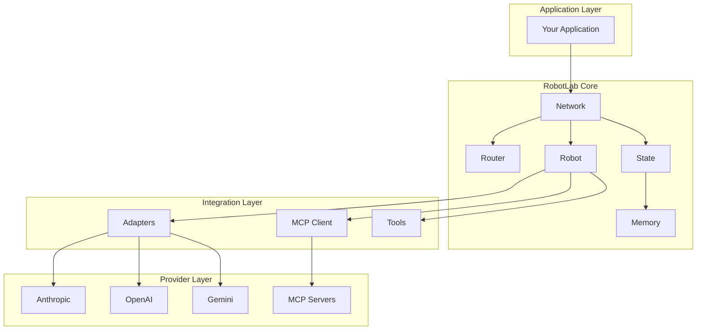

# Architecture Overview

RobotLab is designed around a few core architectural principles that enable flexible, composable AI workflows.

## Design Philosophy

### 1. Separation of Concerns

Each component has a single, well-defined responsibility:

- **Robot**: Encapsulates LLM interaction logic and personality
- **Network**: Orchestrates robot execution and routing
- **State**: Manages conversation and workflow data
- **Tool**: Provides external capabilities to robots

### 2. Composability

Components are designed to be mixed and matched:

- Robots can be reused across multiple networks
- Tools can be shared or robot-specific
- Networks can be nested or chained
- State can be persisted and restored

### 3. Provider Agnostic

RobotLab abstracts away LLM provider differences:

- Unified message format across providers
- Consistent tool calling interface
- Automatic provider detection from model names
- Easy switching between providers

## System Architecture



## Core Components

| Component | Description | Documentation |
|-----------|-------------|---------------|
| **Robot** | LLM-powered agent with personality and tools | [Core Concepts](core-concepts.md) |
| **Network** | Orchestrates multiple robots | [Network Orchestration](network-orchestration.md) |
| **State** | Conversation and workflow data | [State Management](state-management.md) |
| **Router** | Determines robot execution order | [Network Orchestration](network-orchestration.md) |
| **Memory** | Shared key-value store | [State Management](state-management.md) |
| **Adapter** | Provider-specific message conversion | [Message Flow](message-flow.md) |

## Data Flow

1. **Input**: User message enters via State
2. **Routing**: Router selects robot(s) to execute
3. **Execution**: Robot processes message with LLM
4. **Tools**: Robot may call tools during execution
5. **Result**: Robot returns RobotResult
6. **Iteration**: Router checks for next robot
7. **Output**: Final results returned to application

## Key Patterns

### Builder Pattern

Robots and networks are constructed using a fluent DSL:

```ruby
robot = RobotLab.build do
  name "assistant"
  model "claude-sonnet-4"
  template "You are helpful."
end
```

### Strategy Pattern

Routers implement custom selection logic:

```ruby
router = ->(args) {
  # Custom routing strategy
  args.call_count.zero? ? :first_robot : nil
}
```

### Adapter Pattern

Provider adapters normalize LLM interfaces:

```ruby
adapter = Adapters::Registry.for(:anthropic)
messages = adapter.format_messages(robot_lab_messages)
```

## Next Steps

- [Core Concepts](core-concepts.md) - Deep dive into robots and tools
- [Robot Execution](robot-execution.md) - How robots process messages
- [Network Orchestration](network-orchestration.md) - Multi-robot workflows
- [State Management](state-management.md) - Managing conversation state
- [Message Flow](message-flow.md) - How messages move through the system
