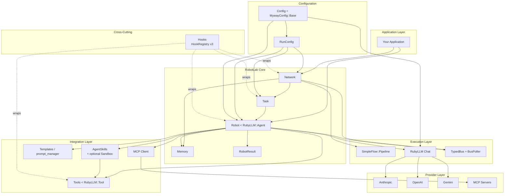
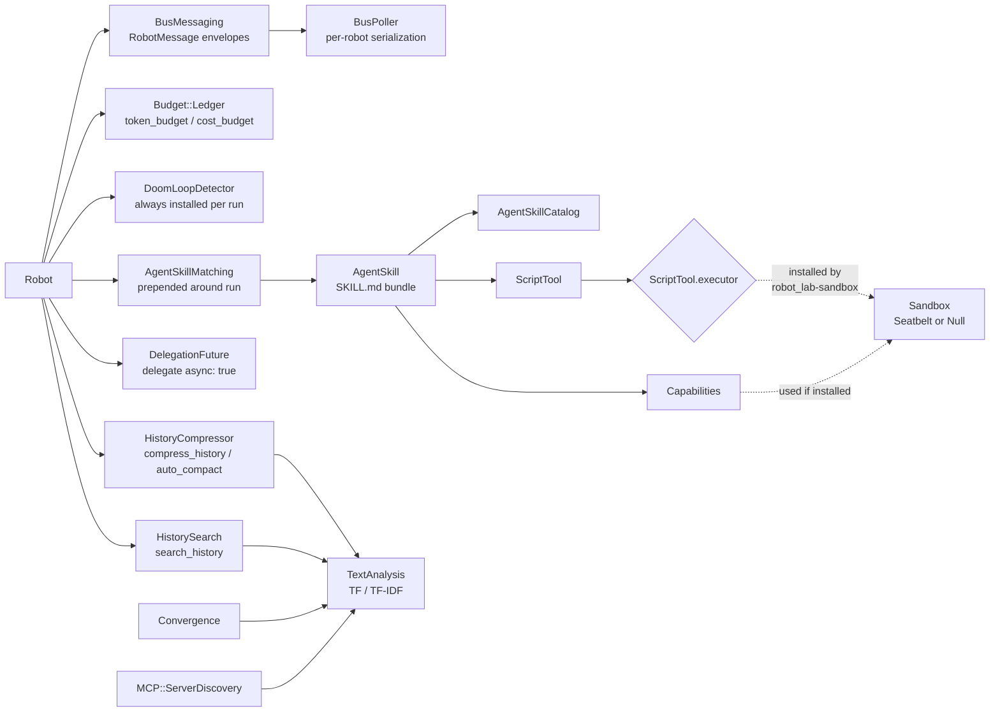

# Architecture Overview

RobotLab is designed around a few core architectural principles that enable flexible, composable AI workflows.

## Design Philosophy

### 1. Separation of Concerns

Each component has a single, well-defined responsibility:

- **Robot**: LLM-powered agent (subclass of `RubyLLM::Agent`) with personality, tools, and memory
- **Network**: Orchestrates robot execution as a DAG pipeline via SimpleFlow
- **Memory**: Reactive key-value store for robot and network data
- **Tool**: Provides external capabilities to robots (inherits from `RubyLLM::Tool`)
- **Task**: Wraps a robot for pipeline execution with per-task configuration

### 2. Composability

Components are designed to be mixed and matched:

- Robots can be used standalone or within networks
- Tools can be shared across robots or scoped per-robot via `local_tools:`
- Networks define DAG pipelines with sequential, parallel, and optional execution
- Memory can be standalone (per-robot) or shared (per-network)
- `with_*` methods return `self` for fluent chaining

### 3. Provider Agnostic

RobotLab abstracts away LLM provider differences through RubyLLM:

- Unified interface across Anthropic, OpenAI, Gemini, DeepSeek, Mistral, and others
- Consistent tool calling interface
- Automatic provider detection from model names
- Easy switching between providers via configuration

## System Architecture


```mermaid
graph TB
    subgraph "Application Layer"
        A[Your Application]
    end

    subgraph "RobotLab Core"
        B[Network]
        C[Task]
        D[Robot &lt; RubyLLM::Agent]
        E[Memory]
        F[RobotResult]
    end

    subgraph "Configuration"
        G[Config &lt; MywayConfig::Base]
        R[RunConfig]
    end

    subgraph "Cross-Cutting"
        HK[Hooks<br/>HookRegistry x3]
    end

    subgraph "Integration Layer"
        H[MCP Client]
        I[Tools &lt; RubyLLM::Tool]
        J[Templates / prompt_manager]
        SK[AgentSkills<br/>+ optional Sandbox]
    end

    subgraph "Execution Layer"
        K[SimpleFlow::Pipeline]
        L[RubyLLM Chat]
        TB[TypedBus + BusPoller]
    end

    subgraph "Provider Layer"
        M[Anthropic]
        N[OpenAI]
        O[Gemini]
        P[MCP Servers]
    end

    A --> B
    A --> D
    B --> C
    C --> D
    B --> K
    B --> E
    B --> TB
    D --> E
    D --> L
    D --> TB
    D --> H
    D --> I
    D --> J
    D --> SK
    D --> F
    SK --> I
    G --> R
    R --> B
    R --> C
    R --> D
    G --> D
    G --> L
    HK -.wraps.-> B
    HK -.wraps.-> C
    HK -.wraps.-> D
    HK -.wraps.-> I
    L --> M
    L --> N
    L --> O
    H --> P
```

The dotted `wraps` edges are the hook system: `Hooks.run` brackets every network
run, task, robot run, LLM generation, tool call, compaction, and `learn` call. It
is the framework's extension seam — the extension gems (`robot_lab-audit`,
`robot_lab-durable`, …) attach here rather than subclassing core objects. See the
[Hooks API](../api/hooks.md).

### Robot subsystems

A `Robot` composes several small collaborators, each documented on the
[Support](../api/support.md) and [Skills](../api/skills.md) API pages:


```mermaid
graph LR
    D[Robot]

    D --> BM[BusMessaging<br/>RobotMessage envelopes]
    BM --> BP[BusPoller<br/>per-robot serialization]
    D --> BD[Budget::Ledger<br/>token_budget / cost_budget]
    D --> DL[DoomLoopDetector<br/>always installed per run]
    D --> HC[HistoryCompressor<br/>compress_history / auto_compact]
    D --> DF[DelegationFuture<br/>delegate async: true]
    D --> HS[HistorySearch<br/>search_history]
    D --> ASM[AgentSkillMatching<br/>prepended around run]

    ASM --> AS[AgentSkill<br/>SKILL.md bundle]
    AS --> CAT[AgentSkillCatalog]
    AS --> CAP[Capabilities]
    AS --> ST[ScriptTool]
    ST --> EX{ScriptTool.executor}
    EX -. "installed by<br/>robot_lab-sandbox" .-> SB[Sandbox<br/>Seatbelt or Null]
    CAP -. "used if installed" .-> SB

    HC --> TA[TextAnalysis<br/>TF / TF-IDF]
    HS --> TA
    CV[Convergence] --> TA
    SD[MCP::ServerDiscovery] --> TA
```

`TextAnalysis` is the shared floor under every similarity feature — history
compression, history search, convergence detection, and MCP server discovery all
route through it, which is why they share the one optional `classifier`
dependency.

## Core Components

| Component | Description | Documentation |
|-----------|-------------|---------------|
| **Robot** | LLM agent (subclass of `RubyLLM::Agent`) with template-based prompts, tools, and memory | [Core Concepts](core-concepts.md) |
| **Network** | Orchestrates multiple robots as a SimpleFlow pipeline | [Network Orchestration](network-orchestration.md) |
| **Memory** | Reactive key-value store with pub/sub and blocking reads | [Memory Management](state-management.md) |
| **Task** | Wraps a robot for pipeline execution with per-task config | [Network Orchestration](network-orchestration.md) |
| **RobotResult** | Captures LLM output, tool calls, and metadata from a run | [Message Flow](message-flow.md) |
| **RunConfig** | Per-run settings object (LLM fields, `mcp`/`tools`, callbacks, infrastructure) that cascades global → network → task → robot | [Core Concepts](core-concepts.md) |
| **Config** | MywayConfig-based global configuration with env var and file support | [Configuration](#configuration) |
| **Hook** | Handler base class for the seven hook families — the framework's extension seam | [Hooks API](../api/hooks.md) |
| **AgentSkill** | A `SKILL.md` bundle whose instructions and `scripts/` become prompt text and tools | [Skills API](../api/skills.md) |
| **Sandbox** | Opt-in OS-level confinement (macOS Seatbelt) for skill scripts, derived from `Capabilities`; ships in the optional `robot_lab-sandbox` gem, not core | [Skills API](../api/skills.md) |
| **RobotMessage** | Immutable envelope for TypedBus inter-robot messaging, serialized per robot by `BusPoller` | [Support API](../api/support.md) |
| **Budget::Ledger** | Thread-safe reserve/reconcile ledger behind `token_budget` / `cost_budget` | [Support API](../api/support.md) |

## Configuration

Global configuration is a MywayConfig subclass (`Config < MywayConfig::Base`). It is loaded from multiple sources in priority order:

1. **Bundled defaults** (`lib/robot_lab/config/defaults.yml`)
2. **Environment overrides** (development, test, production)
3. **XDG user config** (`~/.config/robot_lab/robot_lab.yml` — the filename repeats the app name; `config.yml` is never read)
4. **Project config** (`./config/robot_lab.yml` — the only file with an ERB pass)
5. **Environment variables** (`ROBOT_LAB_*` prefix, double underscore for nesting)
6. **Constructor params**

Top-level wrappers behave differently per file. In the **XDG user config**, a section named for the current environment is honoured — the loader looks for `parsed.key?(env)` (`Anyway::Settings.current_environment`, else `RAILS_ENV`, else `RACK_ENV`, else `"development"`) and falls back to the root when absent — so both `development:` and a flat file work there. A `defaults:` wrapper is not an environment name, so it is ignored. The **project config** must be flat outside Rails (all wrappers ignored); under Rails, `anyway_config` sets `current_environment` to `Rails.env` and the project file becomes environmental, so a flat file is ignored and keys must sit under `development:` / `test:` / `production:`. See [Core Concepts](core-concepts.md#configuration) for details.

```ruby
# Access configuration
RobotLab.config.ruby_llm.model            #=> "claude-sonnet-4"
RobotLab.config.ruby_llm.request_timeout  #=> 120

# Block form (yields the same Config object)
RobotLab.configure do |c|
  c.logger = Logger.new($stdout)
end
```

## Data Flow

1. **Input**: User calls `robot.run("message")` or `network.run(message: "...")`
2. **Memory**: Robot resolves active memory (standalone or network-shared)
3. **MCP**: Robot resolves MCP servers from hierarchical config and connects clients. `run` defaults to `mcp: :none`, so a plain `run` connects nothing
4. **Tools**: Robot resolves and filters tools from hierarchical config. `run` defaults to `tools: :none`, so a plain `run` sends the LLM zero tools; pass `tools: :inherit` to send the robot's attached tools
5. **Execution**: Robot delegates to `Agent#ask` which calls `@chat.ask` on RubyLLM
6. **Tool Loop**: LLM may invoke tools; RubyLLM handles the tool call/result loop
7. **Result**: Robot builds and returns a `RobotResult`
8. **Network**: If in a network, result flows to dependent tasks via SimpleFlow

## Key Patterns

### Factory Methods

Robots and networks are created via factory methods on the `RobotLab` module:

```ruby
robot = RobotLab.build(
  name: "assistant",
  template: :assistant,
  context: { tone: "friendly" }
)

network = RobotLab.create_network(name: "pipeline") do
  task :analyst, analyst_robot, depends_on: :none
  task :writer, writer_robot, depends_on: [:analyst]
end
```

### Fluent Chaining

`with_*` methods on Robot delegate to the underlying `@chat` and return `self`:

```ruby
robot = RobotLab.build(name: "bot")
  .with_instructions("Be concise.")
  .with_temperature(0.3)
  .with_model("gpt-4o")
```

### Hierarchical Configuration

Tools and MCP servers use hierarchical resolution: `run()/task > robot build-time > network > global config`. Values can be `:none`, `:inherit`, or an explicit array (which filters the already-attached tools by name — entries must match how the tool was attached, class or instance). `run()` defaults both to `:none`, so the runtime level is an explicit "send nothing" unless you override it.

### SimpleFlow Pipeline

Networks are thin wrappers around `SimpleFlow::Pipeline`. Each robot is wrapped in a `Task` that implements the `call(result)` interface. Tasks define dependencies (`:none`, `[:task_names]`, or `:optional`) to control execution order.

## Next Steps

- [Core Concepts](core-concepts.md) - Deep dive into robots and tools
- [Robot Execution](robot-execution.md) - How robots process messages
- [Network Orchestration](network-orchestration.md) - Multi-robot workflows
- [Memory Management](state-management.md) - Managing memory and reactive features
- [Message Flow](message-flow.md) - How messages move through the system
