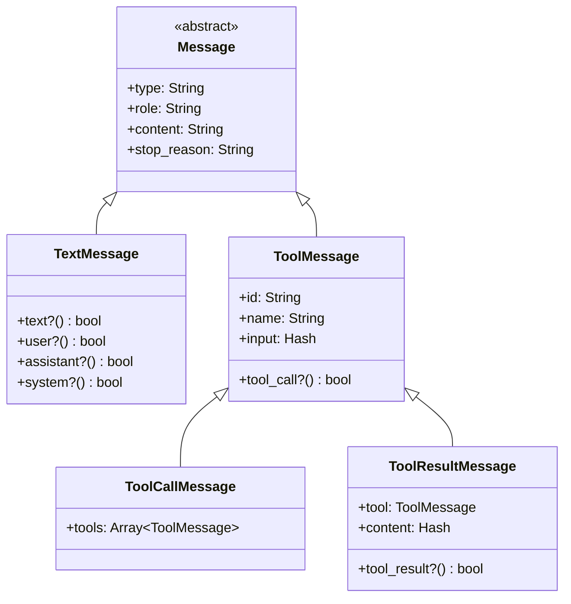
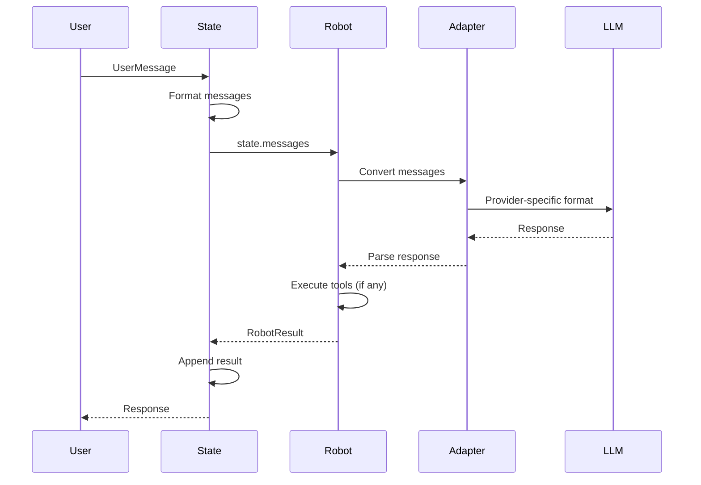

# Message Flow

This page explains how messages move through RobotLab, from user input to LLM response.

## Message Types

RobotLab uses four primary message types:



### TextMessage

Regular text content from users or assistants:

```ruby
TextMessage.new(
  role: "user",
  content: "What's the weather in Paris?"
)

TextMessage.new(
  role: "assistant",
  content: "The weather in Paris is sunny and 22°C.",
  stop_reason: "stop"
)
```

### ToolMessage

Base class for tool-related messages:

```ruby
ToolMessage.new(
  id: "tool_123",
  name: "get_weather",
  input: { location: "Paris" }
)
```

### ToolCallMessage

LLM's request to execute tools:

```ruby
ToolCallMessage.new(
  role: "assistant",
  content: nil,
  stop_reason: "tool",
  tools: [
    ToolMessage.new(id: "call_1", name: "get_weather", input: { location: "Paris" })
  ]
)
```

### ToolResultMessage

Result from tool execution:

```ruby
ToolResultMessage.new(
  tool: tool_message,
  content: { data: { temp: 22, condition: "sunny" } }
)
```

## Message Flow Diagram



## Adapter Layer

Adapters convert between RobotLab's message format and provider-specific formats.

### Anthropic Adapter

```ruby
# RobotLab format
messages = [
  TextMessage.new(role: "user", content: "Hello"),
  TextMessage.new(role: "assistant", content: "Hi there!")
]

# Converted to Anthropic format
[
  { role: "user", content: "Hello" },
  { role: "assistant", content: "Hi there!" }
]
```

### System Message Handling

System messages are handled specially:

```ruby
# RobotLab
messages = [
  TextMessage.new(role: "system", content: "You are helpful."),
  TextMessage.new(role: "user", content: "Hello")
]

# Anthropic: system extracted separately
# OpenAI: system message stays in array
# Gemini: converted to context
```

### Tool Message Conversion

Tool calls are provider-specific:

=== "Anthropic"

    ```ruby
    {
      type: "tool_use",
      id: "tool_123",
      name: "get_weather",
      input: { location: "Paris" }
    }
    ```

=== "OpenAI"

    ```ruby
    {
      type: "function",
      function: {
        name: "get_weather",
        arguments: '{"location":"Paris"}'
      }
    }
    ```

## Conversation Building

### Initial State

```ruby
state = RobotLab.create_state(
  message: "What's the weather?",
  data: { location: "Paris" }
)

state.messages
# => [TextMessage(role: "user", content: "What's the weather?")]
```

### After Robot Execution

```ruby
result = robot.run(state: state, network: network)
state.append_result(result)

state.messages
# => [
#   TextMessage(role: "user", content: "What's the weather?"),
#   TextMessage(role: "assistant", content: "The weather is sunny.")
# ]
```

### With Tool Calls

```ruby
state.messages
# => [
#   TextMessage(role: "user", content: "What's the weather?"),
#   ToolCallMessage(tools: [ToolMessage(name: "get_weather", ...)]),
#   ToolResultMessage(content: { temp: 22 }),
#   TextMessage(role: "assistant", content: "It's 22°C and sunny.")
# ]
```

## Format History

The `format_history` method prepares messages for LLM:

```ruby
# Includes results from previous robots
formatted = state.format_history

# Returns alternating user/assistant messages
# with tool calls/results properly interleaved
```

## Message Predicates

Check message types easily:

```ruby
message.text?         # Is it a TextMessage?
message.tool_call?    # Is it a ToolCallMessage?
message.tool_result?  # Is it a ToolResultMessage?

message.user?         # Is role "user"?
message.assistant?    # Is role "assistant"?
message.system?       # Is role "system"?

message.stopped?      # Is stop_reason "stop"?
message.tool_stop?    # Is stop_reason "tool"?
```

## Creating Messages

### From Strings

```ruby
TextMessage.new(role: "user", content: "Hello")
```

### From Hashes

```ruby
Message.from_hash(
  type: "text",
  role: "user",
  content: "Hello"
)
```

### From UserMessage

```ruby
user_msg = UserMessage.new("Hello", thread_id: "123")
text_msg = user_msg.to_message
# => TextMessage(role: "user", content: "Hello")
```

## Serialization

Messages can be serialized:

```ruby
# To hash
hash = message.to_h
# => { type: "text", role: "user", content: "Hello" }

# To JSON
json = message.to_json
# => '{"type":"text","role":"user","content":"Hello"}'

# From hash
message = Message.from_hash(hash)
```

## Provider Registry

The adapter registry maps providers to adapters:

```ruby
Adapters::Registry.for(:anthropic)  # => Adapters::Anthropic
Adapters::Registry.for(:openai)     # => Adapters::OpenAI
Adapters::Registry.for(:gemini)     # => Adapters::Gemini

# Aliases
Adapters::Registry.for(:azure_openai)  # => Adapters::OpenAI
Adapters::Registry.for(:bedrock)       # => Adapters::Anthropic
```

## Next Steps

- [Building Robots](../guides/building-robots.md) - Creating custom robots
- [Using Tools](../guides/using-tools.md) - Tool message handling
- [API Reference: Messages](../api/messages/index.md) - Detailed message API
