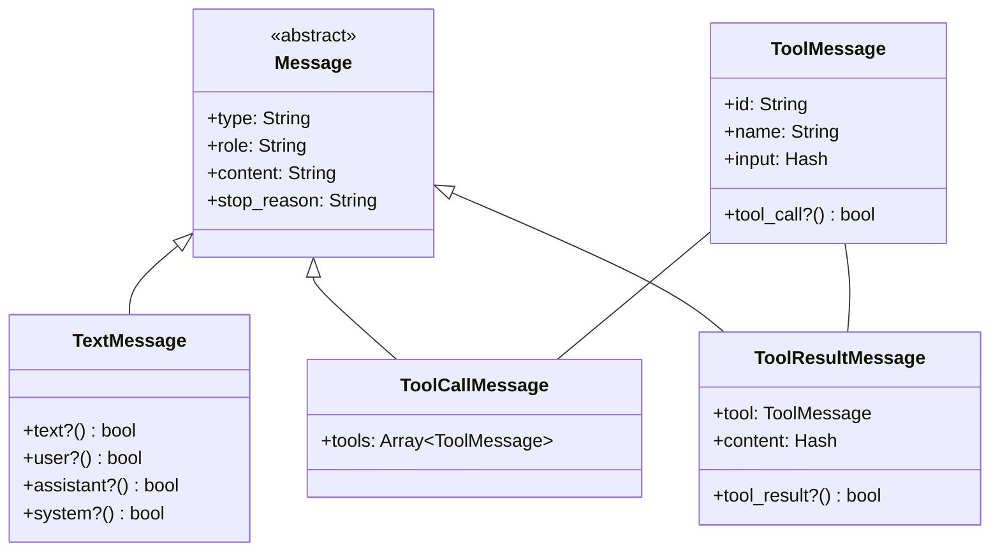
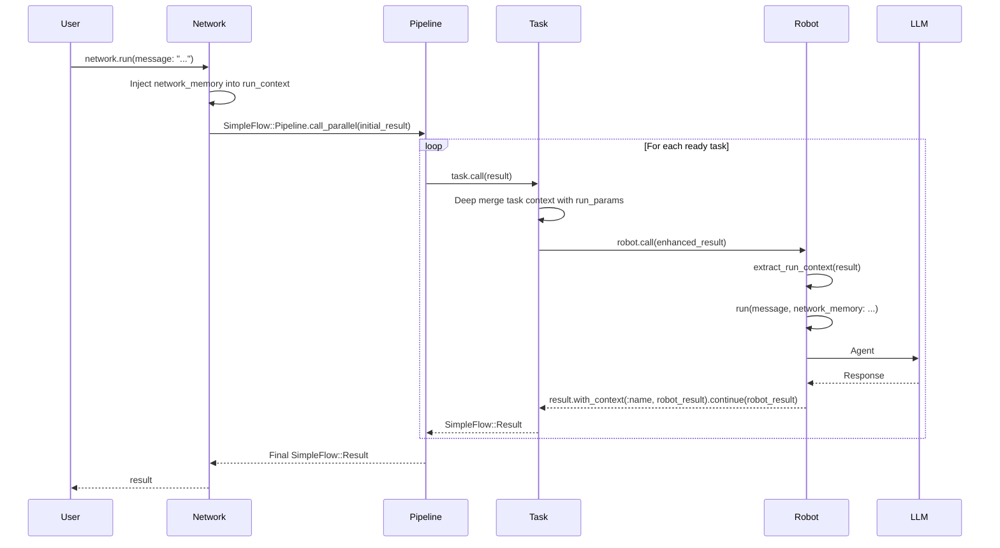

# Message Flow

This page explains how messages move through RobotLab, from user input to LLM response.

## Message Types

RobotLab uses four primary message types:


```mermaid
classDiagram
    class Message {
        <<abstract>>
        +type: String
        +role: String
        +content: String
        +stop_reason: String
    }

    class TextMessage {
        +text?() bool
        +user?() bool
        +assistant?() bool
        +system?() bool
    }

    class ToolMessage {
        +id: String
        +name: String
        +input: Hash
        +tool_call?() bool
    }

    class ToolCallMessage {
        +tools: Array~ToolMessage~
    }

    class ToolResultMessage {
        +tool: ToolMessage
        +content: Hash
        +tool_result?() bool
    }

    Message <|-- TextMessage
    Message <|-- ToolCallMessage
    Message <|-- ToolResultMessage
    ToolMessage -- ToolCallMessage
    ToolMessage -- ToolResultMessage
```

### TextMessage

Regular text content from users or assistants:

```ruby
TextMessage.new(
  role: "user",
  content: "What's the weather in Paris?"
)

TextMessage.new(
  role: "assistant",
  content: "The weather in Paris is sunny and 22 degrees C.",
  stop_reason: "stop"
)
```

### ToolMessage

Represents a tool invocation with its parameters:

```ruby
ToolMessage.new(
  id: "tool_123",
  name: "get_weather",
  input: { location: "Paris" }
)
```

### ToolCallMessage

LLM's request to execute one or more tools:

```ruby
ToolCallMessage.new(
  role: "assistant",
  content: nil,
  stop_reason: "tool",
  tools: [
    ToolMessage.new(id: "call_1", name: "get_weather", input: { location: "Paris" })
  ]
)
```

### ToolResultMessage

Result from tool execution:

```ruby
ToolResultMessage.new(
  tool: tool_message,
  content: { data: { temp: 22, condition: "sunny" } }
)
```

## Message Flow: Standalone Robot

The primary execution path is `robot.run("message")`:


```mermaid
sequenceDiagram
    participant User
    participant Robot
    participant Memory
    participant MCP
    participant Tools
    participant Agent
    participant Chat
    participant LLM

    User->>Robot: robot.run("message")
    Robot->>Memory: resolve_active_memory
    Memory-->>Robot: active memory

    Robot->>MCP: resolve_mcp_hierarchy
    MCP-->>Robot: resolved MCP config
    Robot->>Robot: ensure_mcp_clients

    Robot->>Tools: resolve_tools_hierarchy
    Tools-->>Robot: filtered tools
    Robot->>Chat: @chat.with_tools(...)

    Robot->>Agent: ask("message")
    Agent->>Chat: @chat.ask("message")
    Chat->>LLM: Provider API call

    loop Tool Loop (handled by RubyLLM)
        LLM-->>Chat: Tool call response
        Chat->>Tools: Execute tool
        Tools-->>Chat: Tool result
        Chat->>LLM: Send tool result
    end

    LLM-->>Chat: Final response
    Chat-->>Agent: RubyLLM::Response
    Agent-->>Robot: response

    Robot->>Robot: build_result(response, memory)
    Robot-->>User: RobotResult
```

### Step-by-Step

1. **`robot.run("message")`**: Entry point. Accepts a positional string argument.

2. **Resolve Memory**: Determines which memory to use:
   - `network_memory` if provided (network execution)
   - `network.memory` if in a network context
   - `robot.memory` (standalone, the default)

3. **Merge Runtime Memory**: If a `memory:` keyword argument is passed, it is merged into the active memory.

4. **Set Current Writer**: Sets `memory.current_writer = robot.name` so subscription callbacks know which robot wrote a value.

5. **Resolve MCP Hierarchy**: Resolves MCP server configuration through the hierarchy: `runtime > robot build > network > global config`.

6. **Ensure MCP Clients**: Initializes or updates MCP client connections. Discovers tools from connected MCP servers.

7. **Resolve Tools Hierarchy**: Resolves which tools are available through the same hierarchy.

8. **Filter Tools**: Applies the resolved tool list to `@chat.with_tools(...)`.

9. **Agent#ask**: Delegates to the parent class `RubyLLM::Agent#ask`, which calls `@chat.ask(message)`.

10. **LLM Interaction**: RubyLLM handles the provider-specific API call, including the tool call/result loop.

11. **Build Result**: Wraps the LLM response in a `RobotResult` containing output messages, tool calls, and metadata.

12. **Return**: Returns the `RobotResult` to the caller.

## Message Flow: Network Execution

When running through a network, the flow adds pipeline orchestration:


```mermaid
sequenceDiagram
    participant User
    participant Network
    participant Pipeline
    participant Task
    participant Robot
    participant LLM

    User->>Network: network.run(message: "...")
    Network->>Network: Inject network_memory into run_context
    Network->>Pipeline: SimpleFlow::Pipeline.call_parallel(initial_result)

    loop For each ready task
        Pipeline->>Task: task.call(result)
        Task->>Task: Deep merge task context with run_params
        Task->>Robot: robot.call(enhanced_result)
        Robot->>Robot: extract_run_context(result)
        Robot->>Robot: run(message, network_memory: ...)
        Robot->>LLM: Agent#ask -> @chat.ask
        LLM-->>Robot: Response
        Robot-->>Task: result.with_context(:name, robot_result).continue(robot_result)
        Task-->>Pipeline: SimpleFlow::Result
    end

    Pipeline-->>Network: Final SimpleFlow::Result
    Network-->>User: result
```

### Key Points

- **Network creates initial result**: `SimpleFlow::Result.new(run_context, context: { run_params: run_context })`
- **Task wraps robot**: Each `Task` deep-merges its own context with the run params before delegating to the robot
- **Robot extracts context**: `extract_run_context(result)` pulls the message, MCP, tools, and memory from the SimpleFlow result
- **Shared memory**: All robots use `network.memory` during network execution
- **Result accumulation**: Each task stores its `RobotResult` in `result.context[:task_name]`

## RobotResult

The return value of `robot.run("message")`:

```ruby
result = robot.run("What is Ruby?")

result.last_text_content  #=> "Ruby is a dynamic programming language..."
result.has_tool_calls?    #=> false
result.robot_name         #=> "assistant"
result.output             #=> [TextMessage(role: "assistant", content: "...")]
result.tool_calls         #=> []
result.stop_reason        #=> "stop"
result.created_at         #=> Time
result.id                 #=> "uuid"
result.checksum           #=> "sha256-hex"
```

### Result Serialization

```ruby
# Export for persistence (excludes debug fields)
hash = result.export

# Full hash including debug fields
hash = result.to_h

# JSON
json = result.to_json

# Reconstruct from hash
result = RobotResult.from_hash(hash)
```

## Message Predicates

Check message types:

```ruby
message.text?         # Is it a TextMessage?
message.tool_call?    # Is it a ToolCallMessage?
message.tool_result?  # Is it a ToolResultMessage?

message.user?         # Is role "user"?
message.assistant?    # Is role "assistant"?
message.system?       # Is role "system"?

message.stopped?      # Is stop_reason "stop"?
message.tool_stop?    # Is stop_reason "tool"?
```

## Creating Messages

### From Strings

```ruby
TextMessage.new(role: "user", content: "Hello")
```

### From Hashes

```ruby
Message.from_hash(
  type: "text",
  role: "user",
  content: "Hello"
)
```

## Serialization

Messages can be serialized:

```ruby
# To hash
hash = message.to_h
#=> { type: "text", role: "user", content: "Hello" }

# To JSON
json = message.to_json

# From hash
message = Message.from_hash(hash)
```

## Template Resolution

When a robot has a template, it is resolved at build time via prompt_manager:

```ruby
robot = RobotLab.build(
  name: "helper",
  template: :helper,
  context: { tone: "friendly" }
)
```

The template resolution process:
1. `PM.parse(:helper)` loads the template file from the configured prompts directory
2. YAML front matter is extracted and applied to the chat (model, temperature, etc.)
3. The template body is rendered with the provided context
4. The rendered text is set as system instructions via `@chat.with_instructions(rendered)`

If both `template:` and `system_prompt:` are provided, the template is applied first, then the system prompt is appended via a second `@chat.with_instructions` call.

## Next Steps

- [Memory Management](state-management.md) - How memory stores conversation data
- [Network Orchestration](network-orchestration.md) - Multi-robot pipeline execution
