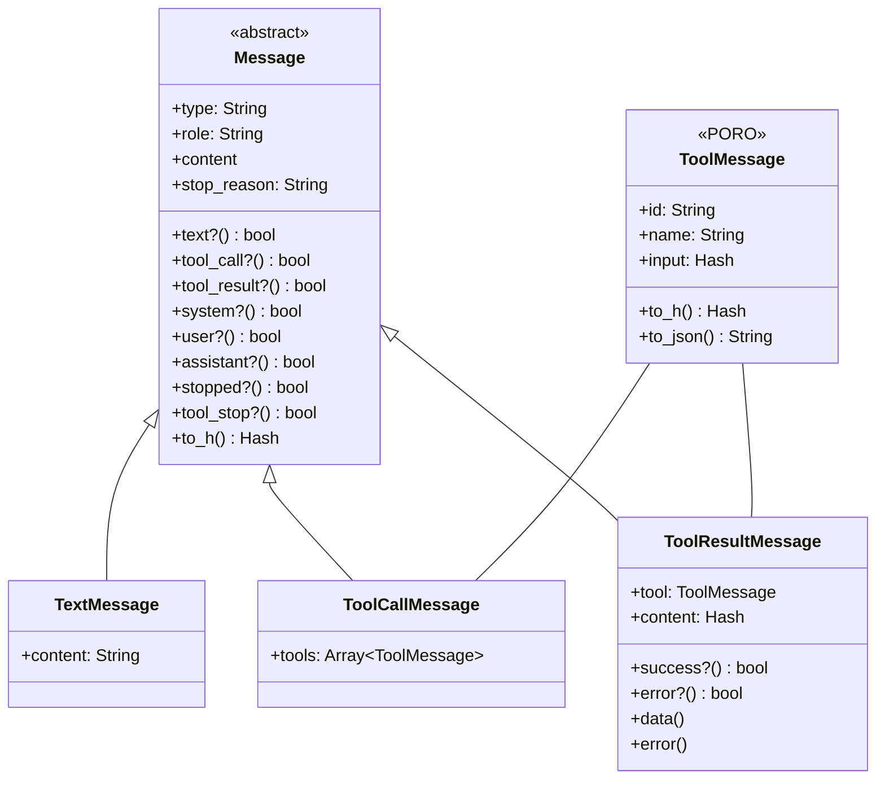
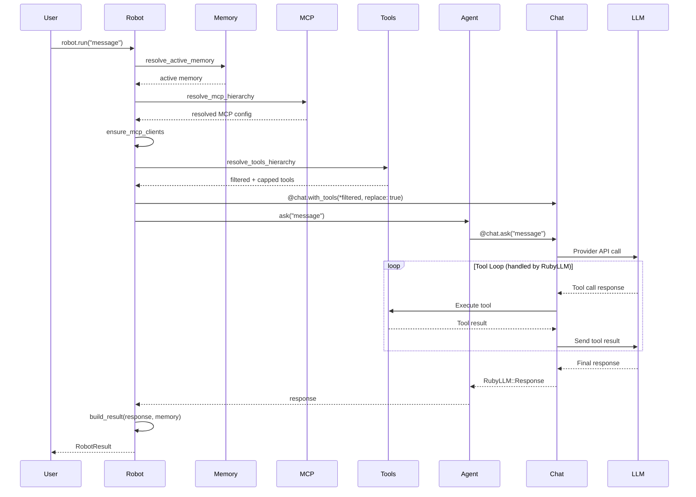
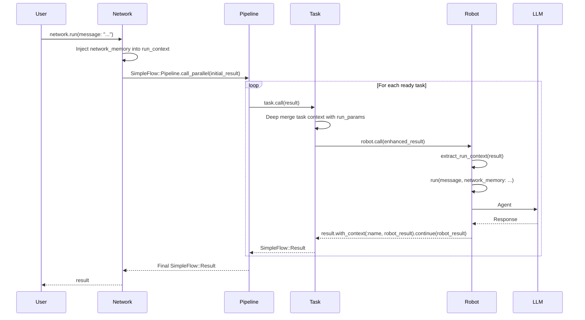

# Message Flow

This page explains how messages move through RobotLab, from user input to LLM response.

## Message Types

`RobotLab::Message` is the abstract base for three conversation message classes. `ToolMessage` is a plain value object that they reference, and two further message classes — `UserMessage` and `RobotMessage` — live outside the hierarchy entirely:


```mermaid
classDiagram
    class Message {
        <<abstract>>
        +type: String
        +role: String
        +content
        +stop_reason: String
        +text?() bool
        +tool_call?() bool
        +tool_result?() bool
        +system?() bool
        +user?() bool
        +assistant?() bool
        +stopped?() bool
        +tool_stop?() bool
        +to_h() Hash
    }

    class TextMessage {
        +content: String
    }

    class ToolMessage {
        <<PORO>>
        +id: String
        +name: String
        +input: Hash
        +to_h() Hash
        +to_json() String
    }

    class ToolCallMessage {
        +tools: Array~ToolMessage~
    }

    class ToolResultMessage {
        +tool: ToolMessage
        +content: Hash
        +success?() bool
        +error?() bool
        +data()
        +error()
    }

    Message <|-- TextMessage
    Message <|-- ToolCallMessage
    Message <|-- ToolResultMessage
    ToolMessage -- ToolCallMessage
    ToolMessage -- ToolResultMessage
```

`ToolMessage` does **not** inherit from `Message` — its superclass is `Object`. It has no `type`, `role`, or predicate methods; only `id`, `name`, `input`, `to_h`, and `to_json`. The `tool_call?` predicate lives on `Message`, so it answers for `ToolCallMessage`, not for `ToolMessage`.

The two classes outside the hierarchy:

| Class | Role |
|-------|------|
| `UserMessage` | Envelope for user input carrying `session_id`, an extra `system_prompt`, `metadata`, `id`, `created_at`. `UserMessage.from` normalizes a String/Hash/TextMessage; `#to_message` converts to a `TextMessage` |
| `RobotMessage` | Immutable `Data.define(:id, :from, :content, :in_reply_to)` envelope for robot-to-robot traffic on the message bus, with `#key` (`"from:id"`) and `#reply?` |

### TextMessage

Regular text content from users or assistants:

```ruby
TextMessage.new(
  role: "user",
  content: "What's the weather in Paris?"
)

TextMessage.new(
  role: "assistant",
  content: "The weather in Paris is sunny and 22 degrees C.",
  stop_reason: "stop"
)
```

### ToolMessage

A standalone value object (not a `Message`) representing a tool invocation and its parameters:

```ruby
tool = ToolMessage.new(
  id: "tool_123",
  name: "get_weather",
  input: { location: "Paris" }
)

tool.to_h  #=> { type: "tool", id: "tool_123", name: "get_weather", input: { location: "Paris" } }
```

Note that the `type: "tool"` key appears only in `to_h`; there is no `type` reader and no predicate methods.

### ToolCallMessage

LLM's request to execute one or more tools:

```ruby
ToolCallMessage.new(
  role: "assistant",
  tools: [
    ToolMessage.new(id: "call_1", name: "get_weather", input: { location: "Paris" })
  ],
  stop_reason: "tool"
)
```

The signature is `initialize(role:, tools:, stop_reason: nil)` — `role` and
`tools` are required and there is **no** `content:` keyword. Passing one raises
`ArgumentError`.

### ToolResultMessage

Result from tool execution:

```ruby
ToolResultMessage.new(
  tool: tool_message,
  content: { data: { temp: 22, condition: "sunny" } }
)
```

## Message Flow: Standalone Robot

The primary execution path is `robot.run("message")`:


```mermaid
sequenceDiagram
    participant User
    participant Robot
    participant Memory
    participant MCP
    participant Tools
    participant Agent
    participant Chat
    participant LLM

    User->>Robot: robot.run("message")
    Robot->>Memory: resolve_active_memory
    Memory-->>Robot: active memory

    Robot->>MCP: resolve_mcp_hierarchy
    MCP-->>Robot: resolved MCP config
    Robot->>Robot: ensure_mcp_clients

    Robot->>Tools: resolve_tools_hierarchy
    Tools-->>Robot: filtered + capped tools
    Robot->>Chat: @chat.with_tools(*filtered, replace: true)

    Robot->>Agent: ask("message")
    Agent->>Chat: @chat.ask("message")
    Chat->>LLM: Provider API call

    loop Tool Loop (handled by RubyLLM)
        LLM-->>Chat: Tool call response
        Chat->>Tools: Execute tool
        Tools-->>Chat: Tool result
        Chat->>LLM: Send tool result
    end

    LLM-->>Chat: Final response
    Chat-->>Agent: RubyLLM::Response
    Agent-->>Robot: response

    Robot->>Robot: build_result(response, memory)
    Robot-->>User: RobotResult
```

### Step-by-Step

1. **`robot.run("message")`**: Entry point. Accepts a positional string argument.

2. **Resolve Memory**: Determines which memory to use:
   - `network_memory` if provided (network execution)
   - `network.memory` if in a network context
   - `robot.memory` (standalone, the default)

3. **Merge Runtime Memory**: If a `memory:` keyword argument is passed, it is merged into the active memory.

4. **Set Current Writer**: Sets `memory.current_writer = robot.name` so subscription callbacks know which robot wrote a value.

5. **Resolve MCP Hierarchy**: Resolves MCP server configuration through the hierarchy: `runtime (run/task) > robot build-time > network > global config`. `run` defaults `mcp:` to `:none`, so nothing is connected unless you pass `mcp: :inherit` or an explicit list.

6. **Ensure MCP Clients**: Initializes or updates MCP client connections and discovers tools from them. Connection failures are logged and recorded in `failed_mcp_server_names`, never raised.

7. **Resolve Tools Hierarchy**: Resolves which tools are available through the same hierarchy. `run` defaults `tools:` to `:none`, which means "send zero tools this turn" — pass `tools: :inherit` to send the robot's attached tools.

8. **Filter Tools**: Filters by the resolved allowlist, clamps to `max_tools` (128 by default), and applies the set with `@chat.with_tools(*filtered, replace: true)` so the persistent chat holds exactly this turn's tools.

9. **Agent#ask**: Delegates to the parent class `RubyLLM::Agent#ask`, which calls `@chat.ask(message)`.

10. **LLM Interaction**: RubyLLM handles the provider-specific API call, including the tool call/result loop.

11. **Build Result**: Wraps the LLM response in a `RobotResult` containing output messages, tool calls, and metadata.

12. **Return**: Returns the `RobotResult` to the caller.

## Message Flow: Network Execution

When running through a network, the flow adds pipeline orchestration:


```mermaid
sequenceDiagram
    participant User
    participant Network
    participant Pipeline
    participant Task
    participant Robot
    participant LLM

    User->>Network: network.run(message: "...")
    Network->>Network: Inject network_memory into run_context
    Network->>Pipeline: SimpleFlow::Pipeline.call_parallel(initial_result)

    loop For each ready task
        Pipeline->>Task: task.call(result)
        Task->>Task: Deep merge task context with run_params
        Task->>Robot: robot.call(enhanced_result)
        Robot->>Robot: extract_run_context(result)
        Robot->>Robot: run(message, network_memory: ...)
        Robot->>LLM: Agent#ask -> @chat.ask
        LLM-->>Robot: Response
        Robot-->>Task: result.with_context(:name, robot_result).continue(robot_result)
        Task-->>Pipeline: SimpleFlow::Result
    end

    Pipeline-->>Network: Final SimpleFlow::Result
    Network-->>User: result
```

### Key Points

- **Network creates initial result**: `SimpleFlow::Result.new(run_context, context: { run_params: run_context })`, after injecting `network_memory`, `network`, and (when non-empty) `network_config` into the run context, all wrapped in the `:network_run` hook
- **Task wraps robot**: Each `Task` runs the `:task` hook and deep-merges its own context, `mcp`, `tools`, `memory`, and `config` into the run params before delegating to the robot
- **Robot extracts context**: `extract_run_context(result)` pulls the message, MCP, tools, memory, network, and task out of the SimpleFlow result and passes them to `run` as keyword arguments
- **Shared memory**: All robots use `network.memory` during network execution
- **Result accumulation**: Each robot stores its `RobotResult` in `result.context[:robot_name]` — the key comes from `@name.to_sym` in `Robot#call`, so it is the **robot's** name, not the task name. They match only when the two are spelled the same way

## RobotResult

The return value of `robot.run("message")`:

```ruby
result = robot.run("What is Ruby?")

result.last_text_content  #=> "Ruby is a dynamic programming language..."
result.reply              #=> alias for last_text_content
result.has_tool_calls?    #=> false
result.robot_name         #=> "assistant"
result.output             #=> [TextMessage(role: "assistant", content: "...")]
result.tool_calls         #=> []
result.stop_reason        #=> nil (always — see below)
result.created_at         #=> Time
result.id                 #=> "uuid"
result.checksum           #=> "sha256-hex"
result.input_tokens       #=> 42
result.output_tokens      #=> 128
result.duration           #=> Float, nil
```

`stop_reason` is always `nil` on a `Robot#run` result: `build_result` reads it as `response.respond_to?(:stop_reason) ? response.stop_reason : nil`, and `RubyLLM::Message` does not define the method. It is consequently dropped from `export`, and `result.stopped?` reduces to `!result.has_tool_calls?`.

`output` always holds exactly one synthesized `TextMessage` built from the final response text — it is not a transcript of the turn, and it never contains `ToolCallMessage` or `ToolResultMessage` entries. `tool_calls` is read off the final assistant message, which carries no tool calls once RubyLLM's tool loop has finished, so it is effectively always empty. To observe tool activity, use the `on_tool_call` / `on_tool_result` callbacks or the tool hooks.

### Result Serialization

```ruby
# Export for persistence (excludes debug fields)
hash = result.export

# Full hash including debug fields
hash = result.to_h

# JSON
json = result.to_json

# Reconstruct from hash
result = RobotResult.from_hash(hash)
```

## Message Predicates

These are defined on `Message`, so every `TextMessage`, `ToolCallMessage`, and `ToolResultMessage` responds to all of them. `ToolMessage` responds to none of them:

```ruby
message.text?         # Is it a TextMessage?
message.tool_call?    # Is it a ToolCallMessage?
message.tool_result?  # Is it a ToolResultMessage?

message.user?         # Is role "user"?
message.assistant?    # Is role "assistant"?
message.system?       # Is role "system"?

message.stopped?      # Is stop_reason "stop"?
message.tool_stop?    # Is stop_reason "tool"?
```

Valid values are constrained at construction: `type` must be one of `text`, `tool_call`, `tool_result`; `role` one of `system`, `user`, `assistant`, `tool_result`; `stop_reason` one of `tool`, `stop`. Anything else raises `ArgumentError`.

## Creating Messages

### From Strings

```ruby
TextMessage.new(role: "user", content: "Hello")
```

### From Hashes

```ruby
Message.from_hash(
  type: "text",
  role: "user",
  content: "Hello"
)
```

## Serialization

Messages can be serialized:

```ruby
# To hash
hash = message.to_h
#=> { type: "text", role: "user", content: "Hello" }

# To JSON
json = message.to_json

# From hash
message = Message.from_hash(hash)
```

## Template Resolution

When a robot has a template, it is resolved at build time via prompt_manager:

```ruby
robot = RobotLab.build(
  name: "helper",
  template: :helper,
  context: { tone: "friendly" }
)
```

The template resolution process:
1. `PM.parse(:helper)` loads the template file from the configured prompts directory
2. Non-LLM front matter (`robot_name`, `description`, `tools`, `mcp`, `skills`) is applied to the robot, filling in only what the constructor did not provide
3. The LLM front-matter keys become a `RunConfig` that the robot's own `@config` merges over — front matter is the base, constructor kwargs win — and `apply_to` dispatches `chat.with_<field>` for each field the chat supports. In practice only `model` and `temperature` reach the chat this way; `top_p`, `top_k`, `max_tokens`, `presence_penalty`, `frequency_penalty`, and `stop` are parsed and silently dropped because `RubyLLM::Chat` defines no `with_` method for them. Set those via constructor kwargs instead
4. The template body is rendered with ERB (`<%= var %>`; `{{ var }}` is not interpolated) and set as system instructions via `@chat.with_instructions(rendered)`

If both `template:` and `system_prompt:` are provided, the system prompt is appended to the rendered template, producing one combined system message — and it is re-appended on every template re-render, so supplying run-time context never silently drops it.

## Next Steps

- [Memory Management](state-management.md) - How memory stores conversation data
- [Network Orchestration](network-orchestration.md) - Multi-robot pipeline execution
