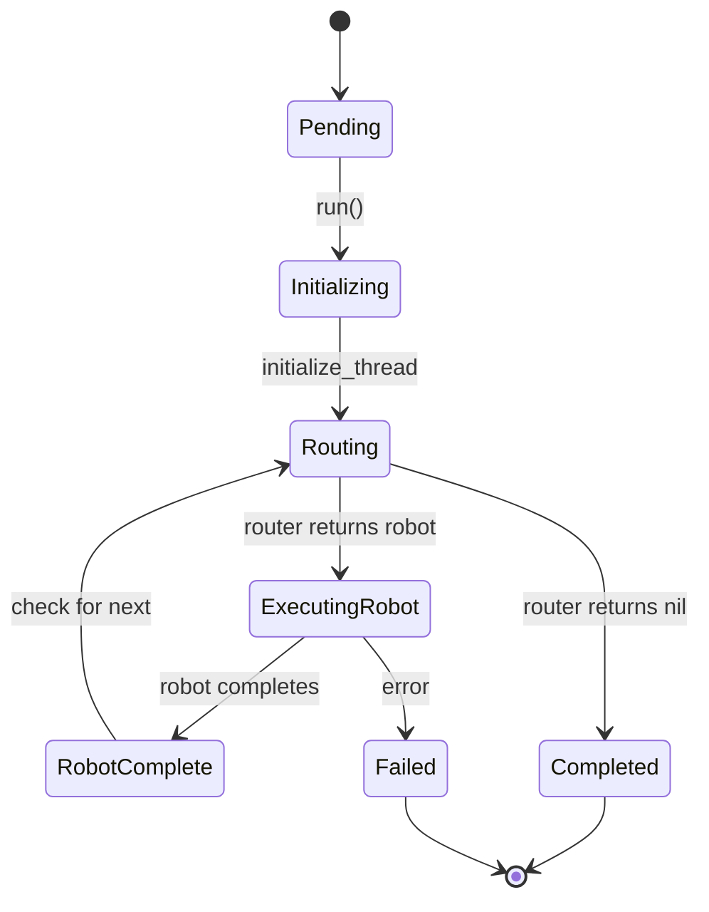

# Network Orchestration

Networks coordinate multiple robots to accomplish complex tasks.

## Network Structure

A network contains:

- **Robots**: Named collection of available robots
- **Router**: Logic to select robots at each step
- **Configuration**: Default model, MCP servers, tools
- **History**: Optional persistence configuration

```ruby
network = RobotLab.create_network do
  name "customer_service"

  # Add robots
  add_robot classifier_robot
  add_robot support_robot
  add_robot billing_robot

  # Configuration
  default_model "claude-sonnet-4"
  max_iterations 10

  # Routing logic
  router ->(args) { ... }

  # History persistence
  history history_config
end
```

## NetworkRun

When you call `network.run(state:)`, a `NetworkRun` is created to manage execution:



### Execution States

| State | Description |
|-------|-------------|
| `pending` | Run created but not started |
| `initializing` | Loading history, setting up |
| `routing` | Consulting router for next robot |
| `executing_robot` | Robot is processing |
| `robot_complete` | Robot finished, checking next |
| `completed` | All robots done |
| `failed` | Error occurred |

## Router

The router is a function that decides which robot runs next:

```ruby
router = ->(args) {
  # args.call_count - How many times router was called
  # args.network    - The NetworkRun
  # args.context    - Run context (message, data, etc.)
  # args.stack      - Robots already scheduled
  # args.last_result - Previous robot's result

  # Return:
  # - Robot instance
  # - Robot name (String/Symbol)
  # - Array of robots (parallel execution)
  # - nil to stop
}
```

### Router Arguments

```ruby
class Router::Args
  attr_reader :context,     # Run context hash
              :network,     # NetworkRun instance
              :stack,       # Array<Robot> scheduled
              :call_count,  # Integer
              :last_result  # RobotResult or nil

  def message
    @context[:message]  # Convenience accessor
  end
end
```

### Common Router Patterns

#### Sequential Execution

Run robots in order:

```ruby
SEQUENCE = [:classifier, :processor, :responder]

router = ->(args) {
  idx = args.call_count
  idx < SEQUENCE.length ? SEQUENCE[idx] : nil
}
```

#### Conditional Routing

Route based on previous results:

```ruby
router = ->(args) {
  case args.call_count
  when 0
    :classifier
  when 1
    classification = args.last_result&.output&.first&.content
    case classification&.strip
    when "BILLING" then :billing_agent
    when "TECHNICAL" then :tech_agent
    else :general_agent
    end
  else
    nil
  end
}
```

#### Single Robot

Run one robot then stop:

```ruby
router = ->(args) {
  args.call_count.zero? ? :assistant : nil
}

# Or simply pass the robot directly
network.run(state: state, router: assistant_robot)
```

## Execution Loop

The main execution loop:

```ruby
def execute(router:, **run_context)
  counter = 0

  loop do
    # Ask router for next robot(s)
    args = build_router_args(last_result)
    next_robots = Router.call(router, args)

    # Stop if no more robots or limit reached
    break if next_robots.nil? || counter >= max_iterations

    # Execute each scheduled robot
    next_robots.each do |robot|
      result = robot.run(
        network: self,
        state: @state,
        **run_context
      )
      @state.append_result(result)
      counter += 1
    end
  end
end
```

## Parallel Execution

Routers can return multiple robots for parallel execution:

```ruby
router = ->(args) {
  if args.call_count.zero?
    [:sentiment_analyzer, :entity_extractor, :summarizer]
  else
    nil
  end
}
```

!!! note "Future Feature"
    Full parallel execution via SimpleFlow is planned but currently executes sequentially.

## History Integration

Networks can persist conversation history:

```ruby
network = RobotLab.create_network do
  history History::Config.new(
    create_thread: ->(state:, input:, **) {
      thread = Thread.create!(input: input.to_s)
      { thread_id: thread.id }
    },
    get: ->(thread_id:, **) {
      Result.where(thread_id: thread_id).map(&:to_robot_result)
    },
    append_results: ->(thread_id:, new_results:, **) {
      new_results.each { |r| Result.create!(thread_id: thread_id, data: r.to_h) }
    }
  )
end
```

### History Flow

1. **Create Thread**: On first run, create persistent thread
2. **Load History**: Load existing results into state
3. **Execute**: Run robots normally
4. **Save Results**: Persist new results to storage

## State Sharing

Robots in a network share state:

```ruby
# First robot stores data
state.data[:classification] = "billing"
state.memory.remember("user_intent", "refund")

# Second robot accesses it
classification = state.data[:classification]
intent = state.memory.recall("user_intent")
```

## Iteration Limits

| Limit | Config | Default |
|-------|--------|---------|
| Max robots per run | `network.max_iterations` | 10 |
| Max tool calls per robot | `config.max_tool_iterations` | 10 |

## NetworkRun Results

After execution:

```ruby
run = network.run(state: state)

run.results      # All results (including loaded history)
run.new_results  # Only results from this run
run.last_result  # Most recent result
run.execution_state  # :completed, :failed, etc.
run.to_h         # Hash representation
```

## Next Steps

- [State Management](state-management.md) - How state flows through networks
- [Creating Networks](../guides/creating-networks.md) - Practical network patterns
- [History Guide](../guides/history.md) - Persisting conversations
