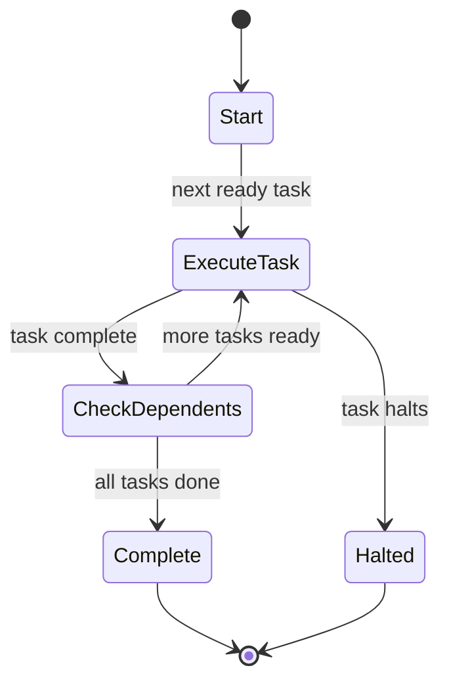

# Network Orchestration

Networks coordinate multiple robots using [SimpleFlow](https://github.com/MadBomber/simple_flow) pipelines for DAG-based execution.

## Network Structure

A network is a thin wrapper around `SimpleFlow::Pipeline`:

- **Pipeline**: DAG-based execution engine
- **Robots**: Named collection of task handlers
- **Tasks**: Define dependencies and execution order

```ruby
network = RobotLab.create_network(name: "customer_service") do
  task :classifier, classifier_robot, depends_on: :none
  task :billing, billing_robot, depends_on: :optional
  task :technical, technical_robot, depends_on: :optional
end
```

## Task Configuration

Tasks can have per-task configuration that's deep-merged with network run params:

```ruby
network = RobotLab.create_network(name: "support") do
  task :classifier, classifier_robot, depends_on: :none
  task :billing, billing_robot,
       context: { department: "billing", escalation_level: 2 },
       tools: [RefundTool],
       depends_on: :optional
  task :technical, technical_robot,
       context: { department: "technical" },
       mcp: [FilesystemServer],
       depends_on: :optional
end
```

## Execution Model



### Task Dependency Types

| Type | Description |
|------|-------------|
| `:none` | No dependencies, runs first |
| `[:task1, :task2]` | Waits for listed tasks |
| `:optional` | Only runs when activated |

## Robot#call Interface

Each robot implements the SimpleFlow step interface:

```ruby
class Robot
  def call(result)
    # Run the LLM
    robot_result = run(**extract_run_context(result))

    # Return new result with context
    result
      .with_context(@name.to_sym, robot_result)
      .continue(robot_result)
  end
end
```

### Result Methods

| Method | Description |
|--------|-------------|
| `continue(value)` | Continue to next tasks |
| `halt(value)` | Stop pipeline execution |
| `with_context(key, val)` | Add data to context |
| `activate(task_name)` | Enable optional task |

## SimpleFlow::Result

The result object flows through the pipeline:

```ruby
result.value      # Current task's output
result.context    # Accumulated context from all tasks
result.halted?    # Whether execution stopped early
result.continued? # Whether execution continues
```

### Context Structure

```ruby
{
  run_params: { message: "...", customer_id: 123 },
  classifier: RobotResult,
  billing: RobotResult,
  # ... other task results
}
```

## Optional Task Activation

Optional tasks don't run automatically. They must be activated:

```ruby
class ClassifierRobot < RobotLab::Robot
  def call(result)
    robot_result = run(**extract_run_context(result))

    new_result = result
      .with_context(@name.to_sym, robot_result)
      .continue(robot_result)

    # Analyze output and activate appropriate task
    category = robot_result.last_text_content.to_s.downcase

    case category
    when /billing/
      new_result.activate(:billing)
    when /technical/
      new_result.activate(:technical)
    else
      new_result.activate(:general)
    end
  end
end
```

## Parallel Execution

Tasks with the same dependencies can run in parallel:

```ruby
network = RobotLab.create_network(name: "analysis", concurrency: :threads) do
  task :fetch, fetcher, depends_on: :none

  # These three run in parallel
  task :sentiment, sentiment_bot, depends_on: [:fetch]
  task :entities, entity_bot, depends_on: [:fetch]
  task :keywords, keyword_bot, depends_on: [:fetch]

  # Waits for all three
  task :merge, merger, depends_on: [:sentiment, :entities, :keywords]
end
```

### Concurrency Modes

| Mode | Description |
|------|-------------|
| `:auto` | SimpleFlow chooses best mode |
| `:threads` | Use Ruby threads |
| `:async` | Use async/fiber |

## Data Flow

1. **Initial Value**: `network.run(**params)` creates initial result
2. **Run Params**: Stored in `result.context[:run_params]`
3. **Task Results**: Each task adds to context
4. **Final Value**: Last task's output becomes `result.value`

```ruby
# Run with context
result = network.run(
  message: "Help with billing",
  customer_id: 123
)

# Access the flow
result.context[:run_params]  # { message: "...", customer_id: 123 }
result.context[:classifier]  # First robot's RobotResult
result.context[:billing]     # Billing robot's RobotResult
result.value                 # Final RobotResult
```

## Visualization

Networks provide visualization methods:

```ruby
# ASCII representation
puts network.visualize

# Mermaid diagram
puts network.to_mermaid

# Execution plan description
puts network.execution_plan
```

## Network Configuration

```ruby
network = RobotLab.create_network(
  name: "support",
  concurrency: :threads  # :auto, :threads, or :async
) do
  task :classifier, classifier, depends_on: :none
  task :handler, handler, depends_on: [:classifier]
end
```

## Next Steps

- [Creating Networks](../guides/creating-networks.md) - Practical patterns
- [Robot Execution](robot-execution.md) - How robots process messages
- [API Reference: Network](../api/core/network.md) - Complete API
