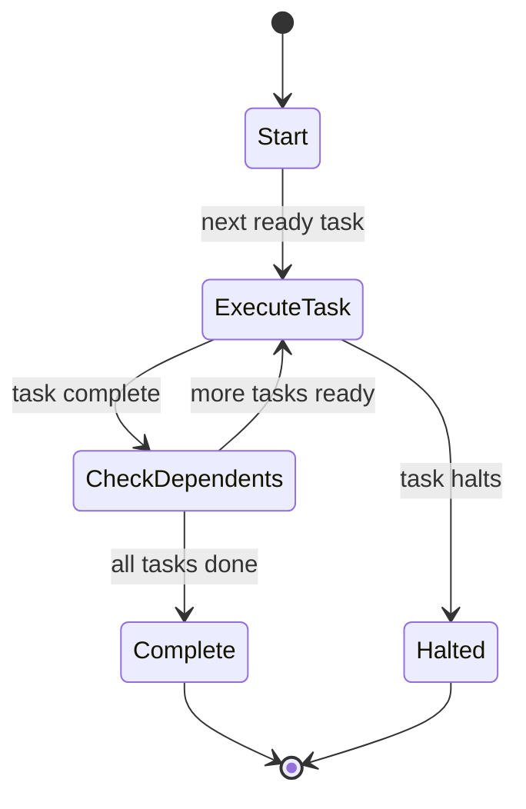

# Network Orchestration

Networks coordinate multiple robots using [SimpleFlow](https://github.com/MadBomber/simple_flow) pipelines for DAG-based execution.

## Network Structure

A network is a thin wrapper around `SimpleFlow::Pipeline`:

- **Pipeline**: DAG-based execution engine
- **Robots**: Named collection of robot instances
- **Tasks**: Wrap robots with per-task configuration and define dependencies
- **Memory**: Shared reactive memory for inter-robot communication

```ruby
network = RobotLab.create_network(name: "customer_service") do
  task :classifier, classifier_robot, depends_on: :none
  task :billing, billing_robot, depends_on: :optional
  task :technical, technical_robot, depends_on: :optional
end
```

## Runnable Protocol

`Network` implements `RobotLab::Runnable` — the same interface `Robot` implements — so code that needs to run "a robot or a network" doesn't have to branch on `is_a?(RobotLab::Network)`. For a `Network`: `crew` returns `robots.values` (pipeline order), `chief` is `crew.first`, `robot_count` is `crew.size`, and `network?` is `true`. `run(message = nil, **opts)` accepts a positional message the same way `Robot#run` does — it's folded into `message:` — while the existing `run(message: ...)` keyword form still works unchanged. See [Runnable Protocol](../architecture/core-concepts.md#runnable-protocol) in Core Concepts for the full comparison against `Robot`.

## Creating Networks

Networks are created via `RobotLab.create_network` with a block DSL:

```ruby
analyst = RobotLab.build(name: "analyst", system_prompt: "Analyze the input.")
writer = RobotLab.build(name: "writer", system_prompt: "Write a report.")
reviewer = RobotLab.build(name: "reviewer", system_prompt: "Review the report.")

network = RobotLab.create_network(name: "pipeline") do
  task :analyst, analyst, depends_on: :none
  task :writer, writer, depends_on: [:analyst]
  task :reviewer, reviewer, depends_on: [:writer]
end

result = network.run(message: "Analyze this quarterly data")
```

## Task Configuration

Tasks can have per-task configuration that is deep-merged with network run params:

```ruby
network = RobotLab.create_network(name: "support") do
  task :classifier, classifier_robot, depends_on: :none
  task :billing, billing_robot,
       context: { department: "billing", escalation_level: 2 },
       tools: [RefundTool],
       depends_on: :optional
  task :technical, technical_robot,
       context: { department: "technical" },
       mcp: [filesystem_server],
       depends_on: :optional
end
```

### Task Parameters

| Parameter | Type | Description |
|-----------|------|-------------|
| `name` | Symbol | Task/step name |
| `robot` | Robot | The robot instance |
| `context` | Hash | Task-specific context (deep-merged with run params) |
| `mcp` | Symbol, Array | MCP server config (`:none`, `:inherit`, or array) |
| `tools` | Symbol, Array | Tools config (`:none`, `:inherit`, or array) |
| `memory` | Memory, Hash, nil | Task-specific memory |
| `depends_on` | Symbol, Array | Dependencies (`:none`, `:optional`, or task names) |

## Execution Model


```mermaid
stateDiagram-v2
    [*] --> Start
    Start --> ExecuteTask: next ready task
    ExecuteTask --> CheckDependents: task complete
    CheckDependents --> ExecuteTask: more tasks ready
    CheckDependents --> Complete: all tasks done
    ExecuteTask --> Halted: task halts
    Complete --> [*]
    Halted --> [*]
```

### Task Dependency Types

| Type | Description |
|------|-------------|
| `:none` | No dependencies, runs first |
| `[:task1, :task2]` | Waits for listed tasks to complete |
| `:optional` | Only runs when explicitly activated |

## Robot#call Interface

Each robot implements the SimpleFlow step interface via `call(result)`:

```ruby
# Inside Robot (simplified)
def call(result)
  run_context = extract_run_context(result)
  message = run_context.delete(:message)

  robot_result = run(message, **run_context)

  result
    .with_context(@name.to_sym, robot_result)
    .continue(robot_result)
end
```

### extract_run_context

The `extract_run_context` method pulls parameters from the SimpleFlow result:

- Extracts `:mcp`, `:tools`, `:memory`, and `:network_memory` from `run_params`
- Merges the current result value into the context
- If the previous result value is a `RobotResult`, extracts its `last_text_content` as the message
- If it is a String, uses it directly as the message
- If it is a Hash, merges it with the run params

## Task#call Interface

Each `Task` wraps a robot and enhances the SimpleFlow result before delegation:

```ruby
# Inside Task (simplified)
def call(result)
  # Deep merge task context with run_params
  run_params = deep_merge(
    result.context[:run_params] || {},
    @context
  )

  # Add task-specific config
  run_params[:mcp] = @mcp unless @mcp == :none
  run_params[:tools] = @tools unless @tools == :none
  run_params[:memory] = @memory if @memory

  enhanced_result = result.with_context(:run_params, run_params)
  @robot.call(enhanced_result)
end
```

## SimpleFlow::Result

The result object flows through the pipeline:

```ruby
result.value      # Current task's output (RobotResult)
result.context    # Accumulated context from all tasks
result.halted?    # Whether execution stopped early
result.continued? # Whether execution continues
```

### Result Methods

| Method | Description |
|--------|-------------|
| `continue(value)` | Continue to next tasks |
| `halt(value)` | Stop pipeline execution |
| `with_context(key, val)` | Add data to context |
| `activate(task_name)` | Enable an optional task |

### Context Structure

```ruby
{
  run_params: { message: "...", customer_id: 123, network_memory: memory },
  classifier: RobotResult,  # Stored by Robot#call
  billing: RobotResult,
  # ... other task results
}
```

## Optional Task Activation

Optional tasks (those with `depends_on: :optional`) do not run automatically. They must be activated by a preceding task using `result.activate(:task_name)`.

This pattern is commonly used with a classifier robot that analyzes the input and routes to the appropriate handler:

```ruby
classifier = RobotLab.build(
  name: "classifier",
  system_prompt: "Classify the request. Respond with: BILLING, TECHNICAL, or GENERAL."
)

billing = RobotLab.build(name: "billing", system_prompt: "Handle billing requests.")
technical = RobotLab.build(name: "technical", system_prompt: "Handle technical requests.")
general = RobotLab.build(name: "general", system_prompt: "Handle general requests.")

network = RobotLab.create_network(name: "support") do
  task :classifier, classifier, depends_on: :none
  task :billing, billing, depends_on: :optional
  task :technical, technical, depends_on: :optional
  task :general, general, depends_on: :optional
end
```

### Classifier Robot Pattern

To activate optional tasks, a robot subclass overrides `call` to inspect its own output and activate the appropriate downstream task:

```ruby
class ClassifierRobot < RobotLab::Robot
  def call(result)
    run_context = extract_run_context(result)
    message = run_context.delete(:message)

    robot_result = run(message, **run_context)

    new_result = result
      .with_context(@name.to_sym, robot_result)
      .continue(robot_result)

    # Analyze output and activate the appropriate optional task
    category = robot_result.last_text_content.to_s.downcase

    case category
    when /billing/
      new_result.activate(:billing)
    when /technical/
      new_result.activate(:technical)
    else
      new_result.activate(:general)
    end
  end
end
```

## Shared Memory

All robots in a network share the network's memory during execution. The network injects its memory into the run context:

```ruby
# Inside Network#run
def run(**run_context)
  run_context[:network_memory] = @memory
  initial_result = SimpleFlow::Result.new(
    run_context,
    context: { run_params: run_context }
  )
  @pipeline.call_parallel(initial_result)
end
```

Robots use the shared memory for inter-robot communication:

```ruby
# Robot A writes to shared memory
memory.set(:classification, "billing")

# Robot B reads from shared memory
category = memory.get(:classification, wait: true)
```

See [Memory Management](state-management.md) for details on reactive features like subscriptions and blocking reads.

## Broadcasting

Networks support a broadcast channel for network-wide announcements:

```ruby
# Register handlers
network.on_broadcast do |message|
  case message[:payload][:event]
  when :pause
    pause_current_work
  when :resume
    resume_work
  end
end

# Send broadcasts
network.broadcast(event: :pause, reason: "rate limit hit")
network.broadcast(event: :phase_complete, phase: "analysis")
```

Broadcasts are dispatched asynchronously and also written to memory at the `_network_broadcast` key, so robots can subscribe via `memory.subscribe(:_network_broadcast)`.

## Parallel Execution

Tasks with the same dependencies can run in parallel:

```ruby
network = RobotLab.create_network(name: "analysis", concurrency: :threads) do
  task :fetch, fetcher, depends_on: :none

  # These three run in parallel after :fetch completes
  task :sentiment, sentiment_bot, depends_on: [:fetch]
  task :entities, entity_bot, depends_on: [:fetch]
  task :keywords, keyword_bot, depends_on: [:fetch]

  # Waits for all three
  task :merge, merger, depends_on: [:sentiment, :entities, :keywords]
end
```

### Concurrency Modes

| Mode | Description |
|------|-------------|
| `:auto` | SimpleFlow chooses best mode |
| `:threads` | Use Ruby threads |
| `:async` | Use async/fiber |

## Data Flow

1. **Initial Value**: `network.run(**params)` creates an initial `SimpleFlow::Result` with the run context
2. **Run Params**: Stored in `result.context[:run_params]`
3. **Task Results**: Each task adds its `RobotResult` to context under its task name
4. **Final Value**: Last task's output becomes `result.value`

```ruby
result = network.run(
  message: "Help with billing",
  customer_id: 123
)

result.context[:run_params]  #=> { message: "...", customer_id: 123, network_memory: ... }
result.context[:classifier]  #=> RobotResult from classifier
result.context[:billing]     #=> RobotResult from billing robot
result.value                 #=> Final RobotResult
```

## Visualization

Networks provide visualization methods via the underlying SimpleFlow pipeline:

```ruby
# ASCII representation
puts network.visualize

# Mermaid diagram
puts network.to_mermaid

# DOT format (Graphviz)
puts network.to_dot

# Execution plan description
puts network.execution_plan
```

## Network Inspection

```ruby
# Get a robot by name
network.robot(:classifier)   #=> Robot
network[:classifier]          #=> Robot (alias)

# List all robots
network.available_robots      #=> [Robot, Robot, ...]

# Add a robot without a task
network.add_robot(extra_robot)

# Remove a dynamically-added robot (returns it, or nil if absent).
# Only affects the crew (@robots) -- does not rewrite the pipeline.
network.remove_robot(:extra_robot)

# Convert to hash
network.to_h
#=> { name: "support", robots: ["classifier", "billing"], tasks: [...], optional_tasks: [...] }
```

## Next Steps

- [Memory Management](state-management.md) - Shared memory and reactive features
- [Message Flow](message-flow.md) - How messages are processed within robots
