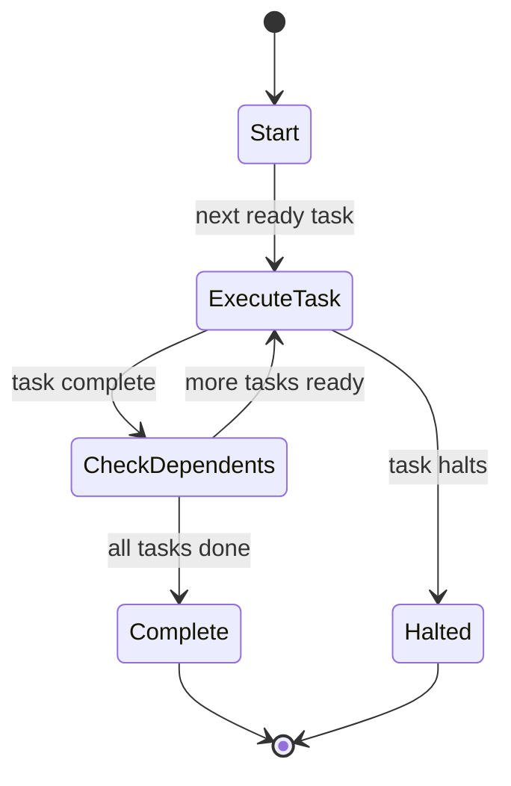

# Network Orchestration

Networks coordinate multiple robots using [SimpleFlow](https://github.com/MadBomber/simple_flow) pipelines for DAG-based execution.

## Network Structure

A network is a thin wrapper around `SimpleFlow::Pipeline`:

- **Pipeline**: DAG-based execution engine
- **Robots**: Named collection of robot instances
- **Tasks**: Wrap robots with per-task configuration and define dependencies
- **Memory**: Shared reactive memory for inter-robot communication

```ruby
network = RobotLab.create_network(name: "customer_service") do
  task :classifier, classifier_robot, depends_on: :none
  task :billing, billing_robot, depends_on: :optional
  task :technical, technical_robot, depends_on: :optional
end
```

## Runnable Protocol

`Network` implements `RobotLab::Runnable` — the same interface `Robot` implements — so code that needs to run "a robot or a network" doesn't have to branch on `is_a?(RobotLab::Network)`. For a `Network`: `crew` returns `robots.values` (pipeline order), `chief` is `crew.first`, `robot_count` is `crew.size`, and `network?` is `true`. `run(message = nil, **opts)` accepts a positional message the same way `Robot#run` does — it's folded into `message:` — while the existing `run(message: ...)` keyword form still works unchanged. See [Runnable Protocol](../architecture/core-concepts.md#runnable-protocol) in Core Concepts for the full comparison against `Robot`.

## Creating Networks

Networks are created via `RobotLab.create_network` with a block DSL:

```ruby
analyst = RobotLab.build(name: "analyst", system_prompt: "Analyze the input.")
writer = RobotLab.build(name: "writer", system_prompt: "Write a report.")
reviewer = RobotLab.build(name: "reviewer", system_prompt: "Review the report.")

network = RobotLab.create_network(name: "pipeline") do
  task :analyst, analyst, depends_on: :none
  task :writer, writer, depends_on: [:analyst]
  task :reviewer, reviewer, depends_on: [:writer]
end

result = network.run(message: "Analyze this quarterly data")
```

## Task Configuration

Tasks can have per-task configuration that is deep-merged with network run params:

```ruby
# The allowlist below matches because the tool was attached as a CLASS.
billing_robot = RobotLab.build(name: "billing", system_prompt: "...",
                               local_tools: [RefundTool])

network = RobotLab.create_network(name: "support") do
  task :classifier, classifier_robot, depends_on: :none
  task :billing, billing_robot,
       context: { department: "billing", escalation_level: 2 },
       tools: [RefundTool],
       depends_on: :optional
  task :technical, technical_robot,
       context: { department: "technical" },
       mcp: [filesystem_server],
       depends_on: :optional
end
```

!!! warning "An explicit `tools:` array must match the attachment form"
    `ToolConfig.filter_tools` selects with `allowed_set.include?(tool_name(tool))`,
    and `tool_name` is just `tool.name.to_s`. But `Class#name` and
    `RubyLLM::Tool#name` return different strings, so the entry you list has to
    match how the tool was attached:

    | Attached as | Allowlist entry | Result |
    |-------------|-----------------|--------|
    | `local_tools: [RefundTool]` (class) | `tools: [RefundTool]` → `"RefundTool"` | matches |
    | `local_tools: [RefundTool]` (class) | `tools: %w[refund]` | no match |
    | `local_tools: [RefundTool.new]` (instance) | `tools: [RefundTool]` | no match |
    | `local_tools: [RefundTool.new]` (instance) | `tools: %w[refund]` | matches |

    Both forms work; mixing them silently yields an empty tool list. Pick one
    convention per robot and keep the allowlist in the same form.

    A task's `tools:` is *not* validated — it lands in `run_params` and reaches
    the robot as a runtime value. The robot **constructor**'s `tools:` kwarg is
    validated by `validate_tools_filter!` and raises `ArgumentError` for
    anything that is not a String or Symbol, so the class form shown above is
    usable only at the task/`run` level.

### Task Parameters

| Parameter | Type | Description |
|-----------|------|-------------|
| `name` | Symbol | Task/step name |
| `robot` | Robot | The robot instance |
| `context` | Hash | Task-specific context (deep-merged with run params) |
| `mcp` | Symbol, Array | MCP server config (`:none`, `:inherit`, or array) |
| `tools` | Symbol, Array | Tools config (`:none`, `:inherit`, or array) |
| `memory` | Memory, Hash, nil | Task-specific memory |
| `config` | RunConfig, nil | Per-task RunConfig, merged into the network config the robot sees (`mcp`/`tools` only in practice) |
| `depends_on` | Symbol, Array | Dependencies (`:none`, `:optional`, or task names) |
| `poller_group` | Symbol | Bus poller group label for this robot (default `:default`; purely organizational) |

`mcp:` and `tools:` default to `:none` here. Anything other than `:none` is written into `run_params` and reaches the robot as its **runtime** value, so it is resolved against the robot's build-time config exactly as if it had been passed to `run`.

## Execution Model


```mermaid
stateDiagram-v2
    [*] --> Start
    Start --> ExecuteTask: next ready task
    ExecuteTask --> CheckDependents: task complete
    CheckDependents --> ExecuteTask: more tasks ready
    CheckDependents --> Complete: all tasks done
    ExecuteTask --> Halted: task halts
    Complete --> [*]
    Halted --> [*]
```

### Task Dependency Types

| Type | Description |
|------|-------------|
| `:none` | No dependencies, runs first |
| `[:task1, :task2]` | Waits for listed tasks to complete |
| `:optional` | Only runs when explicitly activated |

## Robot#call Interface

Each robot implements the SimpleFlow step interface via `call(result)`:

```ruby
# Inside Robot (simplified -- timing and the rescue are elided)
def call(result)
  run_context = extract_run_context(result)
  message = run_context.delete(:message)

  robot_result = run(message, **run_context)
  robot_result.duration = ...   # monotonic elapsed seconds

  result
    .with_context(@name.to_sym, robot_result)   # keyed by the ROBOT's name
    .continue(robot_result)
end
```

The real method also wraps the body so that any exception — including non-`StandardError` ones — is turned into a `RobotResult` whose text is `"Error: <class>: <message>"`, so one failing robot does not crash the pipeline.

### extract_run_context

The `extract_run_context` method pulls parameters from the SimpleFlow result:

- Deletes `:mcp`, `:tools`, `:memory`, `:network_memory`, `:network_config`, `:network`, and `:task` out of `run_params`, then re-attaches them as explicit keyword arguments to `run`
- `:mcp` and `:tools` default to `:none` when the task did not set them — matching `run`'s own defaults
- Merges the current result value into the remaining context
- If the previous result value is a `RobotResult`, uses its `last_text_content` as the message
- If it is a String, uses it directly as the message
- If it is a Hash, merges it into the context
- Anything else is coerced with `to_s` and used as the message

## Task#call Interface

Each `Task` wraps a robot and enhances the SimpleFlow result before delegation:

```ruby
# Inside Task (simplified)
def call(result)
  context = TaskHookContext.new(network: @network, task: self, robot: @robot,
                               memory: @memory || @network&.memory, config: @config)

  RobotLab::Hooks.run(:task, context, registries: [RobotLab.hooks, @network&.hooks]) do
    @robot.call(enhanced_result(result))
  end
end

def enhanced_result(result)
  run_params = deep_merge(result.context[:run_params] || {}, @context)

  run_params[:mcp]    = @mcp   unless @mcp == :none
  run_params[:tools]  = @tools unless @tools == :none
  run_params[:memory] = @memory if @memory

  # Back-references the robot needs for hooks and config resolution
  run_params[:task]    = self
  run_params[:network] = @network if @network

  if @config
    network_rc = run_params[:network_config]
    run_params[:network_config] = network_rc ? network_rc.merge(@config) : @config
  end

  result.with_context(:run_params, run_params)
end
```

Two things to note. The `:task` hook family is dispatched against `[RobotLab.hooks, network&.hooks]` only — a handler registered with `robot.on` never fires for task hooks. And the task's own `config:` is merged into `run_params[:network_config]`, which is the value `Robot#resolve_mcp_hierarchy` / `#resolve_tools_hierarchy` consult as the parent level.

## SimpleFlow::Result

The result object flows through the pipeline:

```ruby
result.value      # Current task's output (RobotResult)
result.context    # Accumulated context from all tasks
result.continue?  # Whether execution continues (the only status predicate)
```

### Result Methods

This is the complete public API of `SimpleFlow::Result` (simple_flow 0.4):

| Method | Description |
|--------|-------------|
| `value` | Current value flowing through the pipeline |
| `context` | Accumulated context hash |
| `continue(value)` | Continue to next tasks |
| `continue?` | Whether the pipeline is still continuing |
| `halt(value)` | Stop pipeline execution |
| `with_context(key, val)` | Add data to context |
| `with_error(key, message)` | Record an error (both arguments required) |
| `errors` | Recorded errors |
| `activate(task_name)` | Enable an optional task |
| `activated_steps` | Optional tasks that have been activated |

There is no `halted?`, no `continued?`, and no `with_value` — use `continue?` for status and `continue(value)` to set a new value.

### Context Structure

```ruby
{
  run_params: { message: "...", customer_id: 123,
                network_memory: memory, network: network, task: task },
  classifier: RobotResult,  # Stored by Robot#call under the ROBOT's name
  billing: RobotResult,
  # ... other robot results
}
```

`Robot#call` stores its output with `result.with_context(@name.to_sym, robot_result)` — the key is the **robot's** `name`, not the task name. The two coincide only when you name them identically:

```ruby
worker = RobotLab.build(name: "worker_bot", system_prompt: "...")

net = RobotLab.create_network(name: "n") do
  task :analysis, worker, depends_on: :none
end

res = net.run(message: "hi")
res.context.keys      #=> [:run_params, :worker_bot]   -- not :analysis
```

## Optional Task Activation

Optional tasks (those with `depends_on: :optional`) do not run automatically. They must be activated by a preceding task using `result.activate(:task_name)`.

This pattern is commonly used with a classifier robot that analyzes the input and routes to the appropriate handler:

```ruby
classifier = RobotLab.build(
  name: "classifier",
  system_prompt: "Classify the request. Respond with: BILLING, TECHNICAL, or GENERAL."
)

billing = RobotLab.build(name: "billing", system_prompt: "Handle billing requests.")
technical = RobotLab.build(name: "technical", system_prompt: "Handle technical requests.")
general = RobotLab.build(name: "general", system_prompt: "Handle general requests.")

network = RobotLab.create_network(name: "support") do
  task :classifier, classifier, depends_on: :none
  task :billing, billing, depends_on: :optional
  task :technical, technical, depends_on: :optional
  task :general, general, depends_on: :optional
end
```

### Classifier Robot Pattern

To activate optional tasks, a robot subclass overrides `call` to inspect its own output and activate the appropriate downstream task:

```ruby
class ClassifierRobot < RobotLab::Robot
  def call(result)
    run_context = extract_run_context(result)
    message = run_context.delete(:message)

    robot_result = run(message, **run_context)

    new_result = result
      .with_context(@name.to_sym, robot_result)
      .continue(robot_result)

    # Analyze output and activate the appropriate optional task
    category = robot_result.last_text_content.to_s.downcase

    case category
    when /billing/
      new_result.activate(:billing)
    when /technical/
      new_result.activate(:technical)
    else
      new_result.activate(:general)
    end
  end
end
```

## Shared Memory

All robots in a network share the network's memory during execution. The network injects its memory into the run context:

```ruby
# Inside Network#run
def run(message = nil, **run_context)
  run_context[:message] = message unless message.nil?     # Runnable protocol

  run_context[:network_memory] = @memory
  run_context[:network]        = self
  run_context[:network_config] = @config unless @config.empty?

  context = NetworkRunHookContext.new(network: self, context: run_context,
                                      memory: @memory, config: @config)

  RobotLab::Hooks.run(:network_run, context, registries: [RobotLab.hooks, @hooks]) do
    if @parallel_mode == :ractor
      run_with_ractor_scheduler(context.context)
    else
      initial_result = SimpleFlow::Result.new(
        context.context,
        context: { run_params: context.context }
      )
      @pipeline.call_parallel(initial_result, max_concurrent: @config.max_concurrent_robots)
    end
  end
end
```

Beyond injecting the shared memory, this does four things worth knowing:

- It puts the network itself and (when non-empty) the network's `RunConfig` into `run_params`, which is how robots find the parent level for `mcp`/`tools` resolution.
- The whole run is wrapped in the `:network_run` hook, dispatched against `[RobotLab.hooks, network.hooks]`.
- `parallel_mode: :ractor` routes to `run_with_ractor_scheduler` instead of the SimpleFlow pipeline; it raises `RobotLab::DependencyError` unless the `robot_lab-ractor` gem is loaded.
- `max_concurrent:` comes from `@config.max_concurrent_robots` — the one `RunConfig` field the network itself consumes.

Robots use the shared memory for inter-robot communication:

```ruby
# Robot A writes to shared memory
memory.set(:classification, "billing")

# Robot B reads from shared memory
category = memory.get(:classification, wait: true)
```

See [Memory Management](state-management.md) for details on reactive features like subscriptions and blocking reads.

## Broadcasting

Networks support a broadcast channel for network-wide announcements:

```ruby
# Register handlers
network.on_broadcast do |message|
  case message[:payload][:event]
  when :pause
    pause_current_work
  when :resume
    resume_work
  end
end

# Send broadcasts
network.broadcast(event: :pause, reason: "rate limit hit")
network.broadcast(event: :phase_complete, phase: "analysis")
```

Each handler is invoked inside an `Async { }` block, and the message is also written to memory at the `_network_broadcast` key (`Network::BROADCAST_KEY`), so robots can subscribe via `memory.subscribe(:_network_broadcast)`. Outside a running reactor, `Async { }` runs the block synchronously on the caller's thread. The message handed to a handler is `{ payload:, network:, timestamp: }`, which is why the examples above reach for `message[:payload][:event]`.

## Parallel Execution

Tasks with the same dependencies can run in parallel:

```ruby
network = RobotLab.create_network(name: "analysis", concurrency: :threads) do
  task :fetch, fetcher, depends_on: :none

  # These three run in parallel after :fetch completes
  task :sentiment, sentiment_bot, depends_on: [:fetch]
  task :entities, entity_bot, depends_on: [:fetch]
  task :keywords, keyword_bot, depends_on: [:fetch]

  # Waits for all three
  task :merge, merger, depends_on: [:sentiment, :entities, :keywords]
end
```

### Concurrency Modes

`create_network`'s `concurrency:` is passed straight to `SimpleFlow::Pipeline`:

| Mode | Description |
|------|-------------|
| `:auto` | SimpleFlow chooses best mode (default) |
| `:threads` | Use Ruby threads |
| `:async` | Use async/fiber |

The number of tasks running at once is capped by the network config's `max_concurrent_robots`, which `Network#run` passes to `call_parallel` as `max_concurrent:`.

Separately, `Network.new(parallel_mode:)` selects the execution backend. It defaults to `:async` (the SimpleFlow pipeline above). Setting `parallel_mode: :ractor` bypasses SimpleFlow entirely for a Ractor-based scheduler and requires the `robot_lab-ractor` gem — without it, `run` raises `RobotLab::DependencyError`.

## Data Flow

1. **Initial Value**: `network.run(message, **params)` creates an initial `SimpleFlow::Result` with the run context
2. **Run Params**: Stored in `result.context[:run_params]`, including `network_memory`, `network`, and (per task) `task`
3. **Task Results**: Each robot adds its `RobotResult` to context under **its own `name`**
4. **Final Value**: Last task's output becomes `result.value`

```ruby
result = network.run(
  message: "Help with billing",
  customer_id: 123
)

result.context[:run_params]  #=> { message: "...", customer_id: 123,
                             #     network_memory: ..., network: ..., task: ... }
result.context[:classifier]  #=> RobotResult from the robot NAMED "classifier"
result.context[:billing]     #=> RobotResult from the robot NAMED "billing"
result.value                 #=> Final RobotResult
```

If a robot's `name:` differs from the task name it was registered under, look it up by the robot's name.

## Visualization

Networks provide visualization methods via the underlying SimpleFlow pipeline:

```ruby
# ASCII representation
puts network.visualize

# Mermaid diagram
puts network.to_mermaid

# DOT format (Graphviz)
puts network.to_dot

# Execution plan description
puts network.execution_plan
```

## Network Inspection

```ruby
# Get a robot by its registration key
network.robot(:classifier)   #=> Robot
network[:classifier]          #=> Robot (alias)

# List all robots
network.available_robots      #=> [Robot, Robot, ...]
network.crew                  #=> same array, via the Runnable protocol

# Add a robot without a task
network.add_robot(extra_robot)

# Remove a dynamically-added robot (returns it, or nil if absent).
# Only affects the crew (@robots) -- does not rewrite the pipeline.
network.remove_robot(:extra_robot)

# Convert to hash
network.to_h
#=> { name: "support", robots: ["classifier", "billing"],
#     tasks: ["classifier", "billing"], optional_tasks: [],
#     config: { ... } }   # :config present only when the network config is non-empty
```

The `@robots` hash is keyed **by task name** for robots registered with `task`, but **by `robot.name`** for robots added with `add_robot`. So for a robot built as `name: "worker_bot"` and registered as `task :analysis, worker`, `network.robot(:analysis)` returns it and `network.robot(:worker_bot)` returns `nil` — the opposite of how `result.context` is keyed. `to_h[:robots]` therefore lists task names for task-registered robots.

## Next Steps

- [Memory Management](state-management.md) - Shared memory and reactive features
- [Message Flow](message-flow.md) - How messages are processed within robots
