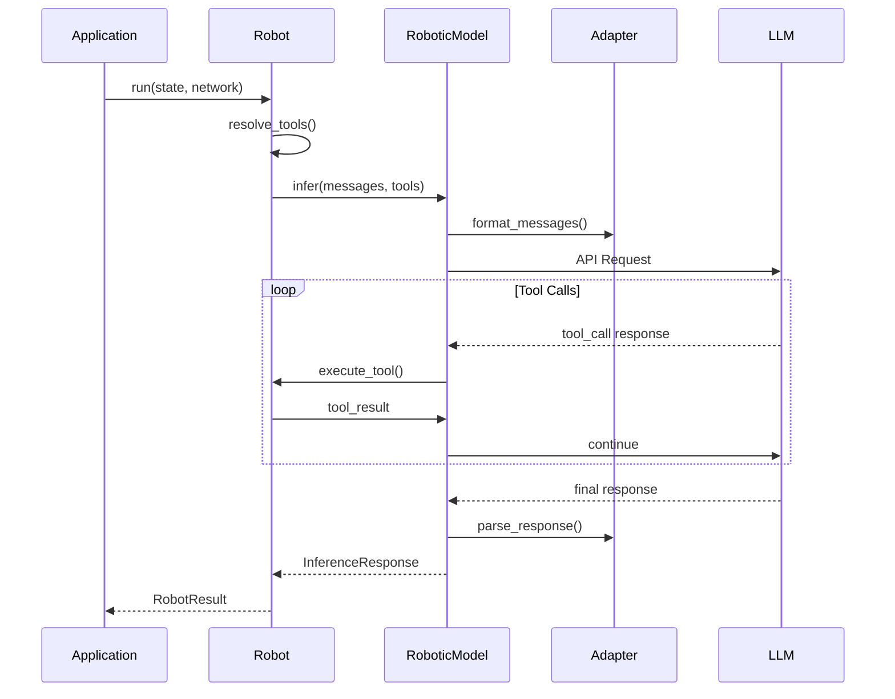

# Robot Execution

This page details how a robot processes messages and generates responses.

## Execution Overview

When you call `robot.run(state:, network:)`, several steps occur:



## Step-by-Step Flow

### 1. Tool Resolution

Before making any LLM call, the robot resolves available tools:

```ruby
# Internal process
tools = []
tools += local_tools           # Tools defined on robot
tools += mcp_tools             # Tools from MCP servers
tools = apply_whitelist(tools) # Filter by allowed tools
```

### 2. Message Preparation

The robot prepares messages from state:

```ruby
messages = []
messages << system_message     # From template
messages += state.messages     # Conversation history
messages << user_message       # Current input
```

### 3. LLM Inference

Messages are sent to the LLM via `RoboticModel`:

```ruby
response = model.infer(
  messages,
  tools,
  tool_choice: "auto",
  streaming: streaming_callback
)
```

### 4. Tool Execution Loop

If the LLM requests tool calls:

```ruby
loop do
  if response.wants_tools?
    response.tool_calls.each do |tool_call|
      result = execute_tool(tool_call)
      # Result sent back to LLM
    end
    response = model.continue_with_results(results)
  else
    break
  end
end
```

### 5. Result Construction

Finally, a `RobotResult` is created:

```ruby
RobotResult.new(
  robot_name: name,
  output: response.output,
  tool_calls: executed_tools,
  stop_reason: response.stop_reason
)
```

## Tool Execution

### Tool Call Processing

When the LLM requests a tool:

1. **Identify Tool**: Match tool name to registered tools
2. **Validate Input**: Check parameters against schema
3. **Execute Handler**: Call the tool's handler function
4. **Capture Result**: Wrap response in ToolResultMessage
5. **Return to LLM**: Send result for continued processing

### Execution Context

Tools receive context about their execution environment:

```ruby
tool.handler.call(
  **tool_call.input,  # User-provided arguments
  robot: self,        # The executing robot
  network: network,   # Network context
  state: state        # Current state
)
```

### Error Handling

Tool errors are captured and returned to the LLM:

```ruby
begin
  result = tool.handler.call(**args)
  ToolResultMessage.new(tool: tool_call, content: { data: result })
rescue StandardError => e
  ToolResultMessage.new(tool: tool_call, content: { error: e.message })
end
```

## Iteration Limits

Robot execution has safeguards:

| Limit | Default | Purpose |
|-------|---------|---------|
| `max_tool_iterations` | 10 | Max tool calls per robot run |

When limits are reached, execution stops with the current state.

## Streaming

Robots support streaming responses:

```ruby
robot.run(
  state: state,
  network: network,
  streaming: ->(event) {
    case event.type
    when :delta then print event.content
    when :tool_call then puts "Calling: #{event.tool_name}"
    end
  }
)
```

### Streaming Events

| Event Type | Description |
|------------|-------------|
| `run.started` | Robot execution began |
| `delta` | Text content chunk |
| `tool_call` | Tool execution starting |
| `tool_result` | Tool execution complete |
| `run.completed` | Robot execution finished |
| `run.failed` | Error occurred |

## Model Selection

The model is determined by:

1. Robot's explicit `model` setting
2. Network's `default_model`
3. Global `RobotLab.configuration.default_model`

```ruby
robot = RobotLab.build do
  model "claude-sonnet-4"  # Takes precedence
end

network = RobotLab.create_network do
  default_model "gpt-4"    # Fallback for robots without model
end
```

## Provider Detection

If no provider is specified, it's detected from model name:

| Model Pattern | Provider |
|--------------|----------|
| `claude-*`, `anthropic-*` | `:anthropic` |
| `gpt-*`, `o1-*`, `chatgpt-*` | `:openai` |
| `gemini-*` | `:gemini` |
| `llama-*`, `mistral-*` | `:ollama` |

## RoboticModel

The `RoboticModel` class handles LLM communication:

```ruby
model = RoboticModel.new("claude-sonnet-4", provider: :anthropic)

# Full inference
response = model.infer(messages, tools)

# Quick ask
response = model.ask("What is 2+2?", system: "You are a math tutor")
```

### InferenceResponse

The response object provides:

```ruby
response.output              # Array<Message> - parsed output
response.raw                 # Original LLM response
response.stop_reason         # "stop", "tool", etc.
response.stopped?            # true if naturally completed
response.wants_tools?        # true if tool calls pending
response.tool_calls          # Array<ToolMessage>
response.text_content        # Combined text from output
response.captured_tool_results  # Auto-executed tool results
```

## Next Steps

- [Network Orchestration](network-orchestration.md) - Multi-robot coordination
- [State Management](state-management.md) - Managing state across robots
- [Using Tools](../guides/using-tools.md) - Creating and using tools
