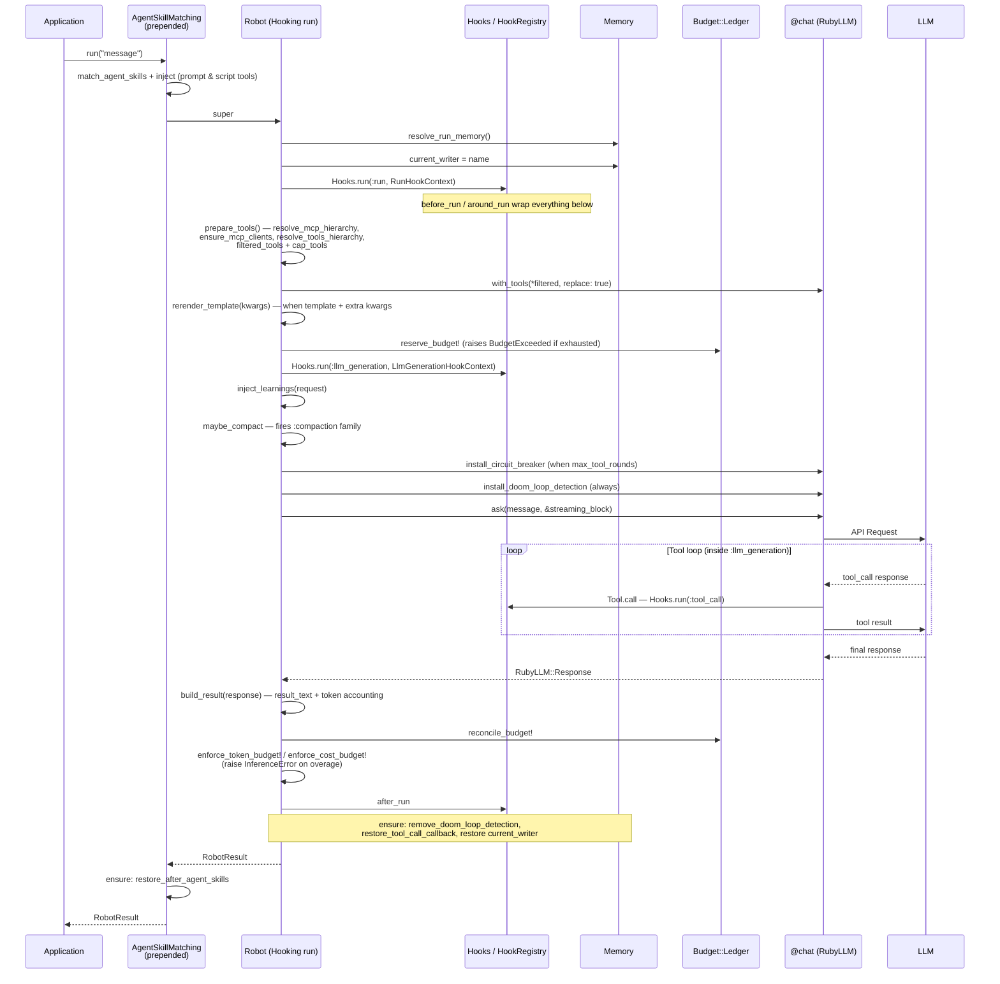
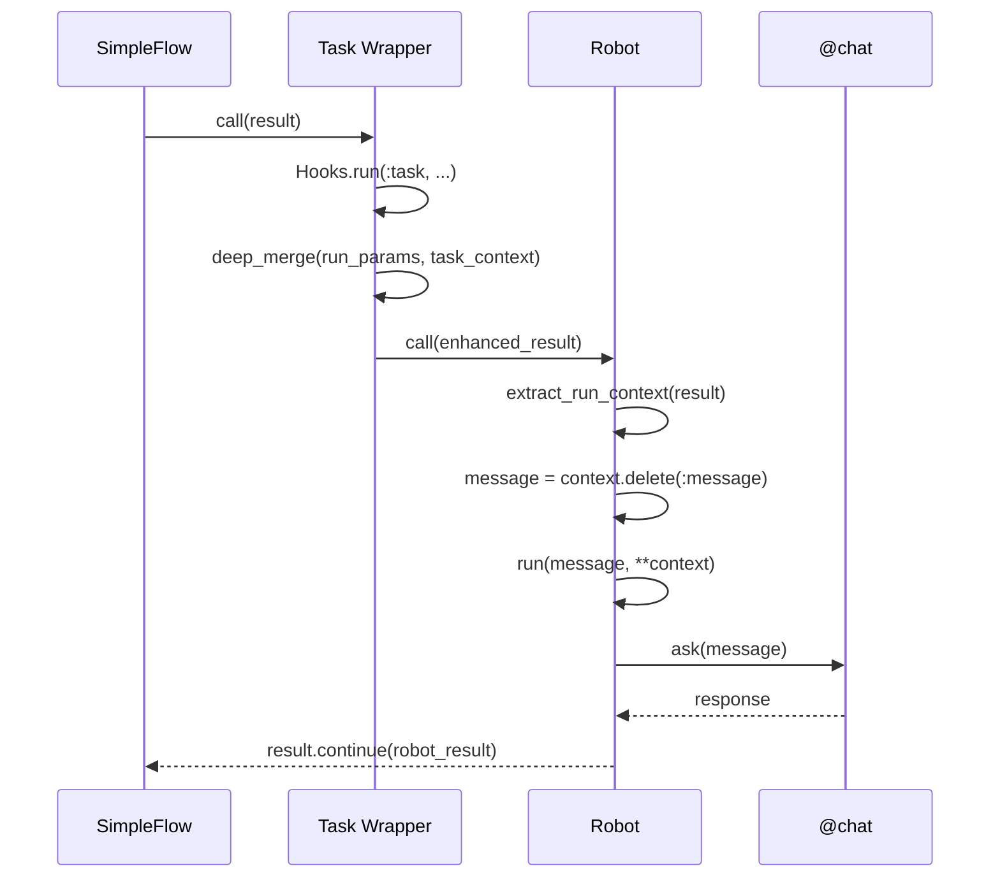

# Robot Execution

This page details how a robot processes messages and generates responses.

## Execution Overview

When you call `robot.run("message")`, several steps occur:


```mermaid
sequenceDiagram
    participant App as Application
    participant Skills as AgentSkillMatching<br/>(prepended)
    participant Robot as Robot (Hooking run)
    participant Hooks as Hooks / HookRegistry
    participant Memory
    participant Ledger as Budget::Ledger
    participant Chat as @chat (RubyLLM)
    participant LLM

    App->>Skills: run("message")
    Skills->>Skills: match_agent_skills + inject (prompt & script tools)
    Skills->>Robot: super

    Robot->>Memory: resolve_run_memory()
    Robot->>Memory: current_writer = name
    Robot->>Hooks: Hooks.run(:run, RunHookContext)
    Note over Hooks: before_run / around_run wrap everything below

    Robot->>Robot: prepare_tools() — resolve_mcp_hierarchy,<br/>ensure_mcp_clients, resolve_tools_hierarchy,<br/>filtered_tools + cap_tools
    Robot->>Chat: with_tools(*filtered, replace: true)
    Robot->>Robot: rerender_template(kwargs) — when template + extra kwargs
    Robot->>Ledger: reserve_budget! (raises BudgetExceeded if exhausted)

    Robot->>Hooks: Hooks.run(:llm_generation, LlmGenerationHookContext)
    Robot->>Robot: inject_learnings(request)
    Robot->>Robot: maybe_compact — fires :compaction family
    Robot->>Chat: install_circuit_breaker (when max_tool_rounds)
    Robot->>Chat: install_doom_loop_detection (always)
    Robot->>Chat: ask(message, &streaming_block)
    Chat->>LLM: API Request

    loop Tool loop (inside :llm_generation)
        LLM-->>Chat: tool_call response
        Chat->>Hooks: Tool.call — Hooks.run(:tool_call)
        Chat->>LLM: tool result
    end

    LLM-->>Chat: final response
    Chat-->>Robot: RubyLLM::Response
    Robot->>Robot: build_result(response) — result_text + token accounting
    Robot->>Ledger: reconcile_budget!
    Robot->>Robot: enforce_token_budget! / enforce_cost_budget!<br/>(raise InferenceError on overage)
    Robot->>Hooks: after_run
    Note over Robot,Memory: ensure: remove_doom_loop_detection,<br/>restore_tool_call_callback, restore current_writer
    Robot-->>Skills: RobotResult
    Skills->>Skills: ensure: restore_after_agent_skills
    Skills-->>App: RobotResult
```

The steps are described individually below. Two things this diagram makes
explicit that the prose repeats: `Robot::AgentSkillMatching` is **prepended**, so
its `run` wraps `Robot::Hooking#run` (which is the `run` everything else calls);
and the `:llm_generation` family wraps the provider's *entire* tool loop, so
`:tool_call` hooks fire nested inside it rather than between generations.

## Step-by-Step Flow

### 1. Memory Resolution

`Robot#run` first resolves the memory this run will write to, via `resolve_run_memory`:

```ruby
# resolve_active_memory priority order:
# 1. Explicit network_memory: parameter
# 2. Network's memory (if running in a network)
# 3. Robot's inherent @memory (standalone mode)
run_memory = resolve_active_memory(network: network, network_memory: network_memory)

# A runtime memory: kwarg either replaces (Memory) or merges into (Hash) it
case memory
when Memory then memory
when Hash   then run_memory.tap { |m| m.merge!(memory) }
else             run_memory
end
```

`run` then sets `run_memory.current_writer = @name` for the duration of the run and restores the previous writer in an `ensure` block, so subscription callbacks always see the robot that actually wrote a value.

The whole run body is wrapped in `RobotLab::Hooks.run(:run, context, ...)` against the registries `[RobotLab.hooks, network&.hooks, @hooks]`.

### 2. MCP Hierarchy Resolution

MCP servers and tools are resolved together in `prepare_tools`, through a hierarchy: **runtime (run/task) > robot build-time > network > global config**.

```ruby
# Parent value: task/network RunConfig, then the network object, then global config
parent_value = network_config&.mcp || network_parent_config(network)&.mcp || RobotLab.config.mcp
build_resolved = ToolConfig.resolve_mcp(@mcp_config, parent_value: parent_value)

# Then resolve the runtime override against the build-time value
resolved_mcp = ToolConfig.resolve_mcp(runtime_mcp, parent_value: build_resolved)
```

Values at each level:

- `:none` -- no MCP servers at this level
- `:inherit` -- use parent level's MCP config
- `Array` -- explicit list of server configurations

`run`'s default for `mcp:` is `:none`, so a plain `robot.run("...")` resolves to an empty server list and connects nothing, even when `mcp:` was supplied at build time. Pass `mcp: :inherit` to trigger the connection. (`robot.connect_mcp!` connects eagerly against the build-time config, which is useful for reporting connection status at startup.)

### 3. MCP Client Initialization

If MCP servers need to be connected (or reconnected), the robot initializes clients:

```ruby
# Connect to each MCP server (ensure_mcp_clients -> init_mcp_client)
client = MCP::Client.new(server_config)   # config is POSITIONAL
client.connect

if client.connected?
  @mcp_clients[client.server.name] = client
  discover_mcp_tools(client, server_name)  # each remote tool becomes a Tool.create wrapper
else
  @failed_mcp_configs[server_name] = server_config
end
```

Connection failures are logged and recorded, never raised — they surface through `robot.failed_mcp_server_names`. A later run retries only the servers that are still needed and still failed.

### 4. Tools Resolution

Tools are resolved through the same hierarchy, filtered, capped, and applied to the chat:

```ruby
# Explicit :none (or a literal []) means "send zero tools this turn"; otherwise
# filter the local + MCP tools by the resolved allowlist and clamp to max_tools.
filtered = explicit_none_tools?(tools) ? [] : cap_tools(filtered_tools(resolved_tools))

@chat.with_tools(*filtered, replace: true) if filtered.any? || explicit_none_tools?(tools)
```

Two details here are load-bearing:

- **`replace: true`** — RubyLLM's `with_tools` appends by default. On a persistent chat that would let tools accumulate across turns, so the chat is made to hold exactly this turn's resolved set. An explicit `:none` therefore clears the chat's tools to zero.
- **`cap_tools`** — the resolved list is clamped to `RunConfig#max_tools`, which defaults to `DEFAULT_MAX_TOOLS` (128) because most providers reject longer tool arrays. Setting `max_tools` to nil, 0, or a negative number falls back to 128; the cap cannot be disabled. Dropped tools are logged at `warn`.

Because `run` defaults to `tools: :none`, a plain `robot.run("...")` sends the LLM no tools at all. Pass `tools: :inherit` to send the robot's attached tools; pass an explicit array of names to use it as an allowlist.

### 5. LLM Inference

The message is sent to the LLM via `Agent#ask`, which delegates to `@chat.ask`. `invoke_ask` wraps that call in the `:llm_generation` hook and installs the per-run guards first:

```ruby
RobotLab::Hooks.run(:llm_generation, generation_context, registries: ..., per_run_hooks: hooks) do
  effective_message = inject_learnings(generation_context.request)
  maybe_compact(network: context.network)
  install_circuit_breaker if @config.max_tool_rounds
  install_doom_loop_detection
  ask(effective_message, **kwargs.slice(:with), &effective_streaming_block(block))
end
```

Notes on the surrounding behavior:

- `:llm_generation` fires **exactly once per `robot.run`** — the provider's tool loop happens inside the block, not once per API call.
- Only `:with` from `run`'s keyword arguments reaches `ask`. Every other unrecognized keyword is treated as template re-render context.
- Doom-loop detection is installed unconditionally on every run; `doom_loop_threshold:` (default 3) only tunes it.

The persistent `@chat` (a `RubyLLM::Chat` instance) handles:

- Maintaining conversation history
- Sending the system prompt
- Formatting messages for the provider
- Executing the tool call loop automatically

### 6. Tool Execution Loop

RubyLLM's `@chat` handles the tool loop automatically. When the LLM requests a tool call:

1. `@chat` identifies the tool from its registered tools
2. Calls the tool's `execute` method (for `RubyLLM::Tool` subclasses) or `call` method (for `RobotLab::Tool`)
3. Sends the result back to the LLM
4. Repeats until the LLM produces a final text response

The `on_tool_call` and `on_tool_result` callbacks fire during this loop if configured. They are read off the effective `RunConfig` and registered on `@chat` during `Robot#initialize`:

```ruby
def register_chat_callbacks
  @chat.on_tool_call(&@on_tool_call)     if @on_tool_call
  @chat.on_tool_result(&@on_tool_result) if @on_tool_result
  setup_bus_channel if @bus
end
```

When `max_tool_rounds` is set, `install_circuit_breaker` temporarily wraps `on_tool_call` for the duration of the run and raises `ToolLoopError` once the round count is exceeded; the original callback is restored in `run`'s `ensure` block.

### 7. Result Construction

After the LLM responds, `build_result` turns the response into a `RobotResult`:

```ruby
def build_result(response, _memory)
  text   = result_text(response)
  output = text ? [TextMessage.new(role: 'assistant', content: text)] : []
  # ... reads response.tokens (or input_tokens/output_tokens), accumulates them
  #     into the robot's running totals, and passes them to RobotResult
end
```

`result_text` is deliberately more forgiving than `response.content`. It falls back, in order, to:

1. `response.content`, when present and non-empty
2. `response.thinking` — Ollama routes some models' (e.g. qwen3) entire output through `reasoning_content`, which RubyLLM surfaces as `thinking`
3. the most recent non-empty assistant message in `@chat.messages`, scoped to messages *after* the last user message, for models that end a turn on a tool call with no trailing text

Scoping the history fallback to the current turn is what prevents a previous turn's answer from being returned when a thinking-mode model emits nothing in `content`.

`build_result` also does token accounting: it reads `response.tokens` (falling back to `input_tokens`/`output_tokens`), adds them to the robot's running totals, and stores them on the result. `run` then reconciles the budget reservation and enforces `token_budget` / `cost_budget`, raising **`RobotLab::InferenceError`** when this call's actual usage pushed cumulative usage over budget. (`RobotLab::BudgetExceeded` is the *other* budget error: it is raised by `reserve_budget!` **before** the call, when a prior call already exhausted the dimension. See [Budgets](../guides/observability.md#budgets-token-cost).)

## RobotResult

The result object from a `robot.run` call:

```ruby
result = robot.run("Hello!")

result.robot_name       # => "assistant"
result.output           # => [TextMessage] synthesized from result_text
result.tool_calls       # => [] in practice (see below)
result.stop_reason      # => nil — always (see below)
result.created_at       # => Time
result.id               # => UUID string
result.duration         # => Float or nil (elapsed seconds, set in pipeline execution)
result.input_tokens     # => Integer
result.output_tokens    # => Integer
result.checksum         # => "sha256-hex"
result.raw              # => raw LLM response object

# Convenience methods
result.last_text_content  # => "Hi there!" (last text message content)
result.reply              # => alias for last_text_content
result.has_tool_calls?    # => false
result.stopped?           # => true
result.export             # => Hash (excludes debug fields)
result.to_h / result.to_json
```

`stop_reason` is always `nil`. `build_result` assigns it with `response.respond_to?(:stop_reason) ? response.stop_reason : nil`, and `RubyLLM::Message` does not define `stop_reason`, so no `robot.run` result ever reports one. It is dropped from `export` by the `.compact`, and `stopped?` therefore reduces to `!has_tool_calls?`.

`output` is a single synthesized `TextMessage`, not a transcript of the turn, and `tool_calls` is read off the final assistant message — which no longer carries tool calls once RubyLLM's tool loop has finished, so it is effectively always empty. Observe tool usage through the `on_tool_call`/`on_tool_result` callbacks or the tool hooks instead.

## Streaming

Robots support streaming by passing a block to `run`. The block receives a `RubyLLM::Chunk`; its text is in `content`:

```ruby
result = robot.run("Tell me a story") do |chunk|
  print chunk.content
end
```

`effective_streaming_block` merges the block with any stored `on_content:` callback. If both are present, both fire — the stored `on_content` first, then the runtime block. The merged block is forwarded to `Agent#ask`, which passes it to `@chat.ask`.

```ruby
# on_content fires on every run, no block required
robot = RobotLab.build(name: "bot", system_prompt: "...",
                       on_content: ->(chunk) { print chunk.content })
```

`on_content` is read from the robot's own config at construction — a network-level `config:` does not supply it.

## Template Resolution

When a robot has a `template:`, it is resolved during initialization:

```ruby
# 1. Parse the template via prompt_manager
parsed = PM.parse(@template)

# 2. Apply the non-LLM front matter keys: robot_name, description, tools, mcp
#    (constructor-provided values win, so these only fill in gaps)
apply_front_matter_extras(parsed.metadata)

# 3. Turn the LLM keys into a RunConfig. Front matter is the BASE;
#    @config (constructor kwargs) merges over it and wins.
effective = RunConfig.from_front_matter(parsed.metadata).merge(@config)
effective.apply_to(@chat, provider: @provider, assume_model_exists: !@provider.nil?)

# 4. Render the template body with context and set it as system instructions
@chat.with_instructions(parsed.to_s(**resolved_context))
```

If required parameters are missing at build time, rendering is skipped and deferred: the first `run` that supplies context calls `rerender_template`, which re-renders and re-appends the inline `system_prompt`. When `skills:` are in play, each skill's body and front matter are accumulated the same way and the bodies are joined before being set as one instructions block.

### Front Matter Config Keys

Templates parse these LLM keys into a `RunConfig`:

| Key | Effect |
|-----|--------|
| `model` | Sets the LLM model |
| `temperature` | Sets randomness |
| `top_p` | Parsed, but **not applied** — see below |
| `top_k` | Parsed, but **not applied** |
| `max_tokens` | Parsed, but **not applied** |
| `presence_penalty` | Parsed, but **not applied** |
| `frequency_penalty` | Parsed, but **not applied** |
| `stop` | Parsed, but **not applied** |

`RunConfig#apply_to` dispatches `chat.with_<field>` guarded by `respond_to?`. `RubyLLM::Chat` only defines `with_model` and `with_temperature`, so the other six are silently dropped when they come from front matter. To set them, use constructor kwargs or a `config:` RunConfig — that path goes through `apply_chat_params` → `with_params` and does take effect:

```ruby
RobotLab.build(name: "bot", template: :report, max_tokens: 2000, top_p: 0.3)
```

Front matter keys that are not LLM fields — `description`, `robot_name`, `tools`, `mcp`, `skills`, `parameters` — all work.

Template bodies render with ERB: use `<%= var %>`. `{{ var }}` is not interpolated and passes through verbatim.

## Model Selection

The model is determined by:

1. Robot's explicit `model:` parameter
2. Front matter `model` from template
3. Global `RobotLab.config.ruby_llm.model`

```ruby
robot = RobotLab.build(
  name: "bot",
  model: "claude-sonnet-4"  # Takes precedence
)

# Or configure globally via config files / environment variables
# ROBOT_LAB_RUBY_LLM__MODEL=gpt-4o
```

## SimpleFlow Integration

When a robot runs inside a network, the `call` method is invoked by SimpleFlow:


```mermaid
sequenceDiagram
    participant SF as SimpleFlow
    participant Task as Task Wrapper
    participant Robot
    participant Chat as @chat

    SF->>Task: call(result)
    Task->>Task: Hooks.run(:task, ...)
    Task->>Task: deep_merge(run_params, task_context)
    Task->>Robot: call(enhanced_result)
    Robot->>Robot: extract_run_context(result)
    Robot->>Robot: message = context.delete(:message)
    Robot->>Robot: run(message, **context)
    Robot->>Chat: ask(message)
    Chat-->>Robot: response
    Robot-->>SF: result.continue(robot_result)
```

The `Task` wrapper runs the `:task` hook family and deep-merges its per-task configuration (context, mcp, tools, memory, config) into `run_params` before delegating to the robot's `call`. Note that a task's `mcp:`/`tools:` land in `run_params` and are therefore consumed by the robot as *runtime* values, not as a separate tier between the network and the robot.

The base `Robot#call` extracts the message, calls `run`, and records the elapsed time in `RobotResult#duration`. Because the result is stored under `@name.to_sym`, the pipeline context is keyed by the **robot's** name, not the task name. If the robot raises any exception, the error is caught and wrapped in a `RobotResult` so one failing robot does not crash the entire pipeline:

```ruby
def call(result)
  run_context = extract_run_context(result)
  message = run_context.delete(:message)

  start_time = Process.clock_gettime(Process::CLOCK_MONOTONIC)
  robot_result = run(message, **run_context)
  robot_result.duration = Process.clock_gettime(Process::CLOCK_MONOTONIC) - start_time

  result
    .with_context(@name.to_sym, robot_result)
    .continue(robot_result)
rescue Exception => e
  elapsed = Process.clock_gettime(Process::CLOCK_MONOTONIC) - start_time
  error_result = RobotResult.new(
    robot_name: @name,
    output: [TextMessage.new(role: 'assistant', content: "Error: #{e.class}: #{e.message}")]
  )
  error_result.duration = elapsed

  result
    .with_context(@name.to_sym, error_result)
    .continue(error_result)
end
```

## Next Steps

- [Network Orchestration](network-orchestration.md) - Multi-robot coordination
- [Core Concepts](core-concepts.md) - Fundamental building blocks
- [Using Tools](../guides/using-tools.md) - Creating and using tools
