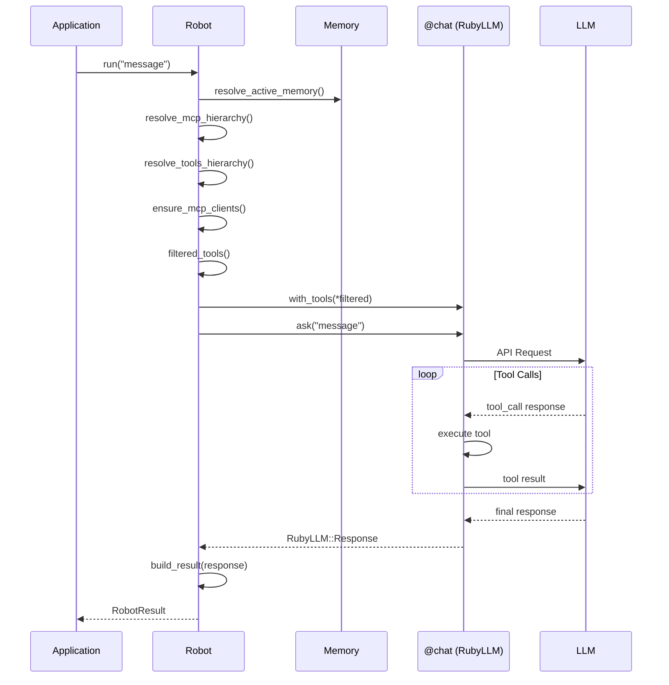
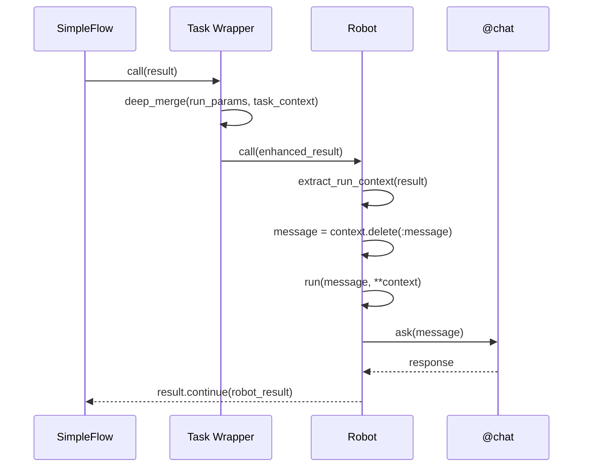

# Robot Execution

This page details how a robot processes messages and generates responses.

## Execution Overview

When you call `robot.run("message")`, several steps occur:


```mermaid
sequenceDiagram
    participant App as Application
    participant Robot
    participant Memory
    participant Chat as @chat (RubyLLM)
    participant LLM

    App->>Robot: run("message")
    Robot->>Memory: resolve_active_memory()
    Robot->>Robot: resolve_mcp_hierarchy()
    Robot->>Robot: resolve_tools_hierarchy()
    Robot->>Robot: ensure_mcp_clients()
    Robot->>Robot: filtered_tools()
    Robot->>Chat: with_tools(*filtered)
    Robot->>Chat: ask("message")
    Chat->>LLM: API Request

    loop Tool Calls
        LLM-->>Chat: tool_call response
        Chat->>Chat: execute tool
        Chat->>LLM: tool result
    end

    LLM-->>Chat: final response
    Chat-->>Robot: RubyLLM::Response
    Robot->>Robot: build_result(response)
    Robot-->>App: RobotResult
```

## Step-by-Step Flow

### 1. Memory Resolution

The robot determines which memory to use for this run:

```ruby
# Priority order:
# 1. Explicit network_memory: parameter
# 2. Network's memory (if running in a network)
# 3. Robot's inherent @memory (standalone mode)
run_memory = resolve_active_memory(network: network, network_memory: network_memory)

# Merge runtime memory if provided
case memory
when Memory then run_memory = memory
when Hash   then run_memory.merge!(memory)
end

# Track who is writing to memory
run_memory.current_writer = @name
```

### 2. MCP Hierarchy Resolution

MCP servers are resolved through a hierarchy: **runtime > robot build-time > network > global config**.

```ruby
# Resolve build-time config against network/global
parent_value = network&.network&.mcp || RobotLab.config.mcp
build_resolved = ToolConfig.resolve_mcp(@mcp_config, parent_value: parent_value)

# Then resolve runtime override against build-time
resolved_mcp = ToolConfig.resolve_mcp(runtime_mcp, parent_value: build_resolved)
```

Values at each level:

- `:none` -- no MCP servers at this level
- `:inherit` -- use parent level's MCP config
- `Array` -- explicit list of server configurations

### 3. MCP Client Initialization

If MCP servers need to be connected (or reconnected), the robot initializes clients:

```ruby
# Connect to each MCP server
mcp_servers.each do |server_config|
  client = MCP::Client.new(server_config)
  client.connect

  if client.connected?
    @mcp_clients[client.server.name] = client
    discover_mcp_tools(client, server_name)  # Auto-discover tools
  end
end
```

### 4. Tools Resolution

Tools are resolved through the same hierarchy and filtered:

```ruby
# Collect all available tools
available = @local_tools + @mcp_tools

# Apply whitelist if specified
filtered = ToolConfig.filter_tools(available, allowed_names: resolved_tools)

# Apply tools to the persistent chat
@chat.with_tools(*filtered) if filtered.any?
```

### 5. LLM Inference

The message is sent to the LLM via `Agent#ask`, which delegates to `@chat.ask`:

```ruby
# Robot#run calls Agent#ask
response = ask(message, **kwargs)

# Internally, Agent#ask calls:
# @chat.ask(message)
```

The persistent `@chat` (a `RubyLLM::Chat` instance) handles:

- Maintaining conversation history
- Sending the system prompt
- Formatting messages for the provider
- Executing the tool call loop automatically

### 6. Tool Execution Loop

RubyLLM's `@chat` handles the tool loop automatically. When the LLM requests a tool call:

1. `@chat` identifies the tool from its registered tools
2. Calls the tool's `execute` method (for `RubyLLM::Tool` subclasses) or `call` method (for `RobotLab::Tool`)
3. Sends the result back to the LLM
4. Repeats until the LLM produces a final text response

The `on_tool_call` and `on_tool_result` callbacks fire during this loop if configured:

```ruby
# These callbacks are registered on @chat during Robot#initialize
@chat.on_tool_call(&@on_tool_call) if @on_tool_call
@chat.on_tool_result(&@on_tool_result) if @on_tool_result
```

### 7. Result Construction

After the LLM responds, a `RobotResult` is built:

```ruby
def build_result(response, _memory)
  output = if response.respond_to?(:content) && response.content
    [TextMessage.new(role: 'assistant', content: response.content)]
  else
    []
  end

  tool_calls = response.respond_to?(:tool_calls) ? (response.tool_calls || []) : []

  RobotResult.new(
    robot_name: @name,
    output: output,
    tool_calls: normalize_tool_calls(tool_calls),
    stop_reason: response.respond_to?(:stop_reason) ? response.stop_reason : nil
  )
end
```

## RobotResult

The result object from a `robot.run` call:

```ruby
result = robot.run("Hello!")

result.robot_name       # => "assistant"
result.output           # => [TextMessage, ...]
result.tool_calls       # => [ToolResultMessage, ...]
result.stop_reason      # => "stop" or nil
result.created_at       # => Time
result.id               # => UUID string

# Convenience methods
result.last_text_content  # => "Hi there!" (last text message content)
result.has_tool_calls?    # => false
result.stopped?           # => true
```

## Streaming

Robots support streaming by passing a block to `run`:

```ruby
result = robot.run("Tell me a story") do |event|
  print event.text if event.respond_to?(:text)
end
```

The block is forwarded to `Agent#ask` which passes it to `@chat.ask`. Streaming events are provider-specific but typically include text deltas.

## Template Resolution

When a robot has a `template:`, it is resolved during initialization:

```ruby
# 1. Parse the template via prompt_manager
parsed = PM.parse(@template)

# 2. Extract and apply front matter config
#    (model, temperature, top_p, etc.)
apply_front_matter_config(parsed.metadata)

# 3. Render the template body with context
rendered = parsed.to_s(**resolved_context)

# 4. Set as system instructions on @chat
@chat.with_instructions(rendered)
```

### Front Matter Config Keys

Templates can configure the chat via YAML front matter:

| Key | Effect |
|-----|--------|
| `model` | Sets the LLM model |
| `temperature` | Sets randomness |
| `top_p` | Sets nucleus sampling |
| `top_k` | Sets top-k sampling |
| `max_tokens` | Sets max response tokens |
| `presence_penalty` | Sets presence penalty |
| `frequency_penalty` | Sets frequency penalty |
| `stop` | Sets stop sequences |

## Model Selection

The model is determined by:

1. Robot's explicit `model:` parameter
2. Front matter `model` from template
3. Global `RobotLab.config.ruby_llm.model`

```ruby
robot = RobotLab.build(
  name: "bot",
  model: "claude-sonnet-4"  # Takes precedence
)

# Or configure globally via config files / environment variables
# ROBOT_LAB_RUBY_LLM__MODEL=gpt-4o
```

## SimpleFlow Integration

When a robot runs inside a network, the `call` method is invoked by SimpleFlow:


```mermaid
sequenceDiagram
    participant SF as SimpleFlow
    participant Task as Task Wrapper
    participant Robot
    participant Chat as @chat

    SF->>Task: call(result)
    Task->>Task: deep_merge(run_params, task_context)
    Task->>Robot: call(enhanced_result)
    Robot->>Robot: extract_run_context(result)
    Robot->>Robot: message = context.delete(:message)
    Robot->>Robot: run(message, **context)
    Robot->>Chat: ask(message)
    Chat-->>Robot: response
    Robot-->>SF: result.continue(robot_result)
```

The `Task` wrapper deep-merges per-task configuration (context, mcp, tools) before delegating to the robot's `call`. The base `Robot#call` extracts the message and calls `run`:

```ruby
def call(result)
  run_context = extract_run_context(result)
  message = run_context.delete(:message)
  robot_result = run(message, **run_context)

  result
    .with_context(@name.to_sym, robot_result)
    .continue(robot_result)
end
```

## Next Steps

- [Network Orchestration](network-orchestration.md) - Multi-robot coordination
- [Core Concepts](core-concepts.md) - Fundamental building blocks
- [Using Tools](../guides/using-tools.md) - Creating and using tools
