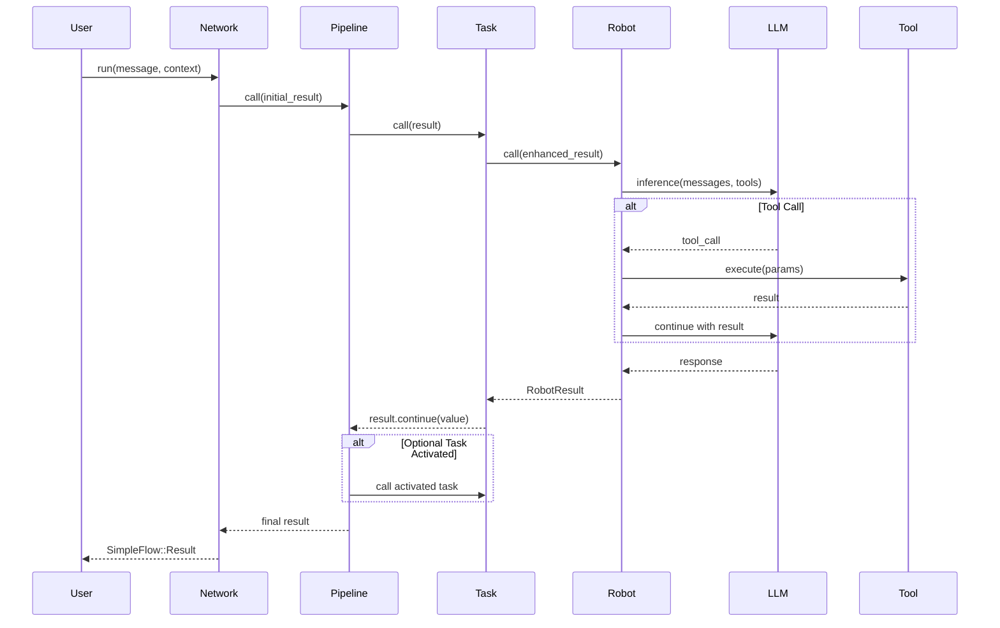

# Core Concepts

Understanding the fundamental concepts in RobotLab will help you build effective AI applications.

## Robot

A **Robot** is an LLM-powered agent with a specific personality, capabilities, and tools. Each robot has:

- **Name**: A unique identifier within a network
- **Description**: What the robot does (used for routing decisions)
- **Template/System Prompt**: Instructions that define the robot's behavior
- **Model**: The LLM model to use (e.g., `claude-sonnet-4`)
- **Tools**: Custom functions the robot can call

```ruby
robot = RobotLab.build do
  name "support_agent"
  description "Handles customer support inquiries"
  model "claude-sonnet-4"
  template "You are a friendly customer support agent..."

  tool :lookup_order do
    description "Look up order details by order ID"
    parameter :order_id, type: :string, required: true
    handler { |order_id:| Order.find(order_id).to_h }
  end
end
```

## Network

A **Network** is a collection of robots orchestrated using [SimpleFlow](https://github.com/MadBomber/simple_flow) pipelines. Networks provide:

- **Task-Based Orchestration**: Define tasks with dependencies and routing
- **Parallel Execution**: Tasks with the same dependencies run concurrently
- **Optional Task Activation**: Dynamic routing based on robot output
- **Per-Task Configuration**: Each task can have its own context, tools, and MCP servers

```ruby
network = RobotLab.create_network(name: "customer_service") do
  task :classifier, classifier_robot, depends_on: :none
  task :billing, billing_robot,
       context: { department: "billing" },
       depends_on: :optional
  task :technical, technical_robot,
       context: { department: "technical" },
       depends_on: :optional
end
```

## Task

A **Task** wraps a robot for use in a network pipeline with per-task configuration:

- **Context**: Task-specific context deep-merged with network run params
- **MCP**: MCP servers available to this task
- **Tools**: Tools available to this task
- **Memory**: Task-specific memory
- **Dependencies**: `:none`, `[:task1, :task2]`, or `:optional`

```ruby
task :billing, billing_robot,
     context: { department: "billing", escalation_level: 2 },
     tools: [RefundTool, InvoiceTool],
     depends_on: :optional
```

## SimpleFlow::Result

Networks use `SimpleFlow::Result` for data flow between tasks:

```ruby
result.value      # Current task's output (RobotResult)
result.context    # Accumulated context from all tasks
result.halted?    # Whether execution stopped early
result.continued? # Whether execution continues
```

### Result Methods

| Method | Purpose |
|--------|---------|
| `continue(value)` | Continue to next tasks |
| `halt(value)` | Stop pipeline execution |
| `with_context(key, val)` | Add data to context |
| `activate(task_name)` | Enable optional task |

## Tool

**Tools** are functions that robots can call to interact with external systems:

```ruby
tool = RobotLab::Tool.new(
  name: "get_weather",
  description: "Get current weather for a location",
  parameters: {
    location: { type: "string", description: "City name" }
  },
  handler: ->(location:, **_context) {
    WeatherService.current(location)
  }
)
```

## Message Types

RobotLab uses several message types to represent conversation content:

| Type | Purpose |
|------|---------|
| `TextMessage` | User or assistant text content |
| `ToolMessage` | Tool definition with name and parameters |
| `ToolCallMessage` | Request from LLM to execute a tool |
| `ToolResultMessage` | Result returned from tool execution |

## Memory

**Memory** provides persistent storage across robot executions:

```ruby
# Robot with inherent memory
robot = RobotLab.build(name: "assistant", system_prompt: "You are helpful.")
robot.run(message: "My name is Alice")
robot.run(message: "What's my name?")  # Memory persists

# Access robot's memory
robot.memory[:user_id] = 123
robot.memory.data[:category] = "billing"

# Runtime memory injection
robot.run(message: "Help me", memory: { session_id: "abc123" })

# Reset memory
robot.reset_memory
```

## MCP (Model Context Protocol)

**MCP** allows robots to connect to external tool servers:

```ruby
robot = RobotLab.build(
  name: "developer",
  mcp: [
    { name: "filesystem", transport: { type: "stdio", command: "mcp-server-filesystem" } },
    { name: "github", transport: { type: "stdio", command: "mcp-server-github" } }
  ]
)
```

## Execution Flow



## Conditional Routing

Use custom Robot subclasses to implement intelligent routing:

```ruby
class ClassifierRobot < RobotLab::Robot
  def call(result)
    robot_result = run(**extract_run_context(result))

    new_result = result
      .with_context(@name.to_sym, robot_result)
      .continue(robot_result)

    # Activate appropriate specialist
    category = robot_result.last_text_content.to_s.downcase
    case category
    when /billing/ then new_result.activate(:billing)
    when /technical/ then new_result.activate(:technical)
    else new_result.activate(:general)
    end
  end
end
```

## Next Steps

- [Quick Start Guide](getting-started/quick-start.md) - Build your first robot
- [Building Robots](guides/building-robots.md) - Detailed robot creation guide
- [Creating Networks](guides/creating-networks.md) - Network orchestration patterns
