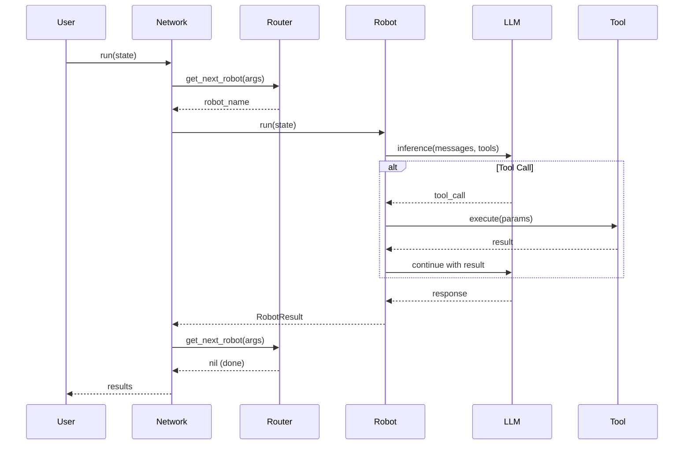

# Core Concepts

Understanding the fundamental concepts in RobotLab will help you build effective AI applications.

## Robot

A **Robot** is an LLM-powered agent with a specific personality, capabilities, and tools. Each robot has:

- **Name**: A unique identifier within a network
- **Description**: What the robot does (used for routing decisions)
- **Template/System Prompt**: Instructions that define the robot's behavior
- **Model**: The LLM model to use (e.g., `claude-sonnet-4`)
- **Tools**: Custom functions the robot can call

```ruby
robot = RobotLab.build do
  name "support_agent"
  description "Handles customer support inquiries"
  model "claude-sonnet-4"
  template "You are a friendly customer support agent..."

  tool :lookup_order do
    description "Look up order details by order ID"
    parameter :order_id, type: :string, required: true
    handler { |order_id:| Order.find(order_id).to_h }
  end
end
```

## Network

A **Network** is a collection of robots that work together. Networks provide:

- **Robot Registry**: Named robots that can be referenced
- **Routing Logic**: Determines which robot handles each request
- **Shared Configuration**: Default model, MCP servers, tools
- **State Management**: Tracks conversation state across robots

```ruby
network = RobotLab.create_network do
  name "customer_service"

  add_robot support_robot
  add_robot billing_robot
  add_robot technical_robot

  router ->(args) {
    # Custom routing logic
    args.call_count.zero? ? :support_agent : nil
  }
end
```

## State

**State** holds all the data for a single conversation or workflow execution:

- **Data**: Key-value store for workflow data
- **Results**: History of robot responses
- **Messages**: Conversation message history
- **Thread ID**: Optional identifier for persistence
- **Memory**: Shared memory accessible by all robots

```ruby
state = RobotLab.create_state(
  message: "I need help with my order",
  data: { user_id: "123", priority: "high" }
)
```

## Tool

**Tools** are functions that robots can call to interact with external systems:

```ruby
tool = RobotLab::Tool.new(
  name: "get_weather",
  description: "Get current weather for a location",
  parameters: {
    location: { type: "string", description: "City name" }
  },
  handler: ->(location:, **_context) {
    WeatherService.current(location)
  }
)
```

## Message Types

RobotLab uses several message types to represent conversation content:

| Type | Purpose |
|------|---------|
| `TextMessage` | User or assistant text content |
| `ToolMessage` | Tool definition with name and parameters |
| `ToolCallMessage` | Request from LLM to execute a tool |
| `ToolResultMessage` | Result returned from tool execution |

## Router

A **Router** determines which robot(s) run at each step in a network. Routers receive context about the current execution and return the next robot(s) to run:

```ruby
router = ->(args) {
  case args.call_count
  when 0 then :classifier
  when 1
    # Route based on classification result
    classification = args.last_result&.output&.first&.content
    classification&.include?("billing") ? :billing_agent : :support_agent
  else
    nil # Stop execution
  end
}
```

## Memory

**Memory** provides a shared key-value store that persists across robot executions within a network run:

```ruby
# In robot handler or tool
state.memory.remember("user_preference", "dark_mode")
preference = state.memory.recall("user_preference")

# Scoped memory for organization
user_memory = state.memory.scoped("user:123")
user_memory.remember("last_order", "ORD-456")
```

## MCP (Model Context Protocol)

**MCP** allows robots to connect to external tool servers:

```ruby
network = RobotLab.create_network do
  mcp [
    { name: "filesystem", transport: { type: "stdio", command: "mcp-server-filesystem" } },
    { name: "github", transport: { type: "stdio", command: "mcp-server-github" } }
  ]
end
```

## Execution Flow



## Next Steps

- [Quick Start Guide](getting-started/quick-start.md) - Build your first robot
- [Building Robots](guides/building-robots.md) - Detailed robot creation guide
- [Creating Networks](guides/creating-networks.md) - Network orchestration patterns
