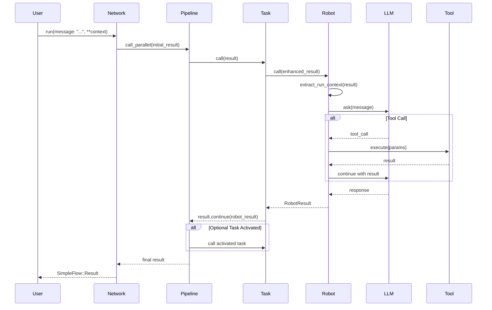

# Core Concepts

Understanding the fundamental concepts in RobotLab will help you build effective AI applications.

## Robot

A **Robot** is an LLM-powered agent that inherits from `RubyLLM::Agent`. Each robot wraps a persistent chat session created at initialization and provides template-based prompts, tools, memory, and MCP integration. Robots are created using keyword arguments via the `RobotLab.build` factory method.

Each robot has:

- **Name**: A unique identifier (auto-generated if omitted)
- **Template**: A `.md` file with YAML front matter managed by prompt_manager, referenced by symbol
- **System Prompt**: Inline instructions (can be used alone or combined with a template)
- **Model**: The LLM model to use (defaults to `RobotLab.config.ruby_llm.model`)
- **Local Tools**: `RubyLLM::Tool` subclasses or `RobotLab::Tool` instances
- **Memory**: Persistent key-value store across runs

```ruby
# Robot with template (references prompts/support.md)
robot = RobotLab.build(
  name: "support_agent",
  template: :support,
  context: { tone: "friendly", department: "billing" },
  local_tools: [OrderLookup, RefundProcessor],
  model: "claude-sonnet-4"
)

# Robot with inline system prompt
robot = RobotLab.build(
  name: "helper",
  system_prompt: "You are a friendly customer support agent."
)

# Bare robot configured via chaining
robot = RobotLab.build(name: "bot")
robot.with_instructions("Be concise.").with_temperature(0.3).run("Hello")
```

The primary method is `robot.run("message")`, which takes a positional string argument and returns a `RobotResult`:

```ruby
result = robot.run("What is 2 + 2?")
puts result.last_text_content  # => "4"
```

Standalone robots persist their conversation history and memory across runs:

```ruby
robot.run("My name is Alice.")
result = robot.run("What is my name?")
puts result.last_text_content  # => "Your name is Alice."
```

## Configuration

RobotLab uses `MywayConfig` for configuration. There is no `RobotLab.configure` block. Instead, configuration is loaded automatically from multiple sources in priority order:

1. Bundled defaults (`lib/robot_lab/config/defaults.yml`)
2. Environment-specific overrides (development, test, production)
3. XDG user config (`~/.config/robot_lab/config.yml`)
4. Project config (`./config/robot_lab.yml`)
5. Environment variables (`ROBOT_LAB_*` prefix)

```ruby
# Access configuration values
RobotLab.config.ruby_llm.model            #=> "claude-sonnet-4"
RobotLab.config.ruby_llm.request_timeout  #=> 120

# Set API keys via environment variables
# ROBOT_LAB_RUBY_LLM__ANTHROPIC_API_KEY=sk-ant-...
# ROBOT_LAB_RUBY_LLM__OPENAI_API_KEY=sk-...

# Reload configuration
RobotLab.reload_config!
```

## Network

A **Network** is a collection of robots orchestrated using [SimpleFlow](https://github.com/MadBomber/simple_flow) pipelines. Networks provide:

- **Task-Based Orchestration**: Define tasks with dependencies and routing
- **Parallel Execution**: Tasks with the same dependencies run concurrently
- **Optional Task Activation**: Dynamic routing based on robot output
- **Per-Task Configuration**: Each task can have its own context, tools, and MCP servers
- **Shared Memory**: All robots in a network share a reactive memory instance

```ruby
network = RobotLab.create_network(name: "customer_service") do
  task :classifier, classifier_robot, depends_on: :none
  task :billing, billing_robot,
       context: { department: "billing" },
       depends_on: :optional
  task :technical, technical_robot,
       context: { department: "technical" },
       depends_on: :optional
end

result = network.run(message: "I was charged twice for my subscription.")
```

## Task

A **Task** wraps a robot for use in a network pipeline with per-task configuration:

- **Context**: Task-specific context deep-merged with network run params
- **MCP**: MCP servers available to this task (`:none`, `:inherit`, or array)
- **Tools**: Tools available to this task (`:none`, `:inherit`, or array)
- **Memory**: Task-specific memory
- **Dependencies**: `:none`, `[:task1, :task2]`, or `:optional`

```ruby
task :billing, billing_robot,
     context: { department: "billing", escalation_level: 2 },
     tools: [RefundTool, InvoiceTool],
     depends_on: :optional
```

## SimpleFlow::Result

Networks use `SimpleFlow::Result` for data flow between tasks:

```ruby
result.value      # Current task's output (RobotResult)
result.context    # Accumulated context from all tasks
result.halted?    # Whether execution stopped early
result.continued? # Whether execution continues
```

### Result Methods

| Method | Purpose |
|--------|---------|
| `continue(value)` | Continue to next tasks |
| `halt(value)` | Stop pipeline execution |
| `with_context(key, val)` | Add data to context |
| `activate(task_name)` | Enable optional task |

## Tool

**Tools** give robots the ability to interact with external systems. There are two patterns for defining tools:

### RubyLLM::Tool Subclass (Preferred)

```ruby
class Calculator < RubyLLM::Tool
  description "Performs basic arithmetic operations"

  param :operation, type: "string", desc: "The operation (add, subtract, multiply, divide)"
  param :a, type: "number", desc: "First operand"
  param :b, type: "number", desc: "Second operand"

  def execute(operation:, a:, b:)
    case operation
    when "add" then a + b
    when "subtract" then a - b
    when "multiply" then a * b
    when "divide" then a.to_f / b
    else "Unknown operation: #{operation}"
    end
  end
end

robot = RobotLab.build(
  name: "math_bot",
  system_prompt: "You can do math.",
  local_tools: [Calculator]
)
```

### RobotLab::Tool.create Factory

```ruby
tool = RobotLab::Tool.create(
  name: "get_weather",
  description: "Get current weather for a location",
  parameters: {
    type: "object",
    properties: {
      location: { type: "string", description: "City name" }
    },
    required: ["location"]
  }
) { |args| WeatherService.current(args[:location]) }
```

## RobotResult

`RobotResult` captures the output of a single `robot.run(...)` call:

```ruby
result = robot.run("Hello!")

result.last_text_content  # => "Hi there!" (String or nil)
result.output             # => [TextMessage, ...] array of output messages
result.tool_calls         # => [] array of tool call results
result.robot_name         # => "assistant"
result.stop_reason        # => "end_turn" or nil
result.has_tool_calls?    # => false
result.checksum           # => "a1b2c3d4..." (for dedup)
```

## Memory

**Memory** is a reactive key-value store that provides persistent storage across robot executions. Standalone robots use their own inherent memory; robots in a network share the network's memory.

```ruby
# Standalone robot with inherent memory
robot = RobotLab.build(name: "assistant", system_prompt: "You are helpful.")
robot.run("My name is Alice")
robot.run("What's my name?")  # Memory persists across runs

# Access robot's memory directly
robot.memory[:user_id] = 123
robot.memory.data[:category] = "billing"
robot.memory.data.category  # => "billing" (method-style access)

# Runtime memory injection
robot.run("Help me", memory: { session_id: "abc123" })

# Reset memory
robot.reset_memory
```

### Reserved Memory Keys

| Key | Purpose |
|-----|---------|
| `:data` | Runtime data (StateProxy for method-style access) |
| `:results` | Accumulated robot results |
| `:messages` | Conversation history |
| `:session_id` | Session identifier for history persistence |
| `:cache` | Semantic cache instance (RubyLLM::SemanticCache) |

### Reactive Memory in Networks

In a network, shared memory supports pub/sub semantics for inter-robot communication:

```ruby
# Robot A writes to shared memory
network.memory.set(:sentiment, { score: 0.8 })

# Robot B reads (blocking until available)
result = network.memory.get(:sentiment, wait: true)
result = network.memory.get(:sentiment, wait: 30)  # timeout in seconds

# Multiple keys
results = network.memory.get(:sentiment, :entities, :keywords, wait: 60)

# Subscribe to changes
network.memory.subscribe(:status) do |change|
  puts "#{change.key} changed by #{change.writer}: #{change.value}"
end
```

## MCP (Model Context Protocol)

**MCP** allows robots to connect to external tool servers:

```ruby
robot = RobotLab.build(
  name: "developer",
  system_prompt: "You are a developer assistant.",
  mcp: [
    { name: "filesystem", transport: { type: "stdio", command: "mcp-server-filesystem" } },
    { name: "github", transport: { type: "stdio", command: "mcp-server-github" } }
  ]
)
```

MCP configuration follows a hierarchical resolution: `runtime > robot > network > global config`. Values can be `:none`, `:inherit`, or explicit arrays.

## Execution Flow


```mermaid
sequenceDiagram
    participant User
    participant Network
    participant Pipeline
    participant Task
    participant Robot
    participant LLM
    participant Tool

    User->>Network: run(message: "...", **context)
    Network->>Pipeline: call_parallel(initial_result)
    Pipeline->>Task: call(result)
    Task->>Robot: call(enhanced_result)
    Robot->>Robot: extract_run_context(result)
    Robot->>LLM: ask(message)

    alt Tool Call
        LLM-->>Robot: tool_call
        Robot->>Tool: execute(params)
        Tool-->>Robot: result
        Robot->>LLM: continue with result
    end

    LLM-->>Robot: response
    Robot-->>Task: RobotResult
    Task-->>Pipeline: result.continue(robot_result)

    alt Optional Task Activated
        Pipeline->>Task: call activated task
    end

    Pipeline-->>Network: final result
    Network-->>User: SimpleFlow::Result
```

## Conditional Routing with ClassifierRobot

Use a custom Robot subclass to implement intelligent routing. Override `call(result)` to inspect the LLM output and activate optional tasks:

```ruby
class ClassifierRobot < RobotLab::Robot
  def call(result)
    # Extract context and message from the pipeline result
    context = extract_run_context(result)
    message = context.delete(:message)

    # Run the robot to classify the input
    robot_result = run(message, **context)

    new_result = result
      .with_context(@name.to_sym, robot_result)
      .continue(robot_result)

    # Activate the appropriate specialist based on classification
    category = robot_result.last_text_content.to_s.strip.downcase
    case category
    when /billing/ then new_result.activate(:billing)
    when /technical/ then new_result.activate(:technical)
    else new_result.activate(:general)
    end
  end
end

# Build the classifier (uses a .md template with YAML front matter)
classifier = ClassifierRobot.new(
  name: "classifier",
  template: :classifier,
  model: "claude-sonnet-4"
)

# Build specialist robots
billing_robot = RobotLab.build(name: "billing", template: :billing)
technical_robot = RobotLab.build(name: "technical", template: :technical)
general_robot = RobotLab.build(name: "general", template: :general)

# Create network with optional task routing
network = RobotLab.create_network(name: "support_network") do
  task :classifier, classifier, depends_on: :none
  task :billing, billing_robot, depends_on: :optional
  task :technical, technical_robot, depends_on: :optional
  task :general, general_robot, depends_on: :optional
end

result = network.run(message: "I was charged twice for my subscription.")
puts result.value.last_text_content
```

## Message Bus

The **Message Bus** enables bidirectional, cyclic communication between robots via `typed_bus`. While Networks enforce DAG-based execution, the bus supports negotiation loops, convergence patterns, and multi-turn dialogues.

```ruby
bus = TypedBus::MessageBus.new

bob   = RobotLab.build(name: "bob", system_prompt: "You tell jokes.", bus: bus)
alice = RobotLab.build(name: "alice", system_prompt: "You evaluate jokes.", bus: bus)

# Register handlers
bob.on_message do |message|
  joke = bob.run(message.content.to_s).last_text_content
  bob.send_reply(to: message.from.to_sym, content: joke, in_reply_to: message.key)
end

alice.on_message do |message|
  verdict = alice.run("Is this funny? #{message.content}").last_text_content
  # Send another request if not satisfied
  alice.send_message(to: :bob, content: "Try again.") unless verdict.start_with?("FUNNY")
end

# Start the conversation
alice.send_message(to: :bob, content: "Tell me a robot joke.")
```

Key features:

- **Typed channels** — only `RobotMessage` objects accepted per channel
- **Auto-ACK** — 1-arg `on_message` blocks auto-acknowledge; 2-arg blocks give manual control
- **Reply correlation** — `send_reply(to:, content:, in_reply_to:)` tracks threads via `in_reply_to`
- **Independent of Network** — bus works without a Network pipeline

### Dynamic Spawning

Robots can create new robots at runtime using `spawn`. The bus is created lazily:

```ruby
dispatcher = RobotLab.build(name: "dispatcher", system_prompt: "You delegate work.")

# spawn creates a child on the same bus (bus created automatically)
helper = dispatcher.spawn(name: "helper", system_prompt: "You answer questions.")
answer = helper.run("What is 2+2?").last_text_content
helper.send_message(to: :dispatcher, content: answer)
```

Robots can also join a bus after creation with `with_bus`:

```ruby
bot = RobotLab.build(name: "latecomer", system_prompt: "Hello.")
bot.with_bus(existing_bus)
```

Multiple robots with the same name enable fan-out — messages sent to that name are delivered to all subscribers.

## Templates

Templates are `.md` files with YAML front matter, managed by the prompt_manager gem. They live in the configured template path (default: `./prompts/` or `app/prompts/` in Rails).

```markdown
---
description: Customer support classifier
model: claude-sonnet-4
temperature: 0.3
---
You are a request classifier. Analyze the user's request and classify it
as either "billing", "technical", or "general".

Respond with ONLY the category name, nothing else.
```

Reference templates by symbol when building robots:

```ruby
robot = RobotLab.build(
  name: "classifier",
  template: :classifier,           # loads prompts/classifier.md
  context: { tone: "professional" } # variables passed to the template
)
```

### Front Matter Keys

Templates support two categories of front matter keys:

**LLM Config:** `model`, `temperature`, `top_p`, `top_k`, `max_tokens`, `presence_penalty`, `frequency_penalty`, `stop` — applied to the robot's chat configuration.

**Robot Extras:** `robot_name`, `description`, `tools`, `mcp` — applied to the robot's identity and capabilities. These make templates self-contained: reading the `.md` file tells you everything about the robot.

```markdown
---
description: GitHub assistant with MCP tool access
robot_name: github_bot
tools:
  - CodeSearchTool
mcp:
  - name: github
    transport: stdio
    command: npx
    args: ["-y", "@modelcontextprotocol/server-github"]
model: claude-sonnet-4
---
You are a GitHub assistant. Use available tools to help with repository tasks.
```

```ruby
# Template provides everything — minimal constructor
robot = RobotLab.build(template: :github_assistant)
```

Constructor-provided values (`local_tools:`, `mcp:`, `name:`, `description:`) always take precedence over front matter values.

## Next Steps

- [Quick Start Guide](getting-started/quick-start.md) - Build your first robot
- [Building Robots](guides/building-robots.md) - Detailed robot creation guide
- [Creating Networks](guides/creating-networks.md) - Network orchestration patterns
